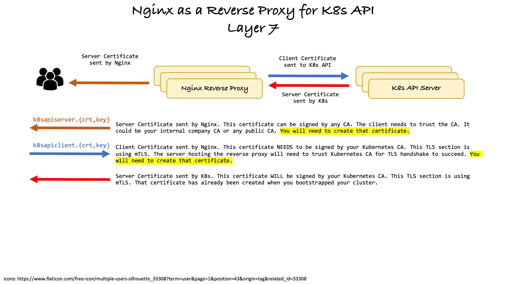

<a name="readme-top"></a>

# Nginx as a layer 7 Load Balancer
This tutorial assumes:
- you already have a Kubernetes Cluster with multi control plane
- you have Nginx configured as a layer 4 load balancer

The goal is to transform Nginx to act as a layer 7 reverse proxy, meaning it will terminate the TLS sessions. It will then create new TLS sessions with the Kubernetes API servers.

> [!IMPORTANT]  
> This configuration is not supported by Kubernetes. All your users will have the same identity from Kubernetes point of view. Nginx will always present the same certificate.

> [!WARNING]  
> DO NOT try this on a production K8s cluster. There's chances that you can break your cluster.

##



## Configure Nginx for layer 7 Load Balancing
Your Nginx should be configured to act as a TCP layer 4 load balancer for K8s API. The following steps will transform it in a HTTPS (layer 7) load balancer. Let's prepare the layer 7 load balancing configuration. The file configuration create will end with `.bak` and won't be read by Nginx.

Create the file `k8sapi.conf.bak` and adjust for your needs:
- the **server** certificate and private key: `k8sapiserver`
- the **client** certificate and private key: `k8sapiclient`
- the group of servers
- the `proxy_pass` which is the URL of the group of K8s API servers

```sh
sudo cat <<'EOF' | sudo tee /etc/nginx/conf.d/k8sapi.conf.bak >/dev/null
upstream k8s-api {
    server k8smaster1.isociel.com:6443;
    server k8smaster2.isociel.com:6443;
    server k8smaster3.isociel.com:6443;
}
server {
    listen 6443 ssl;
    server_name k8sapi.isociel.com;

    # access_log      /var/log/nginx/k8sapi.server.access.log;
    # error_log       /var/log/nginx/k8sapi.server.error.log;

    ssl_certificate       /etc/ssl/certs/k8sapiserver.crt;
    ssl_certificate_key   /etc//ssl/private/k8sapiserver.key;

    ssl_session_cache  builtin:1000  shared:SSL:10m;
    ssl_protocols  TLSv1.3 TLSv1.2;
    ssl_ciphers HIGH:!aNULL:!eNULL:!EXPORT:!CAMELLIA:!DES:!MD5:!PSK:!RC4;
    ssl_prefer_server_ciphers on;

    location / {
      return 404;
      access_log      /var/log/nginx/k8sapi.access.log;
      error_log       /var/log/nginx/k8sapi.error.log;

      proxy_ssl_certificate         /etc/ssl/certs/k8sapiclient.crt;
      proxy_ssl_certificate_key     /etc/ssl/private/k8sapiclient.key;
      proxy_ssl_protocols           TLSv1.3 TLSv1.2;
      proxy_ssl_ciphers             HIGH:!aNULL:!eNULL:!EXPORT:!CAMELLIA:!DES:!MD5:!PSK:!RC4;
      proxy_ssl_verify_depth  2;
    }

    location ~* /api.* {
      access_log      /var/log/nginx/k8sapi.access.log;
      error_log       /var/log/nginx/k8sapi.error.log;

      proxy_set_header   Host              $http_host;
      proxy_set_header   X-Real-IP         $remote_addr;
      proxy_set_header   X-Forwarded-For   $proxy_add_x_forwarded_for;
      proxy_set_header   X-Forwarded-Proto https;

      proxy_ssl_certificate         /etc/ssl/certs/k8sapiclient.crt;
      proxy_ssl_certificate_key     /etc/ssl/private/k8sapiclient.key;
      proxy_ssl_protocols           TLSv1.3 TLSv1.2;
      proxy_ssl_ciphers             HIGH:!aNULL:!eNULL:!EXPORT:!CAMELLIA:!DES:!MD5:!PSK:!RC4;
      proxy_ssl_verify_depth  2;
      proxy_ssl_session_reuse on;
      # round-robin load balancing
      proxy_pass          https://k8s-api;
      proxy_read_timeout  90;
    }
}
EOF
```

**Important**: Verify the Nginx configuration file with the command:
```sh
sudo nginx -t
```

> [!NOTE]  
> If you don't use `sudo`, you'll get some weird alerts

# Create client certificate
Create a client certificate for mTLS. This is the certificate Nginx will present to any master node for API requests. This certificate **MUST** to be signed by your Kubernetes cluster `CA`. You can find the K8s Cluster CA files in `/etc/kubernetes/pki/ca.*`. Just copy the `ca.crt` and `ca.key` files in a temporary directory. They will be needed to create the client certificate. I know, this is against all best practice 😇

As a reminder:
|Role|FQDN|IP|
|----|----|----|
|Load Balancer|k8sapi.isociel.com|192.168.13.60|
|Master Node|k8smaster1.isociel.com|192.168.13.61|
|Master Node|k8smaster2.isociel.com|192.168.13.62|
|Master Node|k8smaster3.isociel.com|192.168.13.63|

Create the client certificate:
```sh
# If you don't want any SAN, just leave the string empty like this: ''
export EXTRA_SAN=',DNS:k8sapi.isociel.com, DNS:k8sapi, IP:192.168.13.60'
export CERT_NAME='k8sapiclient'

printf "\nMaking Client Private Key ...\n"
openssl genpkey -algorithm RSA -pkeyopt rsa_keygen_bits:2048 -out ${CERT_NAME}.key

printf "\nMaking Client CSR ...\n"
openssl req -new -sha256 -key ${CERT_NAME}.key -subj "/CN=kubernetes-admin/O=system:masters" \
-addext "subjectAltName = DNS:localhost,DNS:*.localhost,IP:127.0.0.1$EXTRA_SAN" \
-addext "basicConstraints = CA:FALSE" \
-addext "extendedKeyUsage = serverAuth, clientAuth" \
-addext "subjectKeyIdentifier = hash" \
-addext "keyUsage = digitalSignature, keyEncipherment" \
-out ${CERT_NAME}.csr

printf "\nSigning Client Certificate with Kubernetes CA...\n"
openssl x509 -req -days 365 -in ${CERT_NAME}.csr -CA ca.crt -CAkey ca.key \
-extfile - <<<"subjectAltName = DNS:localhost,DNS:*.localhost,IP:127.0.0.1$EXTRA_SAN
basicConstraints = CA:FALSE
extendedKeyUsage = serverAuth, clientAuth
subjectKeyIdentifier = hash
authorityKeyIdentifier = keyid, issuer
keyUsage = digitalSignature, keyEncipherment" \
-out ${CERT_NAME}.crt

# Verifying that a Certificate is issued by a CA
printf "\n${CERT_NAME}: Chain of trust verification...\n"
openssl verify -show_chain -CAfile ca.crt ${CERT_NAME}.crt 

printf "\n${CERT_NAME}: All 2 digests must be identical ...\n"
printf "${CERT_NAME}.key digest: $(openssl pkey -in ${CERT_NAME}.key  -pubout | openssl dgst -sha256 -r | cut -d' ' -f1)\n"
printf "${CERT_NAME}.crt digest: $(openssl x509 -in ${CERT_NAME}.crt -pubkey -noout | openssl dgst -sha256 -r | cut -d' ' -f1)\n"

unset EXTRA_SAN
unset CERT_NAME
```

## Copy the certificate and private key
I generated the certificate and private key on the `k8smaster1` node. I needed to copy the certificate and private key to the load balancer `k8sapi`. **You might not need to do this!**
```sh
scp k8sapiclient.{crt,key} daniel@k8sapi:/home/daniel/certs/.
```

**On `k8sapi` server**
On `k8sapi`, copy the files to their final destination:
```sh
sudo cp certs/k8sapiclient.crt /etc/ssl/certs/.
sudo cp certs/k8sapiclient.key /etc/ssl/private/.
```

# Trust Kubernetes CA
If you don't trust the Kubernetes root CA certificate, you'll get the following message if you try to make an API call outside Kubernetes.
```sh
curl https://k8sapi.isociel.com:6443/api/v1/nodes?limit=500
```

```
curl: (60) SSL certificate problem: unable to get local issuer certificate
More details here: https://curl.se/docs/sslcerts.html

curl failed to verify the legitimacy of the server and therefore could not
establish a secure connection to it. To learn more about this situation and
how to fix it, please visit the web page mentioned above.
```

Assuming you have the Kubernetes root CA certificate file `ca.crt` in your current directory, follow the steps below to install it:
```sh
sudo cp ca.crt /usr/local/share/ca-certificates/.
sudo update-ca-certificates
```

> [!IMPORTANT]  
> It is important to have the `.crt` extension for the file, otherwise it will not be processed.

If you try the same command, you won't get the error message anymore. You could have used `curl --insecure ...` but I prefer to trust the CA certificate.
```sh
curl https://k8sapi.isociel.com:6443/api/v1/nodes?limit=500
```

# Create server certificate
Create a server certificate for Nginx. This is the certificate Nginx will present to any client doing an API requests (kubectl get ...). This certificate can be signed by any root `CA`. I decided to create my own private `CA` with an intermediate `CA` and signed the server certificate with it.

> [!NOTE]  
> The client will need to trust the `CA`, if it's a private one like I did.

I used the script `06-gen_cert.sh` to create the server certificate. I already had my own private `CA` with the file `ca-crt.pem` and `int-crt.pem`. You can find those files in the `Private-CA` directory. They are needed by the script `06-gen_cert.sh`.

# Trust your own CA
I have a different certificate for the server portion of the Nginx load balancer. The `server` section is to one who answers the requests from the client, `kubectl`. I build my own CA and intermediate CA and generated a certificate with ECC key. I wanted to have a different certificathe than the one for the `location` section. Make sure, if you do that, to add the CA and intermediate CA in the local CA trust store. If you don't trust you root/int CA certificates, you'll get the following message if you try to make an API call outside Kuverbetes.

```
kubectl get nodes
Unable to connect to the server: tls: failed to verify certificate: x509: certificate signed by unknown authority
```

I build a `PEM` file with the chain of trust. You just add all the CA/Int cecrtificates in a file:
```sh
cat int-crt.pem ca-crt.pem > ca-chain.crt
```

Follow the steps below to install it in your local trust store:
```sh
sudo cp ca-chain.crt /usr/local/share/ca-certificates/.
sudo update-ca-certificates
```

Output:
```
Updating certificates in /etc/ssl/certs...
rehash: warning: skipping ca-certificates.crt,it does not contain exactly one certificate or CRL
rehash: warning: skipping ca-chain.pem,it does not contain exactly one certificate or CRL
1 added, 0 removed; done.
Running hooks in /etc/ca-certificates/update.d...
done.
```

After adding the chain of trust for your private CA to your OS store, `curl` will work but not `kubectl`. The reason is that the chain of trust is in the file `.kube/config` file under `certificate-authority-data:` field.

```
kubectl get nodes
Unable to connect to the server: tls: failed to verify certificate: x509: certificate signed by unknown authority
```

### Modification of `~/.kube/config`
The `~/.kube/config` file contains the following TLS certificates and key:
- root CA in the field `certificate-authority-data:`
- client certificate in the field `client-certificate-data:`
- client private key in the field `client-key-data:`

For every certificates you're using, you need to have the root CA, including any intermediate certificate, in your config file. The string for the certificate in the `base64`. The field `certificate-authority-data:` can contain multiple certificates.

At this point Nginx is still in layer 4 load balancer. Let's replace the filed `certificate-authority-data:` with your `ca-chain.crt` file in preparation of using Nginx in layer 7 with our own certificate.

Here's the magic command that will replace the old CA certificate with the new one and preserve leading whitespace, since this is basically a `yaml` file. Keep a backup copy of the original `kubeconfig` file as `config.l4` since we bootstrapped our Kubernetess cluser with Nginx configured as a layer 4 load balancer:
```sh
cp ~/.kube/config ~/.kube/config.l4
sed -i "s/^\([[:blank:]]*\)certificate-authority-data:.*$/\1certificate-authority-data: $(cat ca-chain.crt | base64 | tr -d '\n')/" ~/.kube/config
# Keep a copy for layer 7
cp ~/.kube/config ~/.kube/config.l7
```

Since our API client have different *client* TLS certificate (signed by different root CA), the options to run `kubectl` are:
- `kubectl --kubeconfig ~/.kube/config.l4`: Use this configuration file when you use Nginx in `Layer 4` load balancer
  - or set the environment variable `KUBECONFIG` in your shell to point to `export KUBECONFIG=~/.kube/config.l4`
- `kubectl --kubeconfig ~/.kube/config.l7`: Use this configuration file when you use Nginx in `Layer 7` load balancer
  - or set the environment variable `KUBECONFIG` in your shell to point to `export KUBECONFIG=~/.kube/config.l7`
- modify the `~/.kube/config` to include every root CA and intermediate certificates

### modify the `~/.kube/config`
Let's modify the `~/.kube/config` to include **every** root CA and intermediate certificates we used to signed all of our *client* TLS certificates:
I build a `PEM` file with the chain of trust of my private CA, `int-crt.pem` and `ca-crt.pem`, and the Kubernetes root CA `ca.crt`. Just add all the CA/Int cecrtificates certificates in a file:
```sh
cat int-crt.pem ca-crt.pem ca.crt > ca-chain-k8s.crt
```

Replace the `certificate-authority-data:` field with all the certificates in `base64` with the command:
```sh
sed -i "s/^\([[:blank:]]*\)certificate-authority-data:.*$/\1certificate-authority-data: $(cat ca-chain-k8s.crt | base64 | tr -d '\n')/" ~/.kube/config
```
## Recap
Hope this will clarify the state of the `kubeconfig` files:

- use the command `kubectl --kubeconfig ~/.kube/config.l4` if you want to force the *client* TLS certificate for Nginx in `Layer 4` load balancer
  - or set the environment variable `KUBECONFIG` in your shell: `export KUBECONFIG=~/.kube/config.l4`
- use the command `kubectl --kubeconfig ~/.kube/config.l7` if you want to force the *client* TLS certificate for Nginx in `Layer 7` load balancer
  - or set the environment variable `KUBECONFIG` in your shell: `export KUBECONFIG=~/.kube/config.l7`
- use the command `kubectl` if you want to use Nginx in `Layer 4` or `layer 7` load balancer

### The CA trust store location

The CA trust store, as generated by `update-ca-certificates`, is available at the following locations:
- As a single file (PEM bundle) in `/etc/ssl/certs/ca-certificates.crt` (if you added the K8s CA certificate, it's now in this file)
- As an OpenSSL compatible certificate directory in `/etc/ssl/certs` (if you added the K8s CA certificate, a symbolic link has been created `/etc/ssl/certs/ca.pem -> /usr/local/share/ca-certificates/ca.crt`)

# Convert to Layer 7 Load Balancer
Just apply those changes to have Nginx act as a layer 7 load balancer. Apply this on `k8sapi` server:
```sh
sudo mv /etc/nginx/conf.d/k8sapi.conf.bak /etc/nginx/conf.d/k8sapi.conf
sudo mv /etc/nginx/tcpconf.d/k8sapi.conf /etc/nginx/tcpconf.d/k8sapi.conf.bak
sudo systemctl restart nginx
sudo systemctl status nginx
```

> [!NOTE]  
> I prefer to have Nginx configured as a layer 7 load balancer because the logs are way more verbose since it terminates the TLS session.

# Convert to Layer 4 Load Balancer
If you want to go back to Layer 4 Load Balancer, just apply those changes to have Nginx act as a layer 4 load balancer. Apply this on `k8sapi` server:
```sh
sudo mv /etc/nginx/conf.d/k8sapi.conf /etc/nginx/conf.d/k8sapi.conf.bak
sudo mv /etc/nginx/tcpconf.d/k8sapi.conf.bak /etc/nginx/tcpconf.d/k8sapi.conf
sudo systemctl restart nginx
sudo systemctl status nginx
```

>Use the `--kubeconfig` when using the layer 4 loab balancer since we changed the trusted CA.

```sh
kubectl --kubeconfig config.l4 get nodes
```

# Conclusion
You're K8s API gateway server can:
- Act as a layer 4 (TCP) load balancer for all API requests to K8s (ex.: `kubectl` command)
- Act as a layer 7 (HTTPS) load balancer for all API requests to K8s (ex.: `kubectl` command)

# Troubleshooting
Get the client certificate inside the `kubeconfig` file:
```sh
cat ~/.kube/config | grep client-certificate-data | cut -f2 -d : | tr -d ' ' | base64 -d | openssl x509 -text -noout -

kubectl config view --raw -o jsonpath='{range .users[*].user}{.client-certificate-data}' | base64 -d | openssl x509 -text -noout -
```

Get the client private key inside the `kubeconfig` file:
```sh
cat ~/.kube/config | grep client-key-data | cut -f2 -d : | tr -d ' ' | base64 -d

kubectl config view --raw -o jsonpath='{range .users[*].user}{.client-key-data}' | base64 -d
```

Get the client trusted store (root Certificate Authority) inside the `kubeconfig` file:
```sh
cat ~/.kube/config | grep certificate-authority-data | cut -f2 -d : | tr -d ' ' | base64 -d | openssl x509 -text -noout -

kubectl config view --raw -o jsonpath='{range .clusters[*].cluster}{.certificate-authority-data}' | base64 -d | openssl x509 -text -noout -
```

Create a `base64` encoded string that represents the certificate, to be used inside the `kubeconfig` file:
```sh
cat cert.crt | base64 | tr -d '\n'
```

# References
[Installing a root CA certificate in the trust store](https://ubuntu.com/server/docs/security-trust-store)  

# ???
```sh
sudo cp /etc/kubernetes/admin.conf /etc/kubernetes/admin.conf.org
sudo cp ~/.kube/config /etc/kubernetes/admin.conf
```
