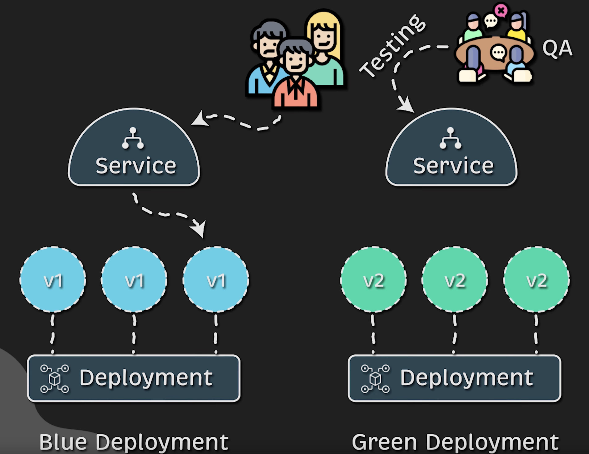

# Kubernetes Blue/Green Deployment Strategy (Examples & Code)
With this type of deployment, we have different version running at the same time.

### Rolling Update  
  

## YAML files
For this one I created separate files for:
- Namespace
- Service
- Blue Deployment
- Green Deployment

## Start Blue Deployment
Create the namespace:
```bash
kubectl create -f 3-namespace.yaml
```

Start the Blue Deployment which is at version 1.
```bash
kubectl create -f 3-blue-deployment.yaml
```

Start the service for all of our Deployment.
```bash
kubectl create -f 3-service.yaml
```

## Start Test Pod
Start a test Pod with an image that has `cURL`:
```bash
kubectl run curl --image=alpine/curl:8.2.1 -n kube-system -it --rm -- /bin/sh
while true; do curl myapp.test:8181/version; echo ""; sleep 1; done
```

> [!NOTE]  
> Hit <kbd>Ctrl</kbd> + <kbd>C</kbd> to stop the `while` loop.

## Start Green Deployment
Start the Blue Deployment which is at version 1.
```bash
kubectl create -f 3-green-deployment.yaml
```

Now we have twenty Pods. Ten are at version 1 from the Blue Deployment and ten are at version 2 from the Green Deployment.
```bash
kubectl get pods -n test
```

```
NAME                           READY   STATUS    RESTARTS   AGE
blue-myapp-5798d95fd4-2zdwk    1/1     Running   0          4m43s
blue-myapp-5798d95fd4-4hpf2    1/1     Running   0          4m43s
blue-myapp-5798d95fd4-fjbqq    1/1     Running   0          4m43s
blue-myapp-5798d95fd4-jdd69    1/1     Running   0          4m43s
blue-myapp-5798d95fd4-mcn8p    1/1     Running   0          4m43s
blue-myapp-5798d95fd4-msddm    1/1     Running   0          4m43s
blue-myapp-5798d95fd4-nqss9    1/1     Running   0          4m43s
blue-myapp-5798d95fd4-pxzxk    1/1     Running   0          4m43s
blue-myapp-5798d95fd4-q5jxx    1/1     Running   0          4m43s
blue-myapp-5798d95fd4-zp8k8    1/1     Running   0          4m43s
green-myapp-6d94c548fb-292pv   1/1     Running   0          79s
green-myapp-6d94c548fb-7wx2k   1/1     Running   0          79s
green-myapp-6d94c548fb-gppmh   1/1     Running   0          79s
green-myapp-6d94c548fb-jx472   1/1     Running   0          79s
green-myapp-6d94c548fb-l57bn   1/1     Running   0          79s
green-myapp-6d94c548fb-lzzs4   1/1     Running   0          79s
green-myapp-6d94c548fb-q74gd   1/1     Running   0          79s
green-myapp-6d94c548fb-rnktr   1/1     Running   0          79s
green-myapp-6d94c548fb-zc74j   1/1     Running   0          79s
green-myapp-6d94c548fb-zfvgh   1/1     Running   0          79s
```

## Test
We have twenty Pods but only the blue ones are accessible via the Kubernetes Service:
```sh
while true; do curl 192.0.2.194:8181/version; sleep 1; echo ""; done
```

You should only receive `v1` version:
```
{"version":"v1"}
{"version":"v1"}
{"version":"v1"}
```

## Flip to version 2
To flip to our new Green Deployment, just change the selector in the service file to `replica: green`, see below:
```
spec:
  selector:
    app: myapp
    replica: green
```

```sh
kubectl replace -f 3-service.yaml
```

This is the ouput from our test, after the command above. We are now on the new Green Deployment. After the change is applied, you should only receive `v2` version:
```
{"version":"v1"}
{"version":"v1"}
{"version":"v2"}
{"version":"v2"}
```

> [!IMPORTANT]  
> If you're satisfied with the new deployment, don't forget to delete the old one wit the command below:
```sh
kubectl delete -f 3-blue-deployment.yaml
```

## Undo
To flip to our old Blue Deployment, just change the selector in the service file to `replica: blue`, see below:
```
spec:
  selector:
    app: myapp
    replica: blue
```

```sh
kubectl replace -f 3-service.yaml
```

# Cleanup
Remove everything we created:
```sh
kubectl delete -f 3-blue-deployment.yaml
kubectl delete -f 3-green-deployment.yaml
kubectl delete -f 3-service.yaml
kubectl delete -f 3-namespace.yaml
```

# References
[Anton Putra - Most Common Kubernetes Deployment Strategies](https://www.youtube.com/watch?v=lxc4EXZOOvE)  
[Anton Putra - GitHub](https://github.com/antonputra/tutorials/tree/main/lessons/171)  
