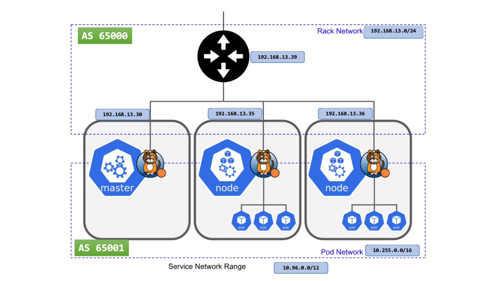

# Configure Calico BGP


## Check Calico's version:
```sh
kubectl calico version
```

>The command `calicoctl version` will produce the same output

The ouput should look like this:
```
Client Version:    v3.26.0
Git commit:        8b103f46f
Cluster Version:   v3.26.0
Cluster Type:      typha,kdd,k8s,operator,bgp,kubeadm
```

## Check Calico's node status
```sh
sudo kubectl calico node status
```

>The command `sudo calicoctl node status` will produce the same output

The ouput should look like this:
```
Calico process is running.

IPv4 BGP status
+---------------+-------------------+-------+----------+-------------+
| PEER ADDRESS  |     PEER TYPE     | STATE |  SINCE   |    INFO     |
+---------------+-------------------+-------+----------+-------------+
| 192.168.13.35 | node-to-node mesh | up    | 14:25:08 | Established |
| 192.168.13.36 | node-to-node mesh | up    | 14:25:20 | Established |
| 192.168.13.37 | node-to-node mesh | up    | 14:24:54 | Established |
+---------------+-------------------+-------+----------+-------------+

IPv6 BGP status
No IPv6 peers found.
```

## 
Check to see if you have a default BGPConfiguration:
```sh
calicoctl get bgpconfig default
```

The ouput should look like this:
```
NAME      LOGSEVERITY   MESHENABLED   ASNUMBER   
default   Info          true          65001      
```

## Check Calico IPAM allocations statistics
Let’s also take a quick look at the IP allocation stats from Calico-IPAM, by running the following command:
```sh
kubectl calico ipam show
```

>The command `calicoctl ipam show` will produce the same output

The ouput should look like this:
```
+----------+---------------+-----------+------------+--------------+
| GROUPING |     CIDR      | IPS TOTAL | IPS IN USE |   IPS FREE   |
+----------+---------------+-----------+------------+--------------+
| IP Pool  | 10.255.0.0/16 |     65536 | 23 (0%)    | 65513 (100%) |
+----------+---------------+-----------+------------+--------------+
```

## Configure Global BGP
A BGP configuration resource `BGPConfiguration` represents BGP specific configuration options for the cluster or a specific node. The resource with the name `default` has a specific meaning as it contains the BGP global default configuration. The resources with the name `node.<nodename>` contain the node-specific overrides, and will be applied to the node `<nodename>`. When deleting a node the BGPConfiguration resource associated with the node will also be deleted. Only prefixAdvertisements, listenPort, and logSeverityScreen can be overridden this way.

Find what is the range of IP addresses for `service cluster IP` and `Pods IP` with the command:
```sh
kubectl cluster-info dump | grep -m 2 -E "cluster-cidr|service-cluster"
```

You should see the following output:
```
  "--service-cluster-ip-range=10.96.0.0/12",
  "--cluster-cidr=10.255.0.0/16",
```
It is also important to understand the IP Pools that Calico has been configured with, which offer finer grained control of IP address ranges to be used by pods in the cluster.

```sh
calicoctl get ippools
```

You should see the following output:
```
NAME                  CIDR            SELECTOR   
default-ipv4-ippool   10.255.0.0/16   all()      
```

A BGP configuration resource `BGPConfiguration` represents BGP specific configuration options for the cluster or a specific node. Setup the Calico BGP configuration on the Master node by running the following command:
```sh
cat > BGPConfiguration.yaml <<EOF
apiVersion: projectcalico.org/v3
kind: BGPConfiguration
metadata:
  name: default
spec:
  logSeverityScreen: Info
  nodeToNodeMeshEnabled: true
  nodeMeshMaxRestartTime: 120s
  asNumber: 65001
  serviceClusterIPs:
    - cidr: 10.96.0.0/12
  serviceExternalIPs:
    - cidr: 2.2.2.2/32
    - cidr: 172.31.255.0/24
  bindMode: NodeIP
  communities:
  - name: bgp-cluster-community
    value: 65001:100
  prefixAdvertisements:
    - cidr: 10.96.0.0/12
      communities:
        - bgp-cluster-community
        - 65001:123
        - 65001:456
EOF
```

Create the configuration:
```sh
kubectl create -f BGPConfiguration.yaml
```

Verify the BGPConfiguration and contains the serviceClusterIPs key:
```sh
calicoctl get bgpconfig default -o yaml
```

## Create the BGP peer (neighbor)
### Global peer
To assign a BGP peer a **global scope**, omit the `node` and `nodeSelector` fields. All nodes in the cluster will attempt to establish BGP connections with it

### Node-specific peer
A BGP peer can also be node-specific. When the `node` field is included, only the specified node will peer with it. When the `nodeSelector` field is included, the nodes with labels that match that selector will peer with it.

Set up the BGP peers with the command:
```sh
cat > k8smaster1.yaml <<EOF
# The following example creates a BGP peer that configures
# one Calico node to peer with 192.168.13.39 in AS 65000.
apiVersion: projectcalico.org/v3
kind: BGPPeer
metadata:
  name: k8smaster1
spec:
  node: k8master1
  peerIP: 192.168.13.39
  asNumber: 65000
EOF
```

Create the BGP peer configuration:
```sh
kubectl create -f k8smaster1.yaml
```

If you specify a `node` then only that node will peer.
```
spec:
  node: k8smaster1.isociel.com
```

If you specify a `nodeSelector`, you can add more than one peer.
```
spec:
  nodeSelector: kubernetes.io/hostname in {'k8smaster1.isociel.com','k8sworker1.isociel.com'}
```

## Verify BGP status
Check that the new peer has been created with the command:
```sh
kubectl get bgpPeer
```

You should see the following output:
```
NAME         CREATED AT
k8smaster1   2023-06-10T15:41:56Z
```

This displays the status of all BGP peers for that node - this includes the peers that are automatically configured as part of the full node-to-node mesh and the explicitly configured global peers and node specific peers. To display the status of all BGP peerings use the following command:
```sh
sudo calicoctl node status
```

You should see the following output:
```
Calico process is running.

IPv4 BGP status
+---------------+-------------------+-------+----------+-------------+
| PEER ADDRESS  |     PEER TYPE     | STATE |  SINCE   |    INFO     |
+---------------+-------------------+-------+----------+-------------+
| 192.168.13.35 | node-to-node mesh | up    | 15:29:54 | Established |
| 192.168.13.36 | node-to-node mesh | up    | 15:29:55 | Established |
| 192.168.13.37 | node-to-node mesh | up    | 15:29:54 | Established |
| 192.168.13.39 | global            | up    | 15:51:55 | Established |
+---------------+-------------------+-------+----------+-------------+

IPv6 BGP status
No IPv6 peers found.
```
>If you were specific about the peer, the `PEER TYPE` will be `node specific` instead of `global`

## FRR configuration
This is my configuration for [FRRouting](https://frrouting.org/). I only configured two peers. Just replicate the configuration for your own environment.
```
router bgp 65000
 neighbor 192.168.13.30 remote-as 65001
 neighbor 192.168.13.35 remote-as 65001
 neighbor 192.168.13.36 remote-as 65001
 neighbor 192.168.13.37 remote-as 65001
 !
 address-family ipv4 unicast
  network 5.5.5.5/32
  neighbor 192.168.13.30 soft-reconfiguration inbound
  neighbor 192.168.13.30 prefix-list INPUTALL in
  neighbor 192.168.13.30 prefix-list OUTPUTALL out
  neighbor 192.168.13.35 prefix-list INPUTALL in
  neighbor 192.168.13.35 prefix-list OUTPUTALL out
  neighbor 192.168.13.36 prefix-list INPUTALL in
  neighbor 192.168.13.36 prefix-list OUTPUTALL out
  neighbor 192.168.13.37 prefix-list INPUTALL in
  neighbor 192.168.13.37 prefix-list OUTPUTALL out
 exit-address-family
exit
!
ip prefix-list INPUTALL seq 5 permit any
ip prefix-list OUTPUTALL seq 5 permit any
!
ip route 5.5.5.5/32 Null0
```

Check the specific subnet `10.96.0.0/12`
```
sh ip bgp 10.96.0.0/12 bestpath 
```

You should see the following output:
```
BGP routing table entry for 10.96.0.0/12, version 8
Paths: (16 available, best #12, table default)
  Advertised to non peer-group peers:
  192.168.13.30 192.168.13.35 192.168.13.36 192.168.13.37
  65001
    192.168.13.30 from 192.168.13.30 (192.168.13.30)
      Origin IGP, valid, external, multipath, best (Older Path)
      Community: 65001:100 65001:123 65001:456
      AddPath ID: RX 2, TX-All 0 TX-Best-Per-AS 0
      Last update: Sun Jun 11 11:35:04 2023
```

## ASA configuration
This is a simple configuration on Cisco ASA to establish a BGP peering with Calico:

```
bgp-community new-format
!
router bgp 65000
 bgp log-neighbor-changes
 address-family ipv4 unicast
  neighbor 192.168.13.30 remote-as 65001
  neighbor 192.168.13.30 activate
  neighbor 192.168.13.30 send-community
  redistribute connected
  redistribute ospf 1
  no auto-summary
  no synchronization
 exit-address-family
!
```

## Check Routing table on K8s Node
Check the routing table on the K8s node with the command:
```sh
ip route | grep bird
```

You should see the following output:
```
5.5.5.5 via 192.168.13.39 dev ens33 proto bird 
```

# External traffic policy
Services must be configured with the correct service mode (“Cluster” or “Local”) for your implementation. For `externalTrafficPolicy: Local`, the service must be type `LoadBalancer` or `NodePort`. This creates or not `SNAT` on the client request.


# Reference
[BGP configuration](https://docs.tigera.io/calico/latest/reference/resources/bgpconfig)
[BGP peer](https://docs.tigera.io/calico/latest/reference/resources/bgppeer)
