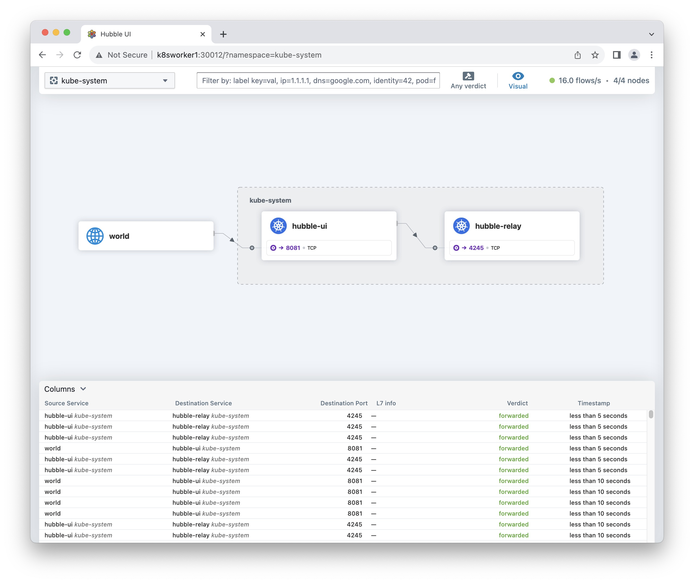

# Upgrade Cilium
This upgrade guide is intended for Cilium running on Kubernetes.

Check the running version **before** the upgrade with the command:
```sh
cilium version
```

The output shoud look like this:
```
cilium-cli: v0.15.14 compiled with go1.21.4 on linux/amd64
cilium image (default): v1.14.2
cilium image (stable): v1.14.5
cilium image (running): 1.14.4
```

## Upgrade Cilium CLI
This is only to upgrade the Cilium CLI.
```sh
CILIUM_CLI_VERSION=$(curl -s https://api.github.com/repos/cilium/cilium-cli/releases/latest | grep tag_name | cut -d '"' -f 4|sed 's/v//g')
echo ${CILIUM_CLI_VERSION}
curl -LO --remote-name-all https://github.com/cilium/cilium-cli/releases/download/v${CILIUM_CLI_VERSION}/cilium-linux-amd64.tar.gz{,.sha256sum}
sha256sum --check cilium-linux-amd64.tar.gz.sha256sum
sudo tar -C /usr/local/bin -xzvf cilium-linux-amd64.tar.gz
rm cilium-linux-amd64.tar.gz{,.sha256sum}
```

The output of the command `cilium version` after the Cilium CLI upgrade shoud look like this:
```
cilium-cli: v0.15.19 compiled with go1.21.5 on linux/amd64
cilium image (default): v1.14.4
cilium image (stable): v1.14.5
cilium image (running): 1.14.4
```

## Upgrade the Hubble Client
In order to access the observability data collected by Hubble, install the Hubble CLI:
```sh
HUBBLE_VERSION=$(curl -s https://raw.githubusercontent.com/cilium/hubble/master/stable.txt)
HUBBLE_ARCH=amd64
if [ "$(uname -m)" = "aarch64" ]; then HUBBLE_ARCH=arm64; fi
curl -L --fail --remote-name-all https://github.com/cilium/hubble/releases/download/$HUBBLE_VERSION/hubble-linux-${HUBBLE_ARCH}.tar.gz{,.sha256sum}
sha256sum --check hubble-linux-${HUBBLE_ARCH}.tar.gz.sha256sum
sudo tar xzvfC hubble-linux-${HUBBLE_ARCH}.tar.gz /usr/local/bin
sudo chown root:adm /usr/local/bin/hubble
rm hubble-linux-${HUBBLE_ARCH}.tar.gz{,.sha256sum}
```

## Completion
Refresh Cilium and Hubble completion with the command:
```sh
cilium completion bash | sudo tee /etc/profile.d/cilium_bash_completion.sh > /dev/null
hubble completion bash | sudo tee /etc/profile.d/hubble_bash_completion.sh > /dev/null
```

> [!NOTE]  
> This above command should be run on every `bastion` host where you use Cilium CLI. You need to logout/login for the change to take effect.

## User Supplied Values
You can retrieve and save the values from an existing installation with the following command:
```sh
helm get values cilium --namespace=kube-system -o yaml > cilium-1.14.4.yaml
```

Output:
```
bgpControlPlane:
  enabled: true
hubble:
  enabled: true
  metrics:
    enableOpenMetrics: true
  relay:
    enabled: true
ipam:
  mode: kubernetes
k8sServiceHost: k8s1api.kloud.lan
k8sServicePort: 6443
kubeProxyReplacement: true
prometheus:
  enabled: true
```

## Running pre-flight check (Required)
When rolling out an upgrade with Kubernetes, Kubernetes will first terminate the pod followed by pulling the new image version and then finally spin up the new image. In order to reduce the downtime of the agent and to prevent `ErrImagePull` errors during upgrade, the pre-flight check pre-pulls the new image version. If you are running in Kubernetes Without kube-proxy mode you must also pass on the Kubernetes API Server IP and / or the Kubernetes API Server Port when generating the `cilium-preflight.yaml` file.

```sh
API_SERVER_IP=k8s1api.kloud.lan
API_SERVER_PORT=6443
helm template cilium/cilium --version 1.14.5 \
  --namespace=kube-system \
  --set preflight.enabled=true \
  --set agent=false \
  --set operator.enabled=false \
  --set k8sServiceHost=${API_SERVER_IP} \
  --set k8sServicePort=${API_SERVER_PORT} \
  > cilium-preflight.yaml
```

```sh
kubectl create -f cilium-preflight.yaml
```

Output:
```
serviceaccount/cilium-pre-flight created
clusterrole.rbac.authorization.k8s.io/cilium-pre-flight created
clusterrolebinding.rbac.authorization.k8s.io/cilium-pre-flight created
daemonset.apps/cilium-pre-flight-check created
deployment.apps/cilium-pre-flight-check created
```

## Verify pre-flight check
After applying the cilium-preflight.yaml, ensure that the number of READY pods is the same number of Cilium pods running.

```sh
kubectl get daemonset -n kube-system | sed -n '1p;/cilium/p'
```

Output:
```
NAME                      DESIRED   CURRENT   READY   UP-TO-DATE   AVAILABLE   NODE SELECTOR            AGE
cilium                    12        12        12      12           12          kubernetes.io/os=linux   39d
cilium-pre-flight-check   12        12        12      12           12          <none>                   106s
```

Once the number of READY pods are equal, make sure the Cilium pre-flight deployment is also marked as READY 1/1. If it shows READY 0/1, consult the CNP Validation section and resolve issues with the deployment before continuing with the upgrade.

```sh
kubectl get deployment -n kube-system cilium-pre-flight-check
```

Output:
```
NAME                      READY   UP-TO-DATE   AVAILABLE   AGE
cilium-pre-flight-check   1/1     1            1           3m31s
```

## Clean up pre-flight check
Once the number of READY for the preflight DaemonSet is the same as the number of cilium pods running and the preflight `Deployment` is marked as READY `1/1` you can delete the `cilium-preflight` and proceed with the upgrade.

```sh
kubectl delete -f cilium-preflight.yaml
```

Output:
```
serviceaccount "cilium-pre-flight" deleted
clusterrole.rbac.authorization.k8s.io "cilium-pre-flight" deleted
clusterrolebinding.rbac.authorization.k8s.io "cilium-pre-flight" deleted
daemonset.apps "cilium-pre-flight-check" deleted
deployment.apps "cilium-pre-flight-check" deleted
```

# Upgrading Cilium
During normal cluster operations, all Cilium components should run the same version. Upgrading just one of them (e.g., upgrading the agent without upgrading the operator) could result in unexpected cluster behavior. The following steps will describe how to upgrade all of the components from one stable release to a later stable release.

## Use Helm to Upgrade your Cilium deployment
Helm can be used to either upgrade Cilium directly or to generate a new set of YAML files that can be used to upgrade an existing deployment via kubectl. By default, Helm will generate the new templates using the default values files packaged with each new release. You still need to ensure that you are specifying the equivalent options as used for the initial deployment, either by specifying a them at the command line or by committing the values to a YAML file.

Make sure `helm` repo is the latest, with the command:
```sh
helm repo update
```

To minimize datapath disruption during the upgrade, the `upgradeCompatibility` option should be set to the initial Cilium version which was installed in this cluster. Unfortunatly I don't remember my initial Cilium version 😱

When upgrading from one minor release to another minor release using helm upgrade, do not use Helm's `--reuse-values` flag. The `--reuse-values` flag ignores any newly introduced values present in the new release and thus may cause the Helm template to render incorrectly. Instead, if you want to reuse the values from your existing installation, save the old values in a values file, check the file for any renamed or deprecated values, and then pass it to the helm upgrade command as described above. You can retrieve and save the values from an existing installation with the following command:

```sh
helm get values cilium --namespace=kube-system -o yaml > cilium-1.14.4.yaml
```

### Upgrade with the command:
```sh
helm upgrade cilium cilium/cilium --version 1.14.5 \
  --namespace=kube-system \
  -f cilium-1.14.4.yaml
```

Output:
```
Release "cilium" has been upgraded. Happy Helming!
NAME: cilium
LAST DEPLOYED: Fri Dec 29 08:53:16 2023
NAMESPACE: kube-system
STATUS: deployed
REVISION: 2
TEST SUITE: None
NOTES:
You have successfully installed Cilium with Hubble Relay.

Your release version is 1.14.5.

For any further help, visit https://docs.cilium.io/en/v1.14/gettinghelp
```

## Check the version
```sh
cilium version
```

Output:
```
cilium-cli: v0.15.19 compiled with go1.21.5 on linux/amd64
cilium image (default): v1.14.4
cilium image (stable): v1.14.5
cilium image (running): 1.14.5
```

```sh
cilium status
```

Output:
```
    /¯¯\
 /¯¯\__/¯¯\    Cilium:             OK
 \__/¯¯\__/    Operator:           OK
 /¯¯\__/¯¯\    Envoy DaemonSet:    disabled (using embedded mode)
 \__/¯¯\__/    Hubble Relay:       OK
    \__/       ClusterMesh:        disabled

Deployment             cilium-operator    Desired: 2, Ready: 2/2, Available: 2/2
Deployment             hubble-relay       Desired: 1, Ready: 1/1, Available: 1/1
DaemonSet              cilium             Desired: 12, Ready: 12/12, Available: 12/12
Containers:            cilium             Running: 12
                       cilium-operator    Running: 2
                       hubble-relay       Running: 1
Cluster Pods:          35/35 managed by Cilium
Helm chart version:    1.14.5
Image versions         cilium-operator    quay.io/cilium/operator-generic:v1.14.5@sha256:303f9076bdc73b3fc32aaedee64a14f6f44c8bb08ee9e3956d443021103ebe7a: 2
                       hubble-relay       quay.io/cilium/hubble-relay:v1.14.5@sha256:dbef89f924a927043d02b40c18e417c1ea0e8f58b44523b80fef7e3652db24d4: 1
                       cilium             quay.io/cilium/cilium:v1.14.5@sha256:d3b287029755b6a47dee01420e2ea469469f1b174a2089c10af7e5e9289ef05b: 12
```

> [!NOTE]  
> Looks like Hubble UI is not running, we'll install it next.

### Validate Hubble API Access
In order to access the Hubble API, create a port forward to the Hubble service from your local machine. This will allow you to connect the Hubble client to the local port `4245` and access the Hubble Relay service in your Kubernetes cluster.

> [!IMPORTANT]  
> The script will kill the port forwarding process at the end.

```sh
cilium hubble port-forward&
CILIUM_PID=$!
hubble status
sleep 3
kill -SIGTERM -- -${CILIUM_PID}
unset CILIUM_PID
```

Output:
```
Healthcheck (via localhost:4245): Ok
Current/Max Flows: 49,140/49,140 (100.00%)
Flows/s: 547.27
Connected Nodes: 12/12
```

### BGP Status
Since I'm using BGP, let's check it's status with the command:
```sh
cilium bgp peers
```

Output
```
Node                    Local AS   Peer AS   Peer Address   Session State   Uptime     Family         Received   Advertised
k8s1master1.kloud.lan   65001      65000     10.101.1.1     established     1h16m13s   ipv4/unicast   18         8    
                                                                                       ipv6/unicast   0          1    
                        65001      65000     10.101.1.2     established     1h16m13s   ipv4/unicast   18         8    
                                                                                       ipv6/unicast   0          1    
k8s1master2.kloud.lan   65001      65000     10.101.1.1     established     1h16m15s   ipv4/unicast   18         8    
                                                                                       ipv6/unicast   0          1    
                        65001      65000     10.101.1.2     established     1h16m15s   ipv4/unicast   18         8    
                                                                                       ipv6/unicast   0          1    
k8s1master3.kloud.lan   65001      65000     10.101.1.1     established     1h16m27s   ipv4/unicast   18         8    
                                                                                       ipv6/unicast   0          1    
                        65001      65000     10.101.1.2     established     1h16m28s   ipv4/unicast   18         8    
                                                                                       ipv6/unicast   0          1    
k8s1master4.kloud.lan   65001      65000     10.101.1.1     established     1h15m46s   ipv4/unicast   18         8    
                                                                                       ipv6/unicast   0          1    
                        65001      65000     10.101.1.2     established     1h15m47s   ipv4/unicast   18         8    
                                                                                       ipv6/unicast   0          1    
k8s1master5.kloud.lan   65001      65000     10.101.1.1     established     1h15m34s   ipv4/unicast   18         8    
                                                                                       ipv6/unicast   0          1    
                        65001      65000     10.101.1.2     established     1h15m35s   ipv4/unicast   18         8    
                                                                                       ipv6/unicast   0          1    
k8s1master6.kloud.lan   65001      65000     10.101.1.1     established     1h16m28s   ipv4/unicast   18         8    
                                                                                       ipv6/unicast   0          1    
                        65001      65000     10.101.1.2     established     1h16m25s   ipv4/unicast   18         8    
                                                                                       ipv6/unicast   0          1    
k8s1worker1.kloud.lan   65001      65000     10.102.1.1     established     1h16m3s    ipv4/unicast   18         8    
                                                                                       ipv6/unicast   0          1    
                        65001      65000     10.102.1.2     established     1h16m0s    ipv4/unicast   18         8    
                                                                                       ipv6/unicast   0          1    
k8s1worker2.kloud.lan   65001      65000     10.102.1.1     established     1h16m1s    ipv4/unicast   18         8    
                                                                                       ipv6/unicast   0          1    
                        65001      65000     10.102.1.2     established     1h16m0s    ipv4/unicast   18         8    
                                                                                       ipv6/unicast   0          1    
k8s1worker3.kloud.lan   65001      65000     10.102.1.1     established     1h15m25s   ipv4/unicast   18         8    
                                                                                       ipv6/unicast   0          1    
                        65001      65000     10.102.1.2     established     1h15m23s   ipv4/unicast   18         8    
                                                                                       ipv6/unicast   0          1    
k8s1worker4.kloud.lan   65001      65000     10.102.1.1     established     1h15m24s   ipv4/unicast   18         8    
                                                                                       ipv6/unicast   0          1    
                        65001      65000     10.102.1.2     established     1h15m24s   ipv4/unicast   18         8    
                                                                                       ipv6/unicast   0          1    
k8s1worker5.kloud.lan   65001      65000     10.102.1.1     established     1h15m47s   ipv4/unicast   18         8    
                                                                                       ipv6/unicast   0          1    
                        65001      65000     10.102.1.2     established     1h15m49s   ipv4/unicast   18         8    
                                                                                       ipv6/unicast   0          1    
k8s1worker6.kloud.lan   65001      65000     10.102.1.1     established     1h15m33s   ipv4/unicast   18         8    
                                                                                       ipv6/unicast   0          1    
                        65001      65000     10.102.1.2     established     1h15m35s   ipv4/unicast   18         8    
                                                                                       ipv6/unicast   0          1    
```

# Enable the Hubble UI (Optional)
I noticed that Hubble UI was not enable. Let's enable it by running the following command:
```sh
helm upgrade cilium cilium/cilium --version 1.14.5 \
  --namespace kube-system \
  --reuse-values \
  --set hubble.relay.enabled=true \
  --set hubble.ui.enabled=true
```

Output:
```
Release "cilium" has been upgraded. Happy Helming!
NAME: cilium
LAST DEPLOYED: Fri Dec 29 08:59:49 2023
NAMESPACE: kube-system
STATUS: deployed
REVISION: 3
TEST SUITE: None
NOTES:
You have successfully installed Cilium with Hubble Relay and Hubble UI.

Your release version is 1.14.5.

For any further help, visit https://docs.cilium.io/en/v1.14/gettinghelp
```

Run `cilium status` again to verify that Hubble UI is indeed working:

Output:
```
    /¯¯\
 /¯¯\__/¯¯\    Cilium:             OK
 \__/¯¯\__/    Operator:           OK
 /¯¯\__/¯¯\    Envoy DaemonSet:    disabled (using embedded mode)
 \__/¯¯\__/    Hubble Relay:       OK
    \__/       ClusterMesh:        disabled

DaemonSet              cilium             Desired: 12, Ready: 12/12, Available: 12/12
Deployment             hubble-relay       Desired: 1, Ready: 1/1, Available: 1/1
Deployment             cilium-operator    Desired: 2, Ready: 2/2, Available: 2/2
Deployment             hubble-ui          Desired: 1, Ready: 1/1, Available: 1/1
Containers:            cilium             Running: 12
                       hubble-relay       Running: 1
                       cilium-operator    Running: 2
                       hubble-ui          Running: 1
Cluster Pods:          36/36 managed by Cilium
Helm chart version:    1.14.5
Image versions         cilium             quay.io/cilium/cilium:v1.14.5@sha256:d3b287029755b6a47dee01420e2ea469469f1b174a2089c10af7e5e9289ef05b: 12
                       hubble-relay       quay.io/cilium/hubble-relay:v1.14.5@sha256:dbef89f924a927043d02b40c18e417c1ea0e8f58b44523b80fef7e3652db24d4: 1
                       cilium-operator    quay.io/cilium/operator-generic:v1.14.5@sha256:303f9076bdc73b3fc32aaedee64a14f6f44c8bb08ee9e3956d443021103ebe7a: 2
                       hubble-ui          quay.io/cilium/hubble-ui:v0.12.1@sha256:9e5f81ee747866480ea1ac4630eb6975ff9227f9782b7c93919c081c33f38267: 1
                       hubble-ui          quay.io/cilium/hubble-ui-backend:v0.12.1@sha256:1f86f3400827a0451e6332262467f894eeb7caf0eb8779bd951e2caa9d027cbe: 1
```

## Check Hubble UI Service
Check that we have a Kubernetes Service for Hubble UI and that it has an `EXTERNAL-IP` so it can be reached from outside the cluster. I'm running BGP and I advertise `EXTERNAL-IP` in my network so any service with an `EXTERNAL-IP` can be reached from anywhere.

```sh
kubectl get services -n kube-system hubble-ui
```

We see the service but without an `EXTERNAL-IP`:
```
NAME             TYPE           CLUSTER-IP     EXTERNAL-IP   PORT(S)                  AGE
hubble-ui        ClusterIP      198.18.1.132   <none>        80/TCP                   98s
```

I already have an IPPOOL for the `kube-system` namespace where Hubble UI reside. We just need to patch the ConfigMap to receive an IP address.

That's the command I used to create the IPPool. Run it **ONLY** if you don't have a pool in the `kube-system` namespace:
```sh
cat <<EOF > kubectl apply -f -
apiVersion: "cilium.io/v2alpha1"
kind: CiliumLoadBalancerIPPool
metadata:
  name: "metric-server-pool"
spec:
  cidrs:
  - cidr: "198.19.0.24/29"
  serviceSelector:
    matchLabels:
      io.kubernetes.service.namespace: kube-system
EOF
```

Patch the ConfigMap of the service with the command:
```sh
kubectl patch services -n kube-system hubble-ui --type=json -p '[{"op":"replace","path":"/spec/type","value":"LoadBalancer"},{"op":"add","path":"/spec/allocateLoadBalancerNodePorts","value":false}]'
```

Get the EXTERNAL-IP with the command:
```sh
kubectl get services -n kube-system hubble-ui
```

My external IP to reach Hubble UI is `198.19.0.27`.
```
NAME        TYPE           CLUSTER-IP     EXTERNAL-IP   PORT(S)   AGE
hubble-ui   LoadBalancer   198.18.1.132   198.19.0.27   80/TCP    13m
```
##
Point your browser to http://198.19.0.27 and you should see Hubble UI 

  

# Reference
[Cilium CNI Upgrade Guide](https://docs.cilium.io/en/stable/operations/upgrade/)  
[Cilium CLI on GitHub](https://github.com/cilium/cilium-cli)  
