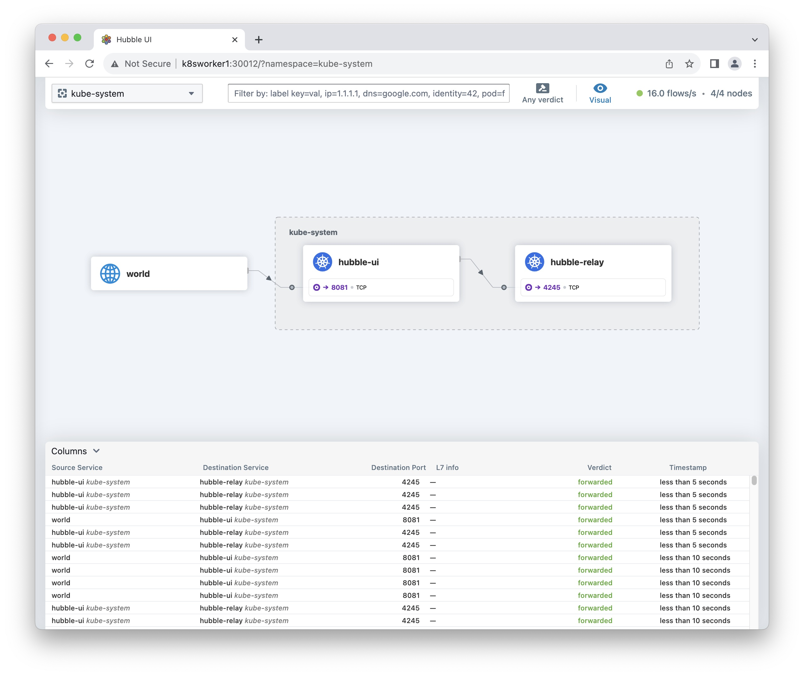

<a name="readme-top"></a>

# Hubble Introduction
Observability is provided by Hubble which enables deep visibility into the communication and behavior of services as well as the networking infrastructure in a completely transparent manner. Hubble is able to provide visibility at the node level, cluster level or even across clusters in a Multi-Cluster (Cluster Mesh) scenario. For an introduction to Hubble and how it relates to Cilium, read the section Introduction to Cilium & Hubble.

By default, the Hubble API is scoped to each individual node on which the Cilium agent runs. In other words, networking visibility is only provided for traffic observed by the local Cilium agent. In this scenario, the only way to interact with the Hubble API is by using the Hubble CLI (hubble) to query the Hubble API provided via a local Unix Domain Socket. The Hubble CLI binary is installed by default on Cilium agent pods.

When Hubble Relay is deployed, Hubble provides full network visibility. In this scenario, the Hubble Relay service provides a Hubble API which scopes the entire cluster or even multiple clusters in a ClusterMesh scenario. Hubble data can be accessed by pointing a Hubble CLI (hubble) to the Hubble Relay service or via Hubble UI. Hubble UI is a web interface which enables automatic discovery of the services dependency graph at the L3/L4 and even L7 layer, allowing user-friendly visualization and filtering of data flows as a service map.

# Setting up Hubble Observability
Hubble is the observability layer of Cilium and can be used to obtain cluster-wide visibility into the network and security layer of your Kubernetes cluster.

# Enable Hubble in Cilium
In order to enable Hubble with `UI`, run the command cilium hubble enable as shown below:
```sh
cilium hubble enable --ui
```
>**Note:** If you don't specify `--ui` now and you try later, you'll get an error message. Just do `cilium hubble disable` and do `cilium hubble enable --ui`.

# Status
Check the status. The result should look like this:
```sh
cilium status
```

Output:
```
    /¯¯\
 /¯¯\__/¯¯\    Cilium:             OK
 \__/¯¯\__/    Operator:           OK
 /¯¯\__/¯¯\    Envoy DaemonSet:    disabled (using embedded mode)
 \__/¯¯\__/    Hubble Relay:       OK
    \__/       ClusterMesh:        disabled

DaemonSet              cilium             Desired: 4, Ready: 4/4, Available: 4/4
Deployment             hubble-ui          Desired: 1, Ready: 1/1, Available: 1/1
Deployment             cilium-operator    Desired: 1, Ready: 1/1, Available: 1/1
Deployment             hubble-relay       Desired: 1, Ready: 1/1, Available: 1/1
Containers:            cilium             Running: 4
                       hubble-ui          Running: 1
                       cilium-operator    Running: 1
                       hubble-relay       Running: 1
Cluster Pods:          4/4 managed by Cilium
Helm chart version:    1.13.4
Image versions         cilium             quay.io/cilium/cilium:v1.13.4@sha256:bde8800d61aaad8b8451b10e247ac7bdeb7af187bb698f83d40ad75a38c1ee6b: 4
                       hubble-ui          quay.io/cilium/hubble-ui:v0.11.0@sha256:bcb369c47cada2d4257d63d3749f7f87c91dde32e010b223597306de95d1ecc8: 1
                       hubble-ui          quay.io/cilium/hubble-ui-backend:v0.11.0@sha256:14c04d11f78da5c363f88592abae8d2ecee3cbe009f443ef11df6ac5f692d839: 1
                       cilium-operator    quay.io/cilium/operator-generic:v1.13.4@sha256:09ab77d324ef4d31f7d341f97ec5a2a4860910076046d57a2d61494d426c6301: 1
                       hubble-relay       quay.io/cilium/hubble-relay:v1.13.4@sha256:bac057a5130cf75adf5bc363292b1f2642c0c460ac9ff018fcae3daf64873871: 1
```
<p align="right">(<a href="#readme-top">back to top</a>)</p>

# Install Hubble Client
In order to access the observability data collected by Hubble, install the Hubble CLI. I did the install on a jump station (a server that is different from the master and worker nodes):
```sh
export HUBBLE_VERSION=$(curl -s https://raw.githubusercontent.com/cilium/hubble/master/stable.txt)
export HUBBLE_ARCH=amd64
echo ${HUBBLE_VERSION}

curl -L --fail --remote-name-all https://github.com/cilium/hubble/releases/download/$HUBBLE_VERSION/hubble-linux-${HUBBLE_ARCH}.tar.gz{,.sha256sum}
sha256sum --check hubble-linux-${HUBBLE_ARCH}.tar.gz.sha256sum
sudo tar xzvfC hubble-linux-${HUBBLE_ARCH}.tar.gz /usr/local/bin
sudo chown root:adm /usr/local/bin/hubble
rm hubble-linux-${HUBBLE_ARCH}.tar.gz{,.sha256sum}
unset HUBBLE_VERSION
unset HUBBLE_ARCH
```

## Validate Hubble API Access
In order to access the Hubble API, create a port forward to the Hubble service from your local machine. This will allow you to connect the Hubble client to the local port 4245 and access the Hubble Relay service in your Kubernetes cluster. For more information on this method, see Use Port Forwarding to Access Application in a Cluster.

In a different terminal, do port forward to hubble-relay:
```sh
kubectl port-forward -n kube-system deployment/hubble-relay 54245:4245
```

Output:
```
    Forwarding from 127.0.0.1:54245 -> 4245
```

Now you can validate that you can access the Hubble API from **another terminal** with the CLI you just installed:
```sh
hubble --server localhost:54245 status
```

Output:
```
  Healthcheck (via localhost:54245): Ok
  Current/Max Flows: 2,011/16,380 (12.28%)
  Flows/s: 13.32
  Connected Nodes: 4/4
```

You can also query the flow API and look for flows:
```sh
hubble observe --server localhost:54245 -f
hubble observe --server localhost:54245 --verdict DROPPED -f
```

>Hit Ctrl-C to terminate the port-forward.

<p align="right">(<a href="#readme-top">back to top</a>)</p>

# Hubble UI
Usually you will never access the Hubble UI directly from a K8s node. You will access it from a management server elsewhere in your network. I made a simple `yaml` file to expose a port on each K8s node with `nodePort`. You can access the UI with a browser pointing to any K8s worker **node's** IP address.

```sh
cat <<EOF | tee hubble-nodeport-ui.yaml
# hubble-nodeport-ui.yaml
# It will expose node port permanently.
# http://<K8s node IP>:30012

apiVersion: v1
kind: Service
metadata:
  name: hubble-nodeport-ui
  namespace: kube-system
spec:
  type: NodePort
  selector:
    k8s-app: hubble-ui # label of the Deployment
  ports:
    - name: hubble-nodeport-ui
      protocol: TCP
      port: 12000        # port exposed internally in the cluster
      targetPort: 8081   # the container port to send requests to
      nodePort: 30012    # port assigned on each the node for external access
EOF
```

Create the `nodePort` with the command:
```sh
kubectl apply -f hubble-nodeport-ui.yaml
```

Point your browser to `http://<K8s node IP>:30012`. All the following URL's will work:
- http://k8smaster1:30012/
- http://k8sworker1:30012/
- http://k8sworker2:30012/
- http://k8sworker3:30012/

Example of the Hubble UI:



>If you want to remove the service, use the command:
```sh
 kubectl delete -f hubble-nodeport-ui.yaml
 ```

# Edit Cilium configmap:
Proceed with Caution, changing advanced configuration preferences can impact Cilium performance or security.

If you don't know what your doing, stay away from this 😀
```sh
kubectl edit configmap cilium-config -n kube-system
```

# References
[Introduction to Hubble](https://docs.cilium.io/en/stable/gettingstarted/hubble_intro/)  
[Hubble Installation](https://docs.cilium.io/en/stable/gettingstarted/hubble_setup/)  
[Great Troubleshooting Guide](https://fossies.org/linux/cilium/Documentation/operations/troubleshooting.rst)  

<p align="right">(<a href="#readme-top">back to top</a>)</p>
