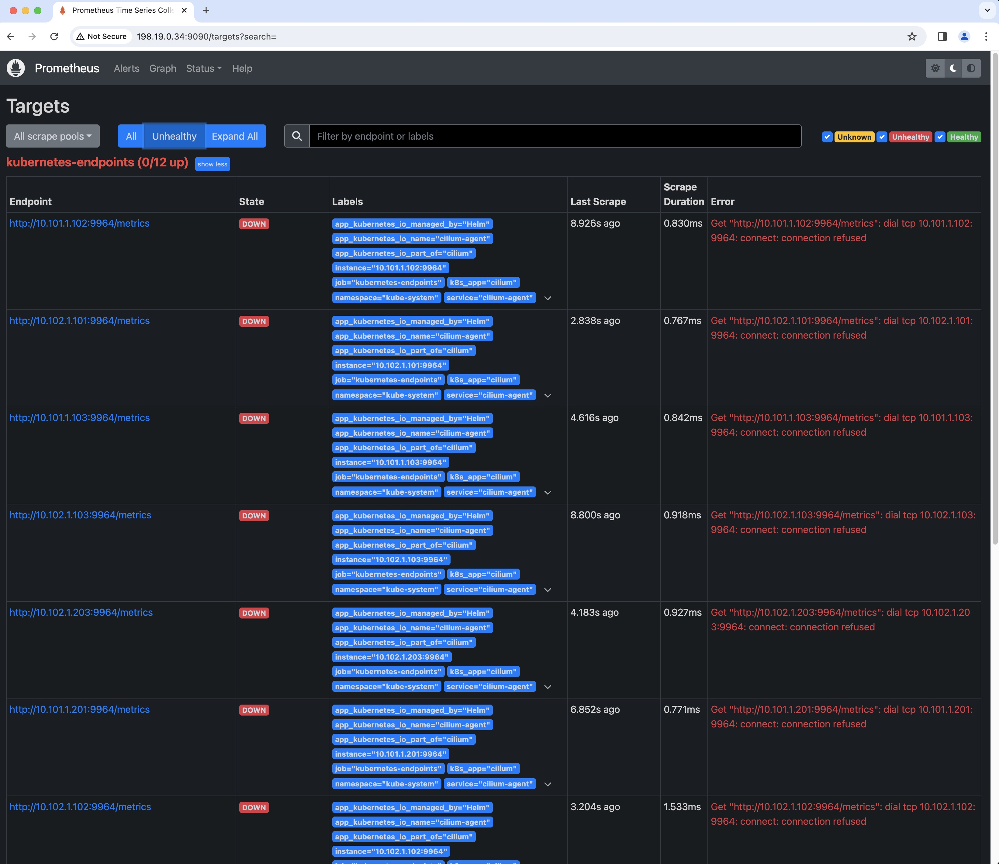

# Install Prometheus & Grafana
This is an example on how to deploy Prometheus and Grafana with Cilium.

The default installation contains:
- Grafana: A visualization dashboard with Cilium Dashboard pre-loaded.
- Prometheus: a time series database and monitoring system.

This assume you have the latest Cilium installed, if not make sure the variable ${CILIUM_VER} reflects your real version:
```sh
CILIUM_VER=$(curl -s https://api.github.com/repos/cilium/cilium/releases/latest | grep tag_name | cut -d '"' -f 4|sed 's/v//g')
echo ${CILIUM_VER}
curl -LO https://raw.githubusercontent.com/cilium/cilium/${CILIUM_VER}/examples/kubernetes/addons/prometheus/monitoring-example.yaml
```

If you use the default Cilium `monitoring-example.yaml` it will never work 😀 Use your prefered text editor and change the following values in the `yaml` file or use [this YAML file](./monitoring-example.yaml).

```
# Not mandatory but I wanted to use the latest at the time of this writing
image: "docker.io/grafana/grafana:10.2.3"
# It was set to 'true'
cookie_secure = false
# Not mandatory but why not
org_name = kloud.lan
#################################### Basic Auth ##########################
# [auth.basic]
enabled = true

# Prometheus version
image: "prom/prometheus:v2.48.1"
```

To print the latest version number of Grafana and Prometheus use the commands:
```sh
printf "Latest version of Grafana is %s\n" $(curl -s https://api.github.com/repos/grafana/grafana/releases/latest | grep tag_name | cut -d '"' -f 4|sed 's/v//g')
printf "Latest version of Prometheus is %s\n" $(curl -s https://api.github.com/repos/prometheus/prometheus/releases/latest | grep tag_name | cut -d '"' -f 4|sed 's/v//g')
```

Install Grafana and Prometheus with the command:
```sh
kubectl apply -f monitoring-example.yaml
```

Output:
```
1.14.5
namespace/cilium-monitoring created
serviceaccount/prometheus-k8s created
configmap/grafana-config created
configmap/grafana-cilium-dashboard created
configmap/grafana-cilium-operator-dashboard created
configmap/grafana-hubble-dashboard created
configmap/grafana-hubble-l7-http-metrics-by-workload created
configmap/prometheus created
clusterrole.rbac.authorization.k8s.io/prometheus created
clusterrolebinding.rbac.authorization.k8s.io/prometheus created
service/grafana created
service/prometheus created
deployment.apps/grafana created
deployment.apps/prometheus created
```

This example deployment of Prometheus and Grafana will automatically scrape the Cilium and Hubble metrics.

## Activate Cilium and Hubble metrics
Cilium, Hubble, and Cilium Operator do not expose metrics by default. Enabling metrics for these services will open ports `9962`, `9965`, and `9963` respectively on all nodes of your cluster where these components are running.

The metrics for Cilium, Hubble, and Cilium Operator can all be enabled independently of each other with the following Helm values:
- `prometheus.enabled=true`: Enables metrics for cilium-agent.
- `operator.prometheus.enabled=true`: Enables metrics for cilium-operator.
- `hubble.metrics.enabled`: Enables the provided list of Hubble metrics. For Hubble metrics to work, Hubble itself needs to be enabled with `hubble.enabled=true`.

```sh
helm upgrade cilium cilium/cilium --version ${CILIUM_VER} \
  --namespace kube-system \
  --reuse-values \
  --set prometheus.enabled=true \
  --set operator.prometheus.enabled=true \
  --set hubble.enabled=true \
  --set hubble.metrics.enableOpenMetrics=true \
  --set hubble.metrics.enabled="{dns,drop,tcp,flow,port-distribution,icmp,httpV2:exemplars=true;labelsContext=source_ip\,source_namespace\,source_workload\,destination_ip\,destination_namespace\,destination_workload\,traffic_direction}"
```

Output:
```
Release "cilium" has been upgraded. Happy Helming!
NAME: cilium
LAST DEPLOYED: Fri Dec 29 11:15:13 2023
NAMESPACE: kube-system
STATUS: deployed
REVISION: 4
TEST SUITE: None
NOTES:
You have successfully installed Cilium with Hubble Relay and Hubble UI.

Your release version is 1.14.5.

For any further help, visit https://docs.cilium.io/en/v1.14/gettinghelp
```

# Web UI
Grafana and Prometheus both have a GUI that can be access with your prefered browser. In my case, I use BGP and advertise the `EXTERNAL-IP`, so let's add one for every services below.
```sh
kubectl get services -n cilium-monitoring
```

We see that we have no `EXTERNAL-IP` for our services. Let's add IP's
```
NAME         TYPE        CLUSTER-IP     EXTERNAL-IP   PORT(S)    AGE
grafana      ClusterIP   198.18.0.67    <none>        3000/TCP   94s
prometheus   ClusterIP   198.18.0.125   <none>        9090/TCP   93s
```

## Create IP Pool
Below is a manifest to create an IP Pools with IPv4 only and a selector based on the NameSpace named `cilium-monitoring`. This is where Prometheus and Grafana web Pod are located. We need `EXTERNAL-IP` for Prometheus and Grafana Pod so they can be reached from outside our Kubernetes Cluster.

Create the pool of `EXTERNAL-IP` with the command:
```sh
cat <<EOF | kubectl apply -f -
apiVersion: "cilium.io/v2alpha1"
kind: CiliumLoadBalancerIPPool
metadata:
  name: "cilium-monitoring-pool"
spec:
  cidrs:
  - cidr: "198.19.0.32/29"
  serviceSelector:
    matchLabels:
      io.kubernetes.service.namespace: cilium-monitoring
EOF
```

## How to access Grafana
To allocate an `EXTERNAL-IP` to the `grafana` service without allocation a `targetPort`, we need to change the type of service from type `ClusterIP` to type `LoadBalancer`:
```sh
kubectl patch services -n cilium-monitoring grafana --type=json -p '[{"op":"replace","path":"/spec/type","value":"LoadBalancer"},{"op":"add","path":"/spec/allocateLoadBalancerNodePorts","value":false}]'
```

Get the IP address with the command:
```sh
kubectl get services -n cilium-monitoring grafana
kubectl get services -n cilium-monitoring grafana -o jsonpath='{.status.loadBalancer.ingress[0].ip}{"\n"}'
```

Output:
```
NAME      TYPE           CLUSTER-IP    EXTERNAL-IP   PORT(S)    AGE
grafana   LoadBalancer   198.18.0.67   198.19.0.36   3000/TCP   9m34s
```

Access it via your browser: http://198.19.0.36:3000/login

You should see this screen:


The initial username and password is `admin` for both. They can be found in the file `monitoring-example.yaml` near line 100. You will be prompted to change the password.

Just in case you need to change the admin password for Grafana, here a single command to change the password:
```sh
kubectl exec -it $(kubectl get pods --no-headers -o custom-columns=":metadata.name" -n cilium-monitoring | grep grafana) -n cilium-monitoring -- grafana-cli admin reset-admin-password <your new password>
```

## How to access Prometheus
To allocate an `EXTERNAL-IP` to the `prometheus` service without allocation a `targetPort`, we need to change the type of service from type `ClusterIP` to type `LoadBalancer`:
```sh
kubectl patch services -n cilium-monitoring prometheus --type=json -p '[{"op":"replace","path":"/spec/type","value":"LoadBalancer"},{"op":"add","path":"/spec/allocateLoadBalancerNodePorts","value":false}]'
```

Get the IP address with the command:
```sh
kubectl get services -n cilium-monitoring prometheus
kubectl get services -n cilium-monitoring prometheus -o jsonpath='{.status.loadBalancer.ingress[0].ip}{"\n"}'
```

Output:
```
NAME         TYPE           CLUSTER-IP     EXTERNAL-IP   PORT(S)    AGE
prometheus   LoadBalancer   198.18.0.125   198.19.0.33   9090/TCP   11m
```

Access it via your browser: http://198.19.0.33:9090

# References
[Grafana on GitHub](https://github.com/grafana/grafana/)  

---

# Error scraping
If you get the error `Get "http://x.x.x.x:9964/metrics": dial tcp x.x.x.x:9964: connect: connection refused` on `cilium-agent`, read the following.



I checked on one master node and found that nothing was listening on port `9964`. I used socket statistics to see what were the ports opened and I tried them all. In my case port `9963` was the one for cilium-agent.
```sh
daniel@k8s1master1 ~ $ ss -l | grep 996
tcp   LISTEN 0      4096                                                                                    *:9962                           *:*          
tcp   LISTEN 0      4096                                                                                    *:9963                           *:*          
tcp   LISTEN 0      4096                                                                                    *:9965                           *:*          
```

I edited the service and changed the port to `9963`
```sh
kubectl edit -n kube-system svc cilium-agent
```
