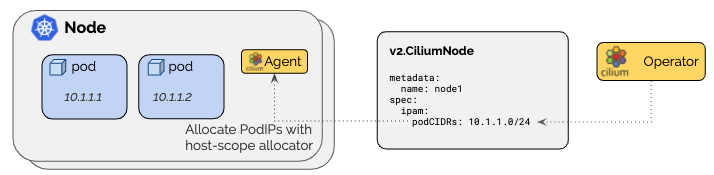
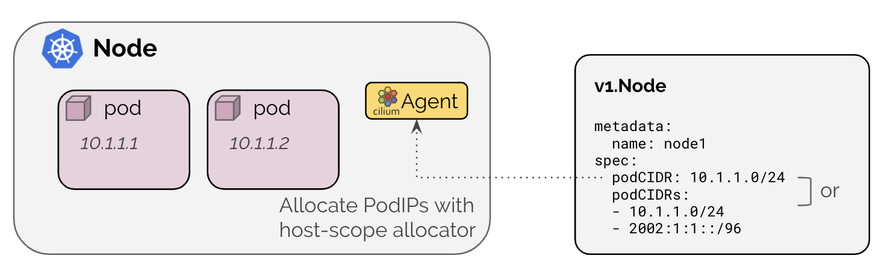

<a name="readme-top"></a>

# IPAM Allocation
After installing Cilium, I noticed that my pods were getting IP addresses from Cilium's IPAM and not from Kubernetes. I decided to fix this behavior and have Kubernetes allocated IP addresses from the pool I configured when I bootstrapped the Cluster.

Here's a example of a simple deployment. The IP addresses came from `10.0.0./8`.
```sh
kubectl get pods -n alpine -o=wide
```

```
NAME                                 READY   STATUS        RESTARTS   AGE   IP           NODE                     NOMINATED NODE   READINESS GATES
alpine-deployment-7b94455bbd-2jv56   1/1     Terminating   0          36s   10.0.1.130   k8sworker3.isociel.com   <none>           <none>
alpine-deployment-7b94455bbd-66txb   1/1     Terminating   0          36s   10.0.0.26    k8sworker1.isociel.com   <none>           <none>
alpine-deployment-7b94455bbd-7v8rt   1/1     Terminating   0          36s   10.0.2.26    k8sworker2.isociel.com   <none>           <none>
```

### NOTE: Changing the `clusterPoolIPv4PodCIDR` in a running cluster is not really supported, it can only be set at installation time. To change it, one has to remove all nodes from the cluster first, remove all CiliumNode objects (or remove their old pod CIDR) and then add the nodes back in, so the cilium agents can allocate new pod CIDRs from the new `clusterPoolIPv4PodCIDR`. The operator will never remove existing podCIDRs from nodes, even if they don't belong to the new `clusterPoolIPv4PodCIDR`. Instead, it will populate `status.ipam.operator-status` with the message: `error: allocator not configured for the requested CIDR 10.0.0.0/24.` [See issue 23872](https://github.com/cilium/cilium/issues/23872)

# Cluster Scope (Default)
The cluster-scope IPAM mode assigns per-node PodCIDRs to each node and allocates IPs using a host-scope allocator on each node. It is thus similar to the Kubernetes Host Scope mode. The difference is that instead of Kubernetes assigning the per-node PodCIDRs via the Kubernetes `v1.Node` resource, the Cilium operator will manage the per-node PodCIDRs via the `v2.CiliumNode` resource. The advantage of this mode is that it does not depend on Kubernetes being configured to hand out per-node PodCIDRs.



# Kubernetes Host Scope
The Kubernetes host-scope IPAM mode is enabled with `ipam: kubernetes` and delegates the address allocation to each individual node in the cluster. IPs are allocated out of the PodCIDR range associated to each node by Kubernetes.



# Check Cilium node CIDRs
Get the Cilium Pods CIDR information:
```sh
kubectl get configmap/cilium-config -n kube-system -o go-template='{{.data.ipam}}{{"\n"}}{{index .data "cluster-pool-ipv4-cidr"}}{{"\n"}}{{index .data "cluster-pool-ipv4-mask-size"}}{{"\n"}}'
```

>The `index` keyword is to escape the `-` in the name "cluster-pool-ipv4-cidr" 😉

Output:
```
10.0.0.0/8
```

10.0.0.0/8 is the default pod CIDR of Cilium and I wanted to change that.

You can solve it in two ways:

1. Explicitly set `clusterPoolIPv4PodCIDRList` to a non-conflicting CIDR
2. Use a different CIDR for your nodes

I choosed option 2 and let Kubernetes assign IP addresses to Pods.

# Get Node Information (Optional)
Retreive the nodes information. We are only interested in the IPv4 allocation for Pods on each node of the K8s Cluster:
```sh
kubectl get ciliumnodes -o go-template='{{- range .items -}}NODE: {{.metadata.name}}IPv4 Range: {{.spec.ipam.podCIDRs}}{{"\n"}}{{- end -}}'
```

Output:
```
NODE: k8smaster1.isociel.comIPv4 Range: [10.0.3.0/24]
NODE: k8sworker1.isociel.comIPv4 Range: [10.0.0.0/24]
NODE: k8sworker2.isociel.comIPv4 Range: [10.0.2.0/24]
NODE: k8sworker3.isociel.comIPv4 Range: [10.0.1.0/24]
```
<p align="right">(<a href="#readme-top">back to top</a>)</p>

# Edit Cilium configmap:
There's two ways to change the configuration:
1. Edit Cilium ConfigMap (with VI)
2. Just patch it with `kubectl`

>Again, I choosed option 2.

If you don't know what your doing, stay away from this 😀

Optional: Yoy can take a backup copy of the configuration before making any changes with the command (juts pipe to a file):
```sh
kubectl get configmap/cilium-config -n kube-system -o yaml
```

### 1. Edit ConfigMap 
Proceed with Caution, changing advanced configuration preferences can impact Cilium performance or security.
```sh
kubectl edit configmap cilium-config -n kube-system
```

### 2. Just patch it with `kubectl`
Patch the configuration with the command below:
```sh
kubectl patch configmap/cilium-config -n kube-system --type merge -p '{"data":{"ipam":"kubernetes"}}'
```

>Replace `"kubernetes"` by `"cluster-role"` for Cilium to allocate the Pod IP's

The change will not affect running pods. They must be deleted manually to pick up any changes:
```sh
kubectl delete pods -n kube-system -l app.kubernetes.io/name=cilium-agent
kubectl delete pods -n kube-system -l app.kubernetes.io/name=hubble-relay
```

>I had Hubble, so I needed to also delete this Pod.

# Test IPAM
I restarted my small deployment and now the IP addresses came from Kubernetes.

```sh
kubectl get pods -n alpine -o=wide
```

```
NAME                                 READY   STATUS    RESTARTS   AGE   IP              NODE                     NOMINATED NODE   READINESS GATES
alpine-deployment-7b94455bbd-n8wxm   1/1     Running   0          10s   10.224.33.77    k8sworker2.isociel.com   <none>           <none>
alpine-deployment-7b94455bbd-nnnh5   1/1     Running   0          10s   10.224.26.188   k8sworker1.isociel.com   <none>           <none>
alpine-deployment-7b94455bbd-w24v6   1/1     Running   0          10s   10.224.63.12    k8sworker3.isociel.com   <none>           <none>
```

# Troubleshooting  (Optional)
Look for allocation errors. Check the Error field in the status.ipam.operator-status field:
```sh
kubectl get ciliumnodes -o jsonpath='{range .items[*]}{.metadata.name}{"\t"}{.status.ipam.operator-status}{"\n"}{end}'
```

Normal output:
```
k8smaster1.isociel.com	{}
k8sworker1.isociel.com	{}
k8sworker2.isociel.com	{}
k8sworker3.isociel.com	{}
```

# References
[Cilium IP Address Management (IPAM)](https://docs.cilium.io/en/stable/network/concepts/ipam/)  
[Go Template](https://cloud.redhat.com/blog/customizing-oc-output-with-go-templates)  
[Great Troubleshooting Guide](https://fossies.org/linux/cilium/Documentation/operations/troubleshooting.rst)  

<p align="right">(<a href="#readme-top">back to top</a>)</p>


kubectl patch configmap/cilium-config -n kube-system --type merge -p '{"data":{"ipam":"kubernetes"}}'
kubectl patch configmap/cilium-config -n kube-system --type merge -p '{"data":{"cluster-pool-ipv4-cidr":"192.168.255.0/30"}}'
kubectl get ciliumnodes -o yaml
