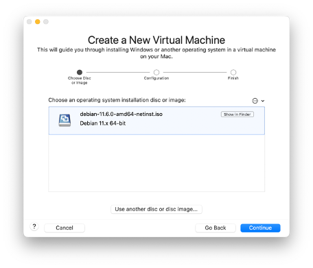
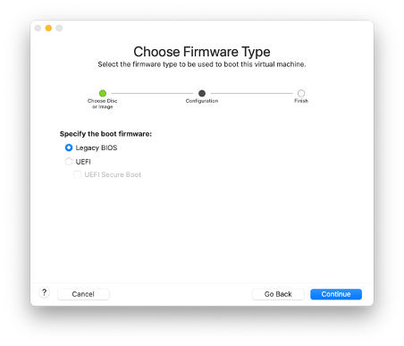
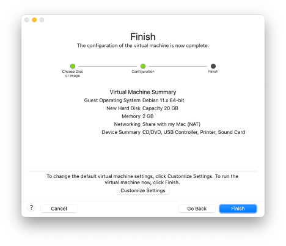
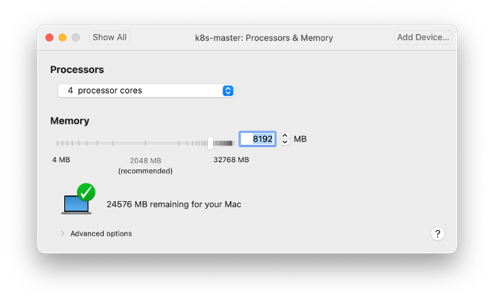
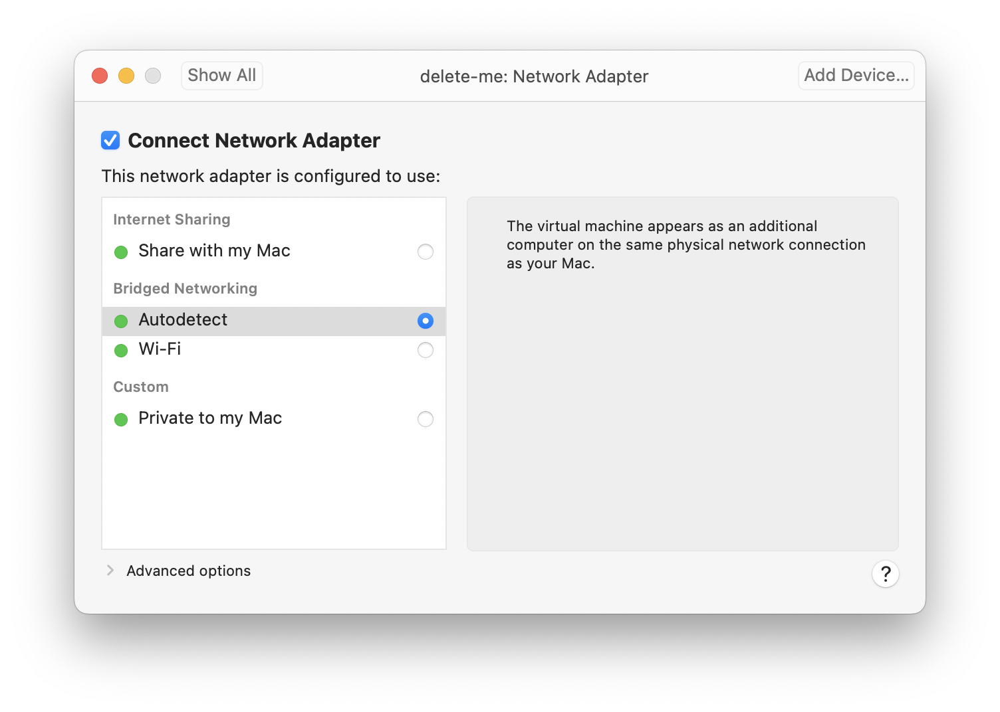
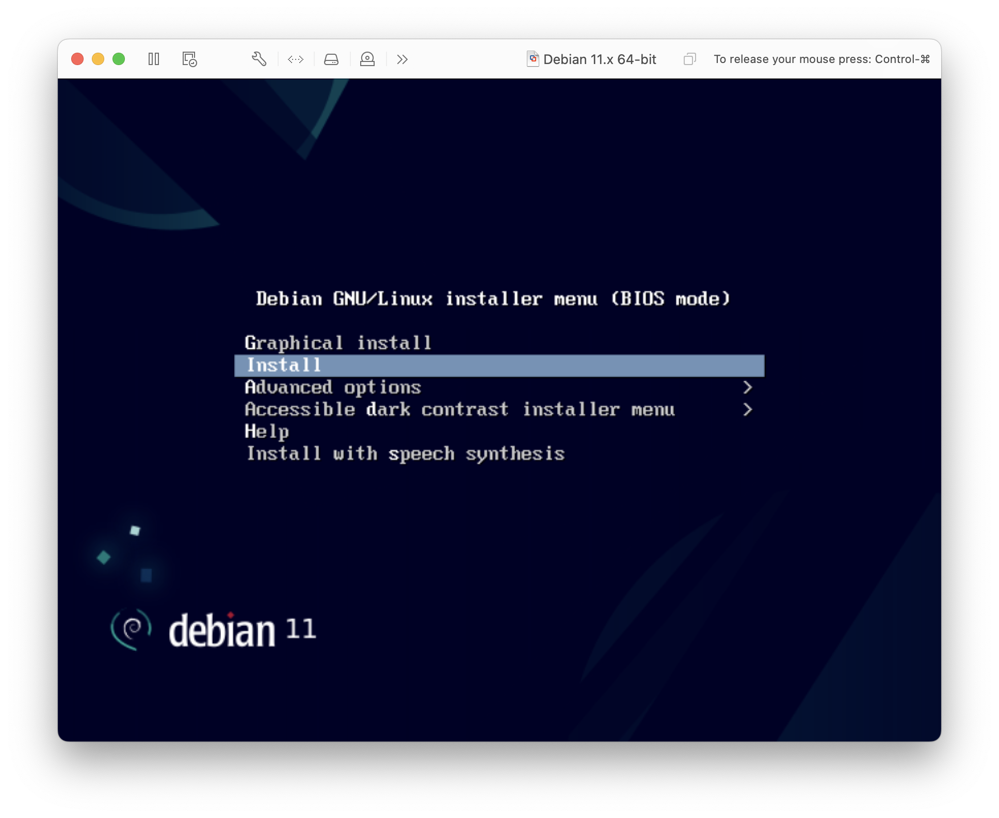
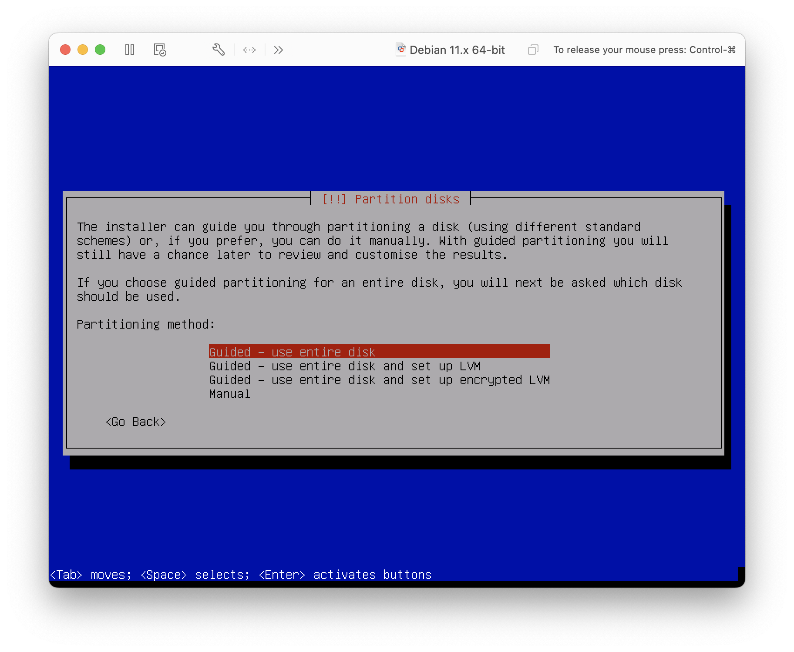
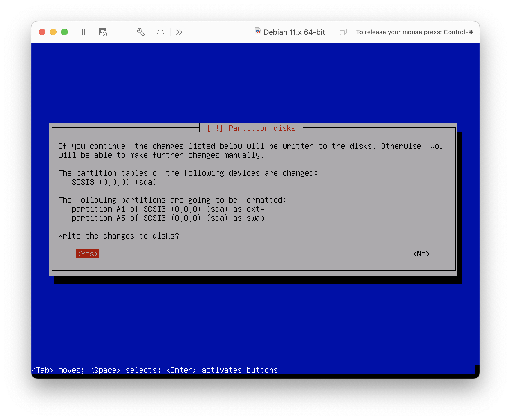

<a name="readme-top"></a>

# Setup a Kubernetes Cluster with Kubeadm on Debian 11
## Last Version
|Name|Version|
|:---|:---|
|**VMware Fusion**|13.0.1|
|**Debian Bullseye**|11.7.0|
|**Kernel**|6.1.15-1|
|**Docker-CE**|23.0.5|
|**K8s**|1.27.1|
|**Cilium**|1.13.1|
|**cri-dockerd**|0.3.1|

# Introduction
The step-by-step guide demonstrates you how to install Kubernetes cluster on Debian 11 with Kubeadm utility for a Learning environment. All the Debian hosts are running as VMs with VMware Fusion.

This Kubernetes (K8s) cluster have one master and two worker nodes. Master node works as the control plane and the worker nodes runs the actual container(s).

**This tutorial in not meant for production installation and is not a tutorial on Debian intallation**. The tutorial main goal is to understand how to install a basic K8s cluster.

In this tutorial, you will set up a Kubernetes Cluster by:

- Setting up three Debian 11 virtual machines with a Kernel 6.1.x
- Installing Docker-CE and Docker Compose plugin
- Installing CRI-Docker plugin
- Installing Kubernetes kubelet, kubeadm, and kubectl
- Installing a CNI Plugin (Cilium)
- Configuring Docker as the container runtime for Kubernetes
- Initializing one K8s master node and adding two worker nodes

At the end you will have a complete K8s cluster ready to run your microservices.

# Prerequisites
To complete this tutorial, you will need the following:

- Three or more physical/virtual Debian 11 servers
    - if you already have 3 Debian 11 installed, skip to <a href="#docker-ce">Docker-CE</a>
- Minimum of 2 CPU / vCPU with 8 GB RAM for the master node (Nothing as such is required for the slave node)
- 20 GB free disk space
- Internet Connectivity

# Lab Setup
For this tutorial, I will be using three Debian 11 systems with following hostnames, IP addresses, OS, Kernel:

## Configurations
|Role|FQDN|IP|OS|Kernel|RAM|CPU|
|----|----|----|----|----|----|----|
|Master|k8smaster1.example.com|192.168.13.30|Debian 11.7|6.1.0-0|4G|4|
|Worker|k8sworker1.example.com|192.168.13.31|Debian 11.7|6.1.0-0|4G|4|
|Worker|k8sworker2.example.com|192.168.13.32|Debian 11.7|6.1.0-0|4G|4|

<p align="right">(<a href="#readme-top">back to top</a>)</p>

# Download the ISO file
Download the [debian-11.7.0-amd64-netinst.iso](https://cdimage.debian.org/debian-cd/current/amd64/iso-cd/debian-11.7.0-amd64-netinst.iso) from a Debian mirror site. I used cluster-info the net install ISO.

If the link is broken, that means there's a new version, browse [here](https://www.debian.org/CD/netinst/) and select the `netinst` image.


# Create the virtual Machine (VMware Fusion)
I'm using VMware Fusion standard edition to create the Debian 11 VMs. It will work with vSphere 7.x

- Create a new virtual machine



- Choose the ISO and select the Legacy BIOS option



- Review and start the installation



- Make sure you have at least two vCPU (required for the master node)



- Choose Bridged Networking (the VMs in part of your local network)



<p align="right">(<a href="#readme-top">back to top</a>)</p>

# Start the installation of Debian Linux
Choose standard text installation



For the next few questions, choose you're
- Keyboard
- Location
- Hostname and domain name
- Root password
- Non-administrative username/password
- Timezone

Choose Guided - use entire disk


Don't forget to write the change to the disk 😀


Make sure you unselect any graphical user interface and you install SSH server


## Finalize Debian installation
Use the VMware console to login with the `root` user account.

### Get the IP address of the VM
Find your network interface name and ip address with the command:

    ip addr

### Use SSH to access the VM
Use SSH to access the VM, you'll have access to copy/paste. You should have the IP address from the step above. Use the non-administrative user since `root` is not allowed to SSH.
    ssh -l <USERNAME> 192.168.13.xxx

### Add sudo
Elevate yourself to `root`, install `sudo` and give your normal user `sudo` privileges. You won't have to enter your password each time you use `sudo`.

```sh
su - root
apt install -y sudo
```

Add you username to `sudo`. Change `<USERNAME>` to your real username before pasting the command.
```sh
echo "<USERNAME> ALL=(ALL:ALL) NOPASSWD: ALL" | sudo tee /etc/sudoers.d/<USERNAME>
```


### Configuring static IP address
Edit the `interfaces` file to configure a static IP address:
>I used `nano`since there's some anoying issues with VI ... that we will fixed soon 😉

    sudo nano /etc/network/interfaces

Add the following lines (adapt to your network):

    allow-hotplug ens33
    iface ens33 inet static
        address 192.168.13.xx/24
        gateway 192.168.13.1
        # dns-* options are implemented by the resolvconf package, if installed
        dns-nameservers 9.9.9.9
        dns-search example.com

Log off completely and login again with your normal username.

## Add entries in /etc/hosts
    cat >> /etc/hosts << "EOF"
    192.168.13.30   k8smaster1.example.com
    192.168.13.31   k8sworker1.example.com
    192.168.13.32   k8sworker2.example.com
    EOF

### Installing Linux kernel 6.x on Debian 11 (Optional)
I wanted to have a Linux kernel 6.x in my lab.

    echo "deb http://deb.debian.org/debian bullseye-backports main" | sudo tee -a /etc/apt/sources.list
    sudo apt update

Install the new kernel with the following command:
```sh
sudo apt -t bullseye-backports upgrade
```

Once the Kernel has been installed, reboot the server with the command:
```sh
sudo init 6
```

List old kernels, they will be deleted to free disk space.
```sh
dpkg --list | grep linux-image
```

Remove old kernels with the command:
```sh
sudo apt-get --purge remove linux-image-5.10.0-20-amd64 linux-image-5.10.0-21-amd64
```

After removing the old kernel, it's time to update the grub2 configuration:
```sh
sudo update-grub2
```

Generate ECC SSH public/private key pair
```sh
ssh-keygen -q -t ecdsa -N '' -f ~/.ssh/id_ecdsa <<<y >/dev/null 2>&1
```

Copy SSH public key from VMware host to master and worker nodes:
```sh
ssh-copy-id -i ~/.ssh/id_ecdsa.pub 192.168.13.3[0-2]
```

K8s requires that swap partition is disabled on master and worker node of a cluster.

Disable swap and make it permanent with those commands:
```sh
sudo swapoff -a
sudo sed -i '/swap/ s/./# &/' /etc/fstab
```

### Fix backspace/arrows issue with VI in edit mode (Optional)
As stated earlier, I had issues with with `vi`. The backspace was not working and up/down/left/right arrows had strange behavior. To fix the issue the following commands will create a file `.vimrc` with 2 commands:

```sh
cat > ~/.vimrc << "EOF"
:set nocompatible
:set backspace=indent,eol,start
EOF
```

>**Note:** Do it for `root`, so when use do `sudo vi <filename>` it will also be applied.

### Terminal color (Optional)
If you like a terminal with colors, add those lines to `~/.bashrc`:
```sh
NORMAL="\[\e[0m\]"
RED="\[\e[1;31m\]"
GREEN="\[\e[1;32m\]"
if [[ $EUID = 0 ]]; then
  PS1="$RED\u [ $NORMAL\w$RED ]# $NORMAL"
else
  PS1="$GREEN\u [ $NORMAL\w$GREEN ]\$ $NORMAL"
fi
 
unset RED GREEN NORMAL
```

You should have a standard Debian 11 installation with no graphical user interface, a non-administrative user account with `sudo` and SSH server.

<a name="docker-ce"></a>
<p align="right">(<a href="#readme-top">back to top</a>)</p>

# Install Docker-CE on Debian 11
For this tutorial, I'm using Docker container runtime. I will publish soon a tutorial on how to migrate an existing K8s cluster from Docker engine to containerd. This is applicable to master and worker node in a K8s cluster.

Install Prerequisites:
```sh
sudo apt install -y apt-transport-https ca-certificates curl gnupg lsb-release
```

Add Docker's Official GPG Key:
```sh
curl -fsSL https://download.docker.com/linux/debian/gpg | sudo gpg --dearmor -o /usr/share/keyrings/docker.gpg
```

Add Docker Repo to Debian 11:
```sh
echo "deb [arch=$(dpkg --print-architecture) signed-by=/usr/share/keyrings/docker.gpg] https://download.docker.com/linux/debian $(lsb_release -cs) stable" | sudo tee /etc/apt/sources.list.d/docker.list > /dev/null
```

Refresh the package list:
```sh
sudo apt update
```

To install the latest up-to-date Docker release on Debian, run the below command:
```sh
sudo apt install -y docker-ce docker-ce-cli containerd.io docker-buildx-plugin docker-compose-plugin
```

Check the Docker service status using the following command:
```sh
sudo systemctl is-active docker
```

Enabling your non-root user to run Docker commands without using `sudo` (Log out from the current terminal and log back in)
```sh
sudo usermod -aG docker ${USER}
```
>**Note**: Logoff and login

Check Docker's version (without sudo):
```sh
docker version
docker compose version
```

Verify that Docker is running:
```sh
sudo systemctl status docker.service
sudo systemctl status docker.socket
sudo systemctl status containerd.service
```

Docker bash completion: If you installed `docker-ce-cli` package, it already ships with bash-completion files:
```sh
dpkg -L docker-ce-cli | grep completion
```

The steps above installed the following Docker components:

- docker-ce: The Docker engine itself.
- docker-ce-cli: A command line tool that lets you talk to the Docker daemon.
- containerd.io: A container runtime that manages the container’s lifecycle.
- docker-buildx-plugin: A CLI plugin that extends the Docker build with many new features.
- docker-compose-plugin: A configuration management plugin to orchestrate the creation and management of Docker containers through compose files.

<a name="cri-docker"></a>
<p align="right">(<a href="#readme-top">back to top</a>)</p>

# Install cri-dockerd on Debian 11
Dockershim has been removed from the Kubernetes project as of release 1.24. You need to install a container runtime into each node in the cluster so that Pods can run there. This section outlines what is involved and describes related tasks for setting up nodes. Kubernetes 1.26 requires that you use a runtime that conforms with the Container Runtime Interface (CRI).

Common container runtimes with Kubernetes:
- containerd
- CRI-O
- Docker Engine
- Mirantis Container Runtime

>**Note**: Kubernetes releases before v1.24 included a direct integration with Docker Engine, using a component named `dockershim`. That special direct integration is no longer part of Kubernetes.

These instructions show how to install `cri-dockerd` adapter to integrate Docker runtime engine with Kubernetes.

1. Let's get the latest release version of `cri-docker`:
```sh
VER=$(curl -s https://api.github.com/repos/Mirantis/cri-dockerd/releases/latest|grep tag_name | cut -d '"' -f 4|sed 's/v//g')

echo $VER
```

2. Download and extract the archive file from Github `cri-docker` releases page:

```sh
wget https://github.com/Mirantis/cri-dockerd/releases/download/v${VER}/cri-dockerd-${VER}.amd64.tgz
tar xvf cri-dockerd-${VER}.amd64.tgz
```

3. Move `cri-dockerd` binary package to `/usr/local/bin` directory with the command:

```sh
sudo mv cri-dockerd/cri-dockerd /usr/local/bin/
```

4. Validate successful installation by running the command below:

```sh
cri-dockerd --version
```

5. Change owner:
```sh
sudo chown root:root /usr/local/bin/cri-dockerd
```

6. Configure systemd units for cri-dockerd:
```sh
wget https://raw.githubusercontent.com/Mirantis/cri-dockerd/master/packaging/systemd/cri-docker.service
wget https://raw.githubusercontent.com/Mirantis/cri-dockerd/master/packaging/systemd/cri-docker.socket
sudo mv cri-docker.socket cri-docker.service /etc/systemd/system/
sudo sed -i -e 's,/usr/bin/cri-dockerd,/usr/local/bin/cri-dockerd,' /etc/systemd/system/cri-docker.service
```

7. Start and enable the services with the following commands:

```sh
sudo systemctl daemon-reload
sudo systemctl enable cri-docker.service
sudo systemctl enable --now cri-docker.socket
```

Check the status of the services with the commands:

```sh
sudo systemctl status cri-docker.service
sudo systemctl status cri-docker.socket
```

>For `cri-dockerd`, the CRI socket is `/run/cri-dockerd.sock` by default.

8. Clean up the package downloaded:
```sh
rm -rf cri-dockerd cri-dockerd-${VER}.amd64.tgz
```

<a name="k8s"></a>
<p align="right">(<a href="#readme-top">back to top</a>)</p>

# Install K8s (master & worker)
Finally the fun part 😀  
This needs to be done on both the Master(s) and the Worker(s) nodes of a K8s cluster..

Install packages dependency (should already be installed from the Docker section):
```sh
sudo apt install -y apt-transport-https ca-certificates curl
```

Download the Google Cloud public (GCP) signing key using curl command:
```sh
sudo curl -fsSLo /usr/share/keyrings/kubernetes-archive-keyring.gpg https://packages.cloud.google.com/apt/doc/apt-key.gpg
```

Add Kubernetes APT Repository:
```sh
echo "deb [signed-by=/usr/share/keyrings/kubernetes-archive-keyring.gpg] https://apt.kubernetes.io/ kubernetes-xenial main" | sudo tee /etc/apt/sources.list.d/kubernetes.list
```

Update the software package index:
```sh
sudo apt update
```

Install Kubernetes with the following commands:
```sh
sudo apt install kubectl kubeadm kubelet kubernetes-cni
```

Optional:
This will make sure that `apt upgrade` win't upgrade K8s.
```sh
sudo apt-mark hold kubelet kubeadm kubectl
```

Verify K8s version (v1.27.1):
```sh
kubectl version --output=yaml
kubeadm version --output=yaml
kubectl version --output=yaml
```

Enable kubectl autocompletion for Bash:
```sh
sudo kubectl completion bash | sudo tee /etc/bash_completion.d/kubectl > /dev/null
```

After reloading your shell, kubectl autocompletion should be working.
```sh
source ~/.bashrc
```

<a name="k8s-master"></a>
<p align="right">(<a href="#readme-top">back to top</a>)</p>

# Configure a K8s master node
This should only be done on the **master node** of a K8s cluster and **ONE** time only. Initialize the master node with the command:
```sh
sudo kubeadm init --cri-socket unix:///var/run/cri-dockerd.sock
```

This should be the result of the `kubeadm init` command:

    Your Kubernetes control-plane has initialized successfully!

    To start using your cluster, you need to run the following as a regular user:

    mkdir -p $HOME/.kube
    sudo cp -i /etc/kubernetes/admin.conf $HOME/.kube/config
    sudo chown $(id -u):$(id -g) $HOME/.kube/config

    Alternatively, if you are the root user, you can run:

    export KUBECONFIG=/etc/kubernetes/admin.conf

    You should now deploy a pod network to the cluster.
    Run "kubectl apply -f [podnetwork].yaml" with one of the options listed at:
    https://kubernetes.io/docs/concepts/cluster-administration/addons/

    Then you can join any number of worker nodes by running the following on each as root:

    kubeadm join 192.168.13.30:6443 --token yb1fqq.as5uf76jzsi8ulhf \
        --discovery-token-ca-cert-hash sha256:5b11f6adfcdceb74d3ca2f40a9f3e5086d7898759e5b1ce66a2d7d79b4bef576

>Keep note of the hash but be aware that it's valid for 24 hours.

Check the status of the master with the command:

    kubectl get nodes

    NAME         STATUS     ROLES           AGE   VERSION
    k8smaster1   NotReady   control-plane   4m    v1.27.1

The status is `NotReady` because we didn't install a pod network.

### New user
When you add a new user to administer K8s, don't forget to enter those commands:
```sh
mkdir -p $HOME/.kube
sudo cp -i /etc/kubernetes/admin.conf $HOME/.kube/config
sudo chown $(id -u):$(id -g) $HOME/.kube/config
```

You will get this message if you don't enter the preceeding commands:

    kubectl get nodes
    E0505 09:34:01.117879 1899475 memcache.go:265] couldn't get current server API group list: Get http://localhost:8080/api?timeout=32s: dial tcp [::1]:8080: connect: connection refused
 

<a name="k8s-worker"></a>
<p align="right">(<a href="#readme-top">back to top</a>)</p>

## Configure the k8s worker node
This should be done on **all** worker node(s) of a K8s cluster and **ONLY** the worker nodes.

Join each of the worker node to the master node with the command:

    sudo kubeadm join 192.168.13.30:6443 --token yb1fqq.as5uf76jzsi8ulhf \
    --cri-socket unix:///var/run/cri-dockerd.sock \
    --discovery-token-ca-cert-hash sha256:5b11f6adfcdceb74d3ca2f40a9f3e5086d7898759e5b1ce66a2d7d79b4bef576

    [preflight] Running pre-flight checks
    [preflight] Reading configuration from the cluster...
    [preflight] FYI: You can look at this config file with 'kubectl -n kube-system get cm kubeadm-config -o yaml'
    [kubelet-start] Writing kubelet configuration to file "/var/lib/kubelet/config.yaml"
    [kubelet-start] Writing kubelet environment file with flags to file "/var/lib/kubelet/kubeadm-flags.env"
    [kubelet-start] Starting the kubelet
    [kubelet-start] Waiting for the kubelet to perform the TLS Bootstrap...

    This node has joined the cluster:
    * Certificate signing request was sent to apiserver and a response was received.
    * The Kubelet was informed of the new secure connection details.

Check that the worker nodes have joined the cluster and they're ready:
```sh
kubectl get nodes
```

You should see something similar:

    NAME         STATUS   ROLES           AGE   VERSION
    k8smaster1   Ready    control-plane   28m   v1.27.1
    k8sworker1   Ready    <none>          85s   v1.27.1
    k8sworker2   Ready    <none>          66s   v1.27.1

<a name="k8s-cilium"></a>
<p align="right">(<a href="#readme-top">back to top</a>)</p>

## Verification
Verify the status of the K8s cluster. You can see that we're using Docker as the container runtime engine.
```sh
kubectl get nodes -o wide
```

    NAME         STATUS   ROLES           AGE     VERSION   INTERNAL-IP     EXTERNAL-IP   OS-IMAGE                         KERNEL-VERSION          CONTAINER-RUNTIME
    k8smaster1   Ready    control-plane   3d16h   v1.27.1   192.168.13.30   <none>        Debian GNU/Linux 11 (bullseye)   6.1.0-0.deb11.5-amd64   docker://23.0.3
    k8sworker1   Ready    <none>          3d16h   v1.27.1   192.168.13.31   <none>        Debian GNU/Linux 11 (bullseye)   6.1.0-0.deb11.5-amd64   docker://23.0.3
    k8sworker2   Ready    <none>          3d16h   v1.27.1   192.168.13.32   <none>        Debian GNU/Linux 11 (bullseye)   6.1.0-0.deb11.5-amd64   docker://23.0.3


## Install Cilium
We're going to use Cilium as our CNI networking solution. Cilium is an incubating CNCF project that implements a wide range of networking, security and observability features, much of it through the Linux kernel eBPF facility. This makes Cilium fast and resource efficient. Cilium offers a command line tool that we can use to install the CNI components.
1.	Download
2.	Extract
3.	Install and test the Cilium CLI:

Download the package:
```sh
wget https://github.com/cilium/cilium-cli/releases/latest/download/cilium-linux-amd64.tar.gz
```

Extract it:
```sh
sudo tar xzvfC cilium-linux-amd64.tar.gz /usr/local/bin
```

Install cilium CNI:
```sh
cilium install
```

Check cilium status:
```sh
cilium status
```

Check that the master and worker nodes are ready:
```sh
kubectl get nodes
```

    NAME         STATUS   ROLES           AGE   VERSION
    k8smaster1   Ready    control-plane   22h   v1.27.1
    k8sworker1   Ready    <none>          22h   v1.27.1
    k8sworker2   Ready    <none>          22h   v1.27.1

Check the Pods for all namespace. You will see the Cilium Pods.
```sh
kubectl get pod -A
```

    NAMESPACE     NAME                                 READY   STATUS    RESTARTS        AGE
    kube-system   cilium-cjp26                         1/1     Running   0               103s
    kube-system   cilium-operator-56486f49cd-7p2j5     1/1     Running   0               103s
    kube-system   cilium-srfjx                         1/1     Running   0               103s
    kube-system   cilium-zhvcj                         1/1     Running   0               103s
    kube-system   coredns-787d4945fb-294tz             1/1     Running   3 (8m36s ago)   22h
    kube-system   coredns-787d4945fb-q4mc8             1/1     Running   0               57s
    kube-system   etcd-k8smaster1                      1/1     Running   3 (8m41s ago)   22h
    kube-system   kube-apiserver-k8smaster1            1/1     Running   5 (7m52s ago)   22h
    kube-system   kube-controller-manager-k8smaster1   1/1     Running   3 (8m41s ago)   22h
    kube-system   kube-proxy-bmgjw                     1/1     Running   3 (8m41s ago)   22h
    kube-system   kube-proxy-nwt9b                     1/1     Running   2 (15h ago)     22h
    kube-system   kube-proxy-vsb96                     1/1     Running   2 (15h ago)     22h
    kube-system   kube-scheduler-k8smaster1            1/1     Running   3 (8m41s ago)   22h

Delete the Cilium package with the command:
```sh
rm -f cilium-linux-amd64.tar.gz
```

Verify the status of `kubelet` and version:
```sh
sudo systemctl status kubelet.service
kubectl version --output=yaml
```

You should have a fully functionnal Kubernetes Cluster running on three nodes.

## License
Distributed under the MIT License. See [LICENSE](LICENSE) for more information.
<p align="right">(<a href="#readme-top">back to top</a>)</p>

## Contact
Daniel Della-Noce - [Linkedin](https://www.linkedin.com/in/daniel-della-noce-2176b622/) - daniel@isociel.com  
Project Link: [https://github.com/ddella/Debian11-Docker-K8s](https://github.com/ddella/Debian11-Docker-K8s)
<p align="right">(<a href="#readme-top">back to top</a>)</p>
