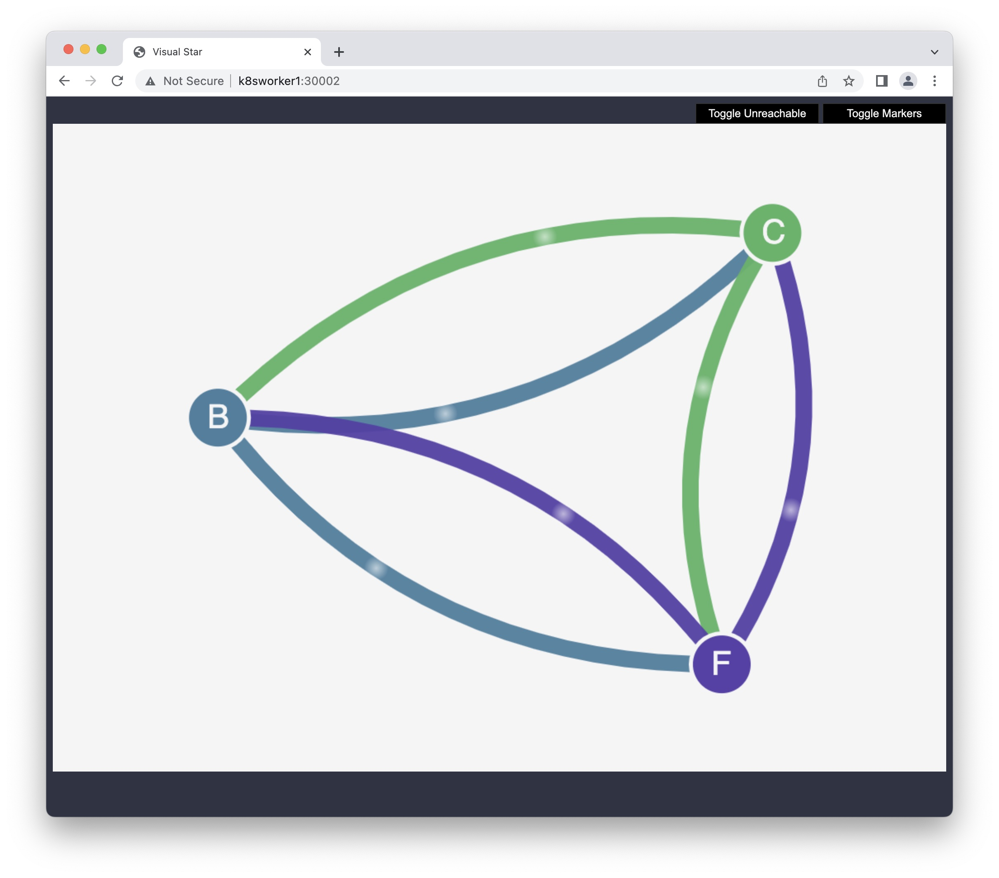
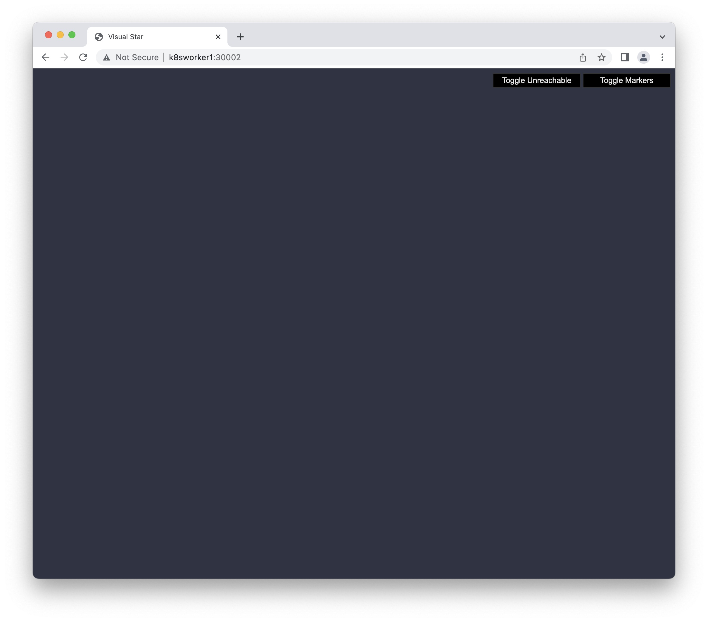
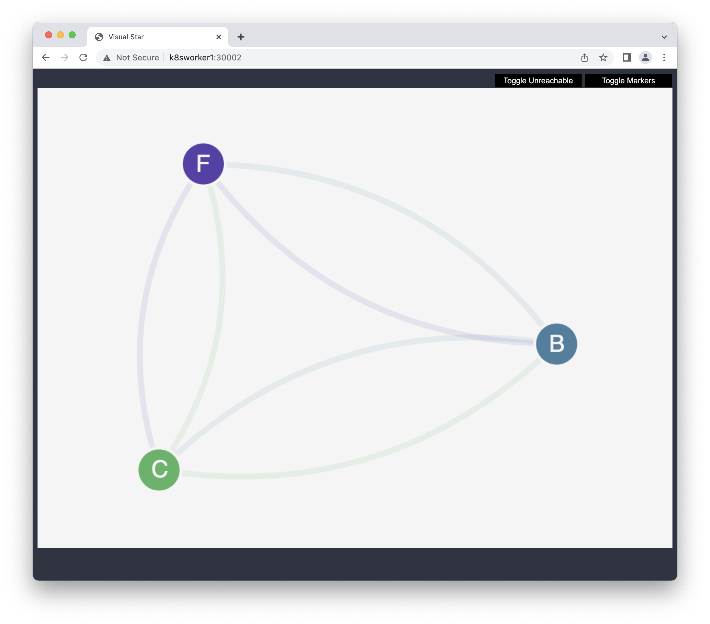
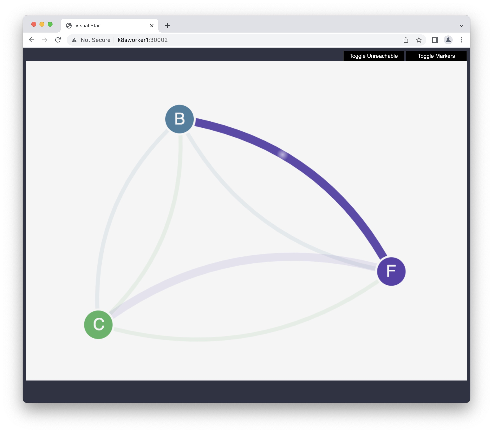
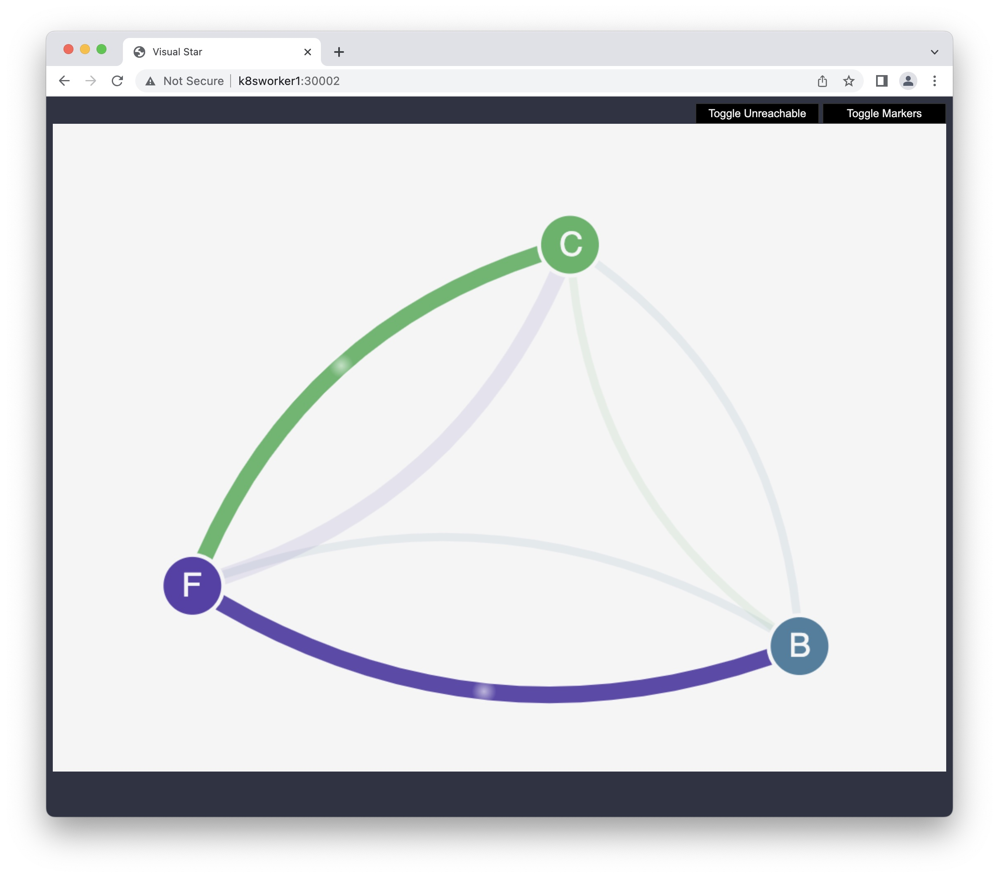

# Stars policy demo

This section walks through the Stars policy demo provided by the Project Calico documentation and isn't necessary for Calico functionality on your cluster. The demo creates a front-end, back-end, and client service on your Amazon EKS cluster. The demo also creates a management graphical user interface that shows the available ingress and egress paths between each service. We recommend that you complete the demo on a cluster that you don't run production workloads on.

Before you create any network policies, all services can communicate bidirectionally. After you apply the network policies, you can see that the client can only communicate with the front-end service, and the back-end only accepts traffic from the front-end.

>I did the tests with AWS EKS with a seperate `kubeconfig` file. The only thing is to add `--kubeconfig=$HOME/.kube/eks-calicoebpf` to every `kubectl` command.

## Check NetworkPolicy
### Calico Policy
Check for any Calico Network Policy:
```sh
calicoctl get NetworkPolicy --all-namespaces -o wide
```

The output should look like this:
```
NAMESPACE   NAME   ORDER   SELECTOR   
```

Check for any Calico Global Network Policy (Global Network Policy is not namespaced):
```sh
calicoctl get GlobalNetworkPolicy -o wide
```

The output should look like this:
```
NAME   ORDER   SELECTOR   
```

### Kubernetes Policy
Check for any K8s Network Policy:
```sh
kubectl get NetworkPolicy --all-namespaces -o wide
```

The output should look like this:
```
NAMESPACE          NAME              POD-SELECTOR     AGE
calico-apiserver   allow-apiserver   apiserver=true   25d
```

## Start the Stars policy demo
Start by download all the manifests. You could have passed the url directly to `kubectl` but I wanted to keep a copy for cleanup at the end.

```sh
curl -LO https://docs.projectcalico.org/v3.5/getting-started/kubernetes/tutorials/stars-policy/manifests/00-namespace.yaml
curl -LO https://docs.projectcalico.org/v3.5/getting-started/kubernetes/tutorials/stars-policy/manifests/01-management-ui.yaml
curl -LO https://docs.projectcalico.org/v3.5/getting-started/kubernetes/tutorials/stars-policy/manifests/02-backend.yaml
curl -LO https://docs.projectcalico.org/v3.5/getting-started/kubernetes/tutorials/stars-policy/manifests/03-frontend.yaml
curl -LO https://docs.projectcalico.org/v3.5/getting-started/kubernetes/tutorials/stars-policy/manifests/04-client.yaml
```

Create all the ressources for the tests:
```sh
kubectl apply -f 00-namespace.yaml
kubectl apply -f 01-management-ui.yaml
kubectl apply -f 02-backend.yaml
kubectl apply -f 03-frontend.yaml
kubectl apply -f 04-client.yaml
```

Verify that the Pods in namespace `client`, `stars` and `management-ui` are running
```sh
kubectl get pods -n client
```

```
NAME           READY   STATUS    RESTARTS   AGE
client-7rhfn   1/1     Running   0          15m
```

```sh
kubectl get pods -n stars
```

```
NAME             READY   STATUS    RESTARTS   AGE
backend-dzkh2    1/1     Running   0          15m
frontend-qcr46   1/1     Running   0          15m
```

```sh
kubectl get pods -n management-ui
```

```
NAME                  READY   STATUS    RESTARTS   AGE
management-ui-k622m   1/1     Running   0          15m
```

## Create a service
If you're in EKS, this will start a ELB service running on your EKS cluster.

To connect to the management user interface via a browser, start a load balancer to listen on local port `9001` to the `management-ui` service running on your EKS cluster:
```sh
cat > management-ui-lb.yaml<< EOF
apiVersion: v1
kind: Service
metadata:
  name: management-ui
  namespace: management-ui
spec:
  selector:
    role: management-ui
  ports:
    - port: 9001
      targetPort: 9001
  type: LoadBalancer
EOF
```

```sh
kubectl apply -f management-ui-lb.yaml
```

```sh
kubectl get svc -n management-ui
```

In the case of AWS EKS, you will use the `EXTERNAL-IP` to access the page via your browser wit the port 9001:
```
NAME            TYPE           CLUSTER-IP     EXTERNAL-IP                                                              PORT(S)          AGE
management-ui   LoadBalancer   10.250.22.73   aabf5dc23e6934afc8b2c2cd659b112b-106276692.us-east-2.elb.amazonaws.com   9001:30002/TCP   21m
```

In the case of 'on-prem' cluster, you will use the IP of any nodes to access the page via your browser with the port `30002`:
```
NAME            TYPE           CLUSTER-IP       EXTERNAL-IP   PORT(S)          AGE
management-ui   LoadBalancer   10.100.182.199   <pending>     9001:30002/TCP   7m28s
```

>For the rest of this tutorial, I'll be performing all the commands of an 'on-prem' cluster. If you're perform this on an EKS cluster just replace `http://k8worker1:30002/` with your service's external IP, like this for example: `http://k8smaster1:30002/`.

# Networking Policy
Start by downloading the Networking Policies to you local drive:
```sh
curl -LO https://docs.projectcalico.org/v3.5/getting-started/kubernetes/tutorials/stars-policy/policies/default-deny.yaml
curl -LO https://docs.projectcalico.org/v3.5/getting-started/kubernetes/tutorials/stars-policy/policies/allow-ui.yaml
curl -LO https://docs.projectcalico.org/v3.5/getting-started/kubernetes/tutorials/stars-policy/policies/allow-ui-client.yaml
curl -LO https://docs.projectcalico.org/v3.5/getting-started/kubernetes/tutorials/stars-policy/policies/backend-policy.yaml
curl -LO https://docs.projectcalico.org/v3.5/getting-started/kubernetes/tutorials/stars-policy/policies/frontend-policy.yaml
```

## No Policy
Open a browser on your local system and point it to `http://k8sworker1:30002/` or any valid nodes in your cluster. You should see the management user interface. The `C` node is the client service, the `F` node is the front-end service, and the `B` node is the back-end service. Each node has full communication access to all other nodes, as indicated by the bold, colored lines. By default every Pods can talk to every other Pods even in different namespace.

The color of the line (edges) that is the same as the node (vertices) represents the `egress traffic` from that node. If a line goes to a node with a different color, it represents `ingress traffic`.



## Deny All
Apply the following network policies to isolate the services from each other (NetworkPolicy are namespaced):
```sh
kubectl apply -n stars -f default-deny.yaml
kubectl apply -n client -f default-deny.yaml
```

Refresh your browser. You see that the management user interface can no longer reach any of the nodes, so they don't show up in the user interface. The page is blank.

Check K8s Network Policy:
```sh
kubectl get NetworkPolicy --all-namespaces -o wide
```

The output should look like this:
```
NAMESPACE          NAME              POD-SELECTOR     AGE
calico-apiserver   allow-apiserver   apiserver=true   25d
client             default-deny      <none>           85s
stars              default-deny      <none>           85s
```



## Allow UI only
Apply the following network policies to allow the management user interface to access the nodes. You will see the nodes but no traffic can be received:
```sh
kubectl apply -f allow-ui.yaml
kubectl apply -f allow-ui-client.yaml
```



Check K8s Network Policy:
```sh
kubectl get NetworkPolicy --all-namespaces -o wide
```

The output should look like this:
```
NAMESPACE          NAME              POD-SELECTOR     AGE
calico-apiserver   allow-apiserver   apiserver=true   25d
client             allow-ui          <none>           2m21s
client             default-deny      <none>           5m21s
stars              allow-ui          <none>           2m21s
stars              default-deny      <none>           5m21s
```

## front-end service to back-end service
Apply the following network policy to allow traffic from the `front-end` service to the `back-end` service:
```sh
kubectl apply -f backend-policy.yaml
```



## client to front-end service
Apply the following network policy to allow traffic from the `client` to the `front-end` service.
```sh
kubectl apply -f frontend-policy.yaml
```

Refresh your browser. You see that the `client` can communicate to the `front-end` service and the `front-end` service can still communicate to the `back-end` service. This could represent a simplistic example of a real life scenario.

- Management has access to everything
- Client can only access the front-end
- Only the the front-end can access the back-end

Do **NOT** use this in a real production environment 😉



Check K8s Network Policy:
```sh
kubectl get NetworkPolicy --all-namespaces -o wide
```

The output should look like this:
```
NAMESPACE          NAME              POD-SELECTOR     AGE
calico-apiserver   allow-apiserver   apiserver=true   25d
client             allow-ui          <none>           11m
client             default-deny      <none>           14m
stars              allow-ui          <none>           11m
stars              backend-policy    role=backend     6m51s
stars              default-deny      <none>           14m
stars              frontend-policy   role=frontend    2m13s
```

## Cleanup
When you are done with the demo, you can delete its resources.

```sh
kubectl delete -f 04-client.yaml
kubectl delete -f 03-frontend.yaml
kubectl delete -f 02-backend.yaml
kubectl delete -f 01-management-ui.yaml
kubectl delete -f 00-namespace.yaml
```

The output should look like this. Be patient, it can take 3-5 minutes:
```
namespace "client" deleted
replicationcontroller "client" deleted
service "client" deleted
service "frontend" deleted
replicationcontroller "frontend" deleted
service "backend" deleted
replicationcontroller "backend" deleted
namespace "management-ui" deleted
service "management-ui" deleted
replicationcontroller "management-ui" deleted
namespace "stars" deleted
```

Delete the load balancer, especially if you did this tutorial on a cloud provider:
```sh
kubectl delete -f management-ui-lb.yaml
```

Check that there's no more K8s Network Policy. They should be gone since they are `namespaced` and we deleted the namespaces:
```sh
kubectl get NetworkPolicy --all-namespaces -o wide
```

Normal output since the load balancer is namespaced, but make sure it's deleted in case of a cloud provider.
```
Error from server (NotFound): error when deleting "management-ui-lb.yaml": services "management-ui" not found
```

The output should look like this:
```
NAMESPACE          NAME              POD-SELECTOR     AGE
calico-apiserver   allow-apiserver   apiserver=true   25d
```

# Reference
[AWS](https://docs.aws.amazon.com/eks/latest/userguide/calico.html)  
[Project Calico Stars Policy Demo](https://docs.projectcalico.org/v3.5/getting-started/kubernetes/tutorials/stars-policy/)  
[GitHub](https://github.com/mesosphere/star)  
[](https://github.com/projectcalico/star/tree/master)  
