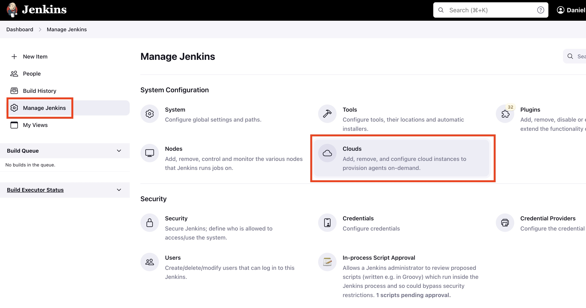
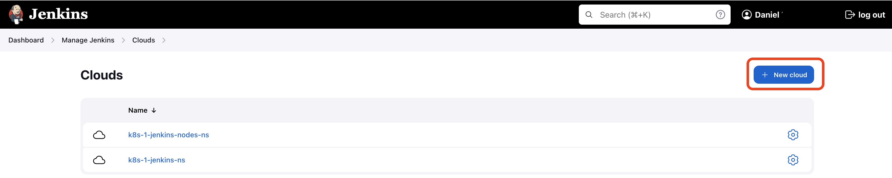
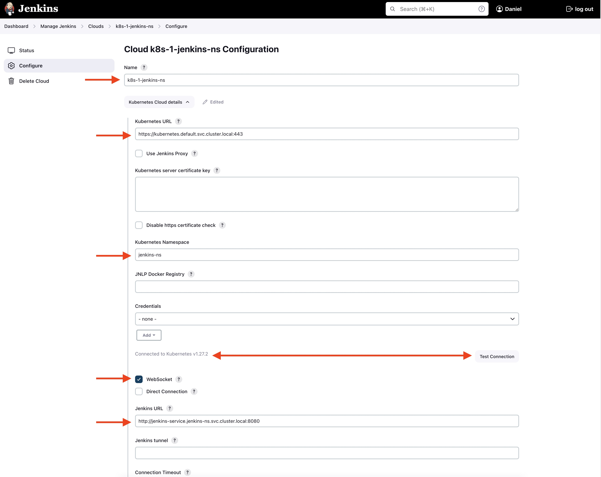
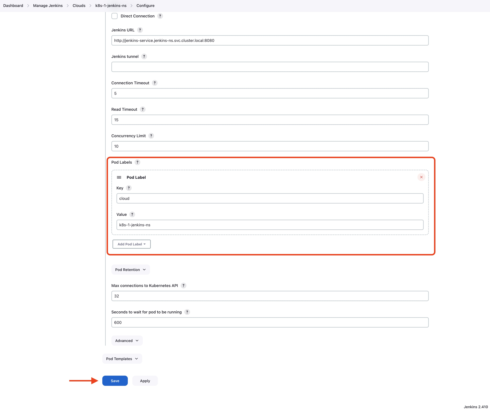

# Create a cloud agent
The Jenkins controller is the original node in the Jenkins installation. The Jenkins controller administers the Jenkins agents and orchestrates their work, including scheduling jobs on agents and monitoring agents. It's a bit like a Kubernetes cluster with the controle plane and the worker nodes. Agents may be connected to the Jenkins controller using either local or cloud computers.

In this tutorial, we'll use cloud computers running on K8s worker nodes.

## Create Cloud Agent

## Configure Cloud Agent
1. Give it a name
2. The `Kubernetes URL` is the URL of your K8s control Plane
3. You can decide to run your Pod agent in it's own namespace (Optional)
4. Test the connection. You should see the message `Connected to Kubernetes v1.27.2`, your version will be different
5. Check `WebSocket`
6. The `Jenkins URL` is your Jenkins master node. Since I'm running everything in K8s, I'M using the service name.

>**Note:**Please don't use any IP addresses in both URLs, make me proud and use DNS names 😀

7. Add at least one label. You never know, it might be usefull down the road.
8. Click `Save`

