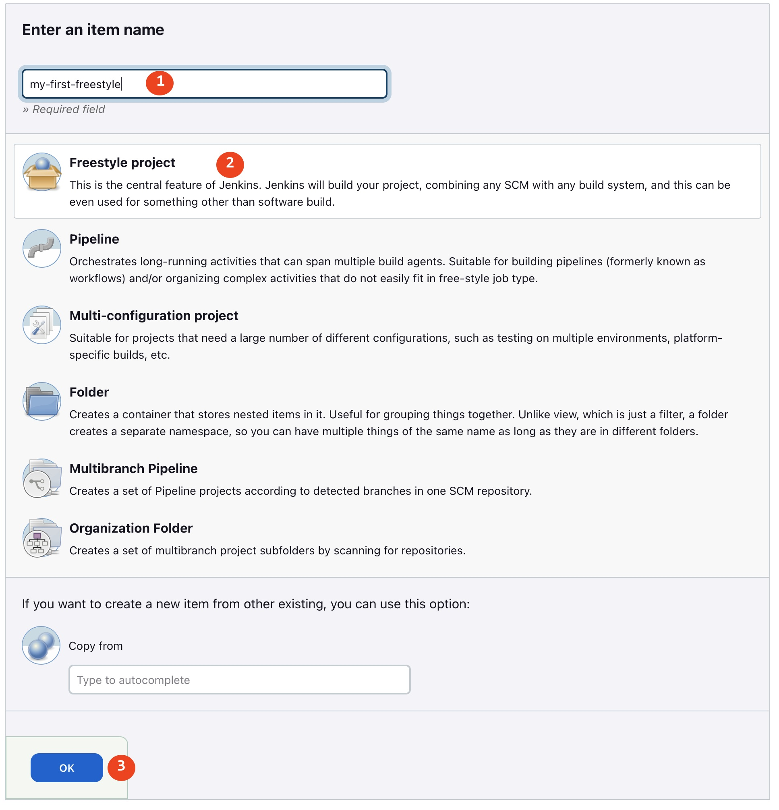
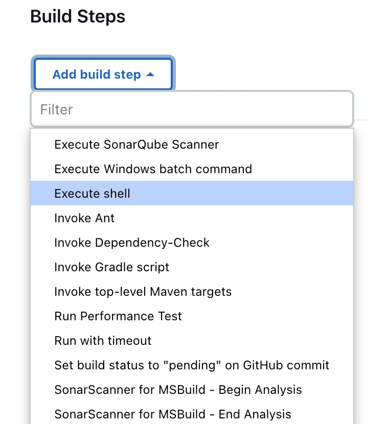
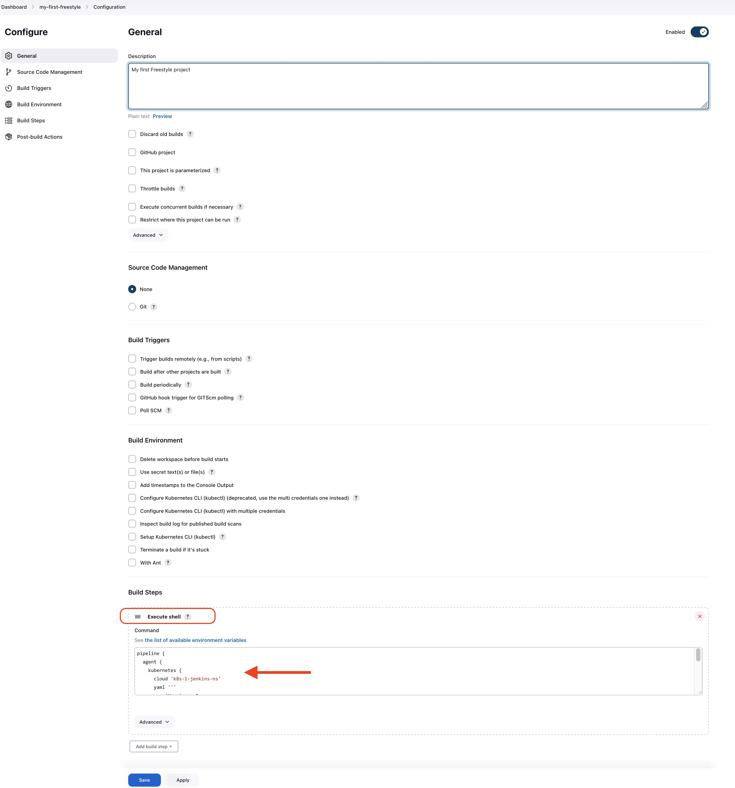

# Freestyle project
In this tutorial, we'll learn how to build a `Freestyle project`. This is the central feature of Jenkins. Jenkins will build your project, combining any SCM with any build system, and this can be even used for something other than software build.

## Create
1. From the dashboard, select `New Item` to create a new item
 
2. Enter the name of the item, select `Freestyle project` and click `Ok`. If it's not your first item, you can copy from an existing one, see the last option.


3. In the `Add build step` near the bottom, select `Execute Shell`


4. In the command window, paste the following `Groovy` script and click Ok:
```groovy
pipeline {
  agent {
    kubernetes {
      cloud 'k8s-1-jenkins-ns'
      yaml '''
        apiVersion: v1
        kind: Pod
        spec:
          containers:
          - name: python3
            image: python:3.11.4-slim-bullseye
            command:
            - cat
            tty: true
        '''
    }
  }
  stages {
    stage('Run python3') {
      steps {
        container('python3') {
          sh 'python3 --version'
          sh 'cat /etc/os-release'
        }
      }
    }
  }
}
```




