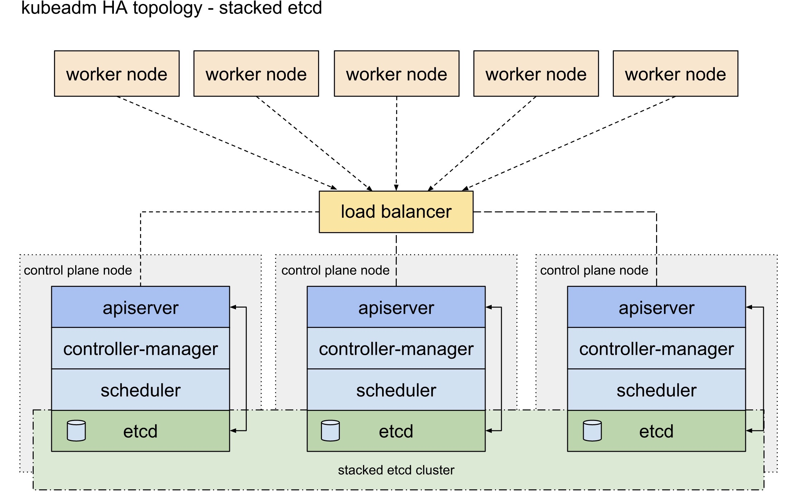
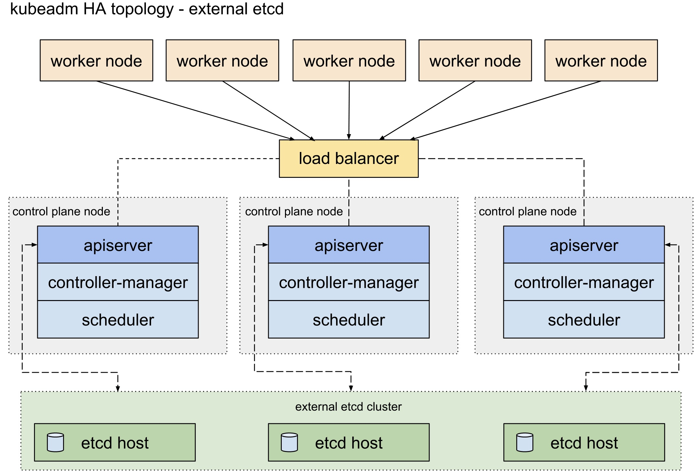
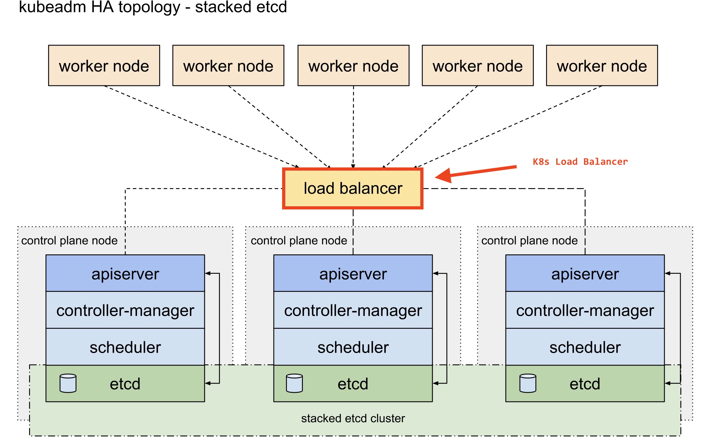

# Creating Highly Available Clusters with kubeadm
The goal of this tutorial is to add a new master node to an existing K8s cluster running in non-HA mode.

## Check Prerequisite

- Kubernetes Cluster that already running with only one master node.
- The New Node that already has `kubeadm`, `kubelet`, and `kubectl` installed on Ubuntu 22.04. Follow the tutorial until the kubeadm, kubelet, and kubectl are installed.
- The existing single control plane node was bootstrapped using `kubeadm`.
- The existing single control plane node is using a **stacked configuration** in which both `etcd` and the Kubernetes control plane components are running on the same nodes. See below for the **Options for Highly Available Topology**.

## Options for Highly Available Topology
This section explains the two options for configuring the topology of your highly available (HA) Kubernetes clusters.

You can set up an HA cluster:

- With stacked control plane nodes, where `etcd` nodes are colocated with control plane nodes
- With external `etcd` nodes, where `etcd` runs on separate nodes from the control plane

You should carefully consider the advantages and disadvantages of each topology before setting up an HA cluster.

### Stacked etcd topology 
A stacked HA cluster is a topology where the distributed data storage cluster provided by `etcd` is stacked on top of the cluster formed by the nodes managed by `kubeadm` that run control plane components.

Each control plane node runs an instance of the `kube-apiserver`, `kube-scheduler`, and `kube-controller-manager`. The `kube-apiserver` is exposed to worker nodes using a load balancer.

This topology couples the control planes and `etcd` members on the same nodes. It is simpler to set up than a cluster with external `etcd` nodes, and simpler to manage for replication.

You should therefore run a minimum of three (3) stacked control plane nodes for an HA cluster.



### External etcd topology
An HA cluster with external `etcd` is a topology where the distributed data storage cluster provided by `etcd` is external to the cluster formed by the nodes that run control plane components.

Like the stacked `etcd` topology, each control plane node in an external `etcd` topology runs an instance of the `kube-apiserver`, `kube-scheduler`, and `kube-controller-manager`. And the `kube-apiserver` is exposed to worker nodes using a load balancer. However, `etcd` members run on separate hosts, and each `etcd` host communicates with the `kube-apiserver` of each control plane node.

This topology decouples the control plane and `etcd` member. It therefore provides an HA setup where losing a control plane instance or an `etcd` member has less impact and does not affect the cluster redundancy as much as the stacked HA topology.

However, this topology requires twice the number of hosts as the stacked HA topology. A minimum of three hosts for control plane nodes and three hosts for `etcd` nodes are required for an HA cluster with this topology.




# Converting Kubernetes Control Plande to H.A.
## Assumptions

- The existing single control plane node was bootstrapped using `kubeadm`.
- The existing single control plane node is using a **stacked configuration** (see above for more information).

Existing control plane is `k8smaster1` and we will add two more control plane.

|Role|FQDN|IP|OS|Kernel|RAM|vCPU|Status|
|----|----|----|----|----|----|----|----|
|Master|k8smaster1.example.com|192.168.13.30|Ubuntu 22.04.2|6.3.3|4G|4|Existing|
|Master|k8smaster2.example.com|192.168.13.31|Ubuntu 22.04.2|6.3.3|4G|4|New|
|Master|k8smaster3.example.com|192.168.13.32|Ubuntu 22.04.2|6.3.3|4G|4|New|

## Steps
Following are the high-level steps to :

- Create a load balancer for the control plane.
- Update the API server’s certificate.
- Update the kubelet on the existing control plane.
- Update other control plane components.
- Update worker nodes.
- Add control plane nodes.

>**Note**:I do not recommend using this procedure on any **PRODUCTION** cluster. This is for educational purposes only.

# Create a load balancer for the control plane
Usually when you bootstraped a new Kubernetes cluster in *non-HA* mode, you dodn't provision the `kube-apiserver` load balancer. All API requests are directly routed to the single control plane either with the IP address or the hostname. In highly available configurations, a load balancer must sit in front of the `kube-apiservers` to correctly route requests to a healthy API servers.



As seen above, the load balancer routes traffic to the `kube-apiservers`. If a `kube-apiserver` goes down, the load balancer routes traffic to the other healthy nodes.

## Create Load Balancer
Adding the load balancer won’t affect anything since everything in the cluster still points directly to the single control plane. My "on-prem" K8s cluster is running BGP and it advertises service IP addresss `10.96.0.0/12` , so I decided to use the service `load-balancer` from Kubernetes.

Create the `yaml` file:
```sh
cat > K8s-API-LB.yaml<<EOF
apiVersion: v1
kind: Service
metadata:
  name: k8s-api-lb
  namespace: kube-system
spec:
  type: LoadBalancer
  selector:
    component: kube-apiserver
  ports:
    - name: http
      protocol: TCP
      port: 6443
      targetPort: 6443
EOF
```

Create the service:
```sh
kubectl create -f K8s-API-LB.yaml
```

Get the IP address of the service. That IP will never change unless you delete the service:
```sh
kubectl get svc -n kube-system
```

Output:
```
NAME         TYPE           CLUSTER-IP      EXTERNAL-IP   PORT(S)                  AGE
k8s-api-lb   LoadBalancer   10.97.38.197    <pending>     6443:31170/TCP           6m46s
kube-dns     ClusterIP      10.96.0.10      <none>        53/UDP,53/TCP,9153/TCP   52d
```

Test the connectivity with `cURL` (if you don't have BGP, use the IP address of any nodes with the `NodePort` port of 31170)
```sh
curl --connect-timeout 3 --insecure https://10.97.38.197:6443
```

Output for a working service. You reached the API server but you are not allowed:
```
{
  "kind": "Status",
  "apiVersion": "v1",
  "metadata": {},
  "status": "Failure",
  "message": "forbidden: User \"system:anonymous\" cannot get path \"/\"",
  "reason": "Forbidden",
  "details": {},
  "code": 403
}
```

If you get the following error, it probably means you have a firewall in the path that blocks the traffic:
```
curl: (7) Failed to connect to 10.97.38.197 port 6443 after 0 ms: Connection refused
```

### Show Details for One Load Balancer
To get detailed information about the load balancer configuration of a single load balancer, including the event stream at the bottom, use the `describe` service command. That's usefull to verify the `Endpoints` each time you add a new master node:
```sh
kubectl describe service k8s-api-lb -n kube-system
```

## DNS CNAME
It is a very good idea to create a DNS CNAME entry for the load balancer. Make sure you choose a good CNAME since in the next step we'll create a new certificate with the CNAME.


```
apiserver.example.com
```

# Update the API server’s certificate
The next step is to update the API server’s TLS certificate to account for the IP address(es) and/or DNS names that will be used to reach the control plane through the load balancer. The API server (one of the three Kubernetes control plane components, the other two being the controller manager and the scheduler) uses a M-TLS to provide authentication as well as to encrypt control plane traffic. This certificate needs to have a proper Subject Alternative Name (SAN) that matches whatever IP address or DNS name is being used to communicate with the API server.

Follow the steps in [this](K8s-API-Server-Certificate.md) tutorial to update the certificate and don't forget to come back here 😉

To test

Edit the file `~/.kube/config` and replace the line `server:` with something like `server: https://apiserver.example.com:6443` and execute any `kubectl` command to test if it reaches the API server.

# Update the kubelet on the existing control plane (Needs to be executed on the **master node**)
The Kubelet on the existing control plane node communicates with the API server, as do all the other components of the cluster. Once you’ve verified that access to the API server through the load balancer works, the next step is to update the Kubelet to access the API server through the load balancer as well.

Much like a user does, the Kubelet uses a `kubeconfig` file to know how to find the control plane and authenticate to it. This file is found in `/etc/kubernetes/kubelet.conf`, which you can verify by looking at the systemd drop-in added to the Kubelet service by kubeadm (the file is `/etc/systemd/system/kubelet.service.d/10-kubeadm.conf`).

In order to have the Kubelet communicate with the API server through the load balancer, you’ll need to edit this `kubeconfig` file for the Kubelet and change the `server:` line to point to an IP address or DNS name for the load balancer (and for which there is a corresponding SAN on the API server’s certificate).

```sh
sudo vi /etc/kubernetes/kubelet.conf
```

Once you made this change, restart the Kubelet with `systemctl restart kubelet`, and then check the logs for the Kubelet to be sure it is working as expected.
```sh
sudo systemctl restart kubelet
sudo systemctl status kubelet
```

# Update other control plane components (Needs to be executed on the **master node**)
The fourth step is to update the other control plane components to communicate with the API server through the load balancer. Like the `kubelet`, both the controller manager and the scheduler (two other components of the Kubernetes control plane along with the API server) use `kubeconfig` files to communicate with and authenticate to the API server. Just as you updated the `kubeconfig` file (by modifying the `server:` line for the cluster being modified to point to the load balancer) used by the Kubelet, you’ll also need to update the Kubeconfig files that the controller manager and scheduler use to connect to the API server.

The files that need to be modified are:

```sh
sudo vi /etc/kubernetes/controller-manager.conf
sudo vi /etc/kubernetes/scheduler.conf
```

These files are standard Kubeconfig files. The only line that needs to be changed is the server: line that specifies the API endpoint (this is currently probably pointing to the IP address or hostname of the single control plane node). Edit each of these files to point to an IP address or DNS name for the load balancer (and for which a SAN exists on the API server certificate).

For these components to pick up the change, you’ll need to restart them.  

These commands will kill the container for each component (be patient):
```sh
# Restart kube-controller-manager
kubectl delete $(kubectl get pods -n kube-system -l component=kube-controller-manager -o name) -n kube-system
# Restart kube-scheduler
kubectl delete $(kubectl get pods -n kube-system -l component=kube-scheduler -o name) -n kube-system
```

Don't forget to modify the `server:` line for the following two files:
```sh
sudo vi /etc/kubernetes/admin.conf
vi  ~/.kube/config
```

# Update Kube-Proxy on the Control Plane Node
With most CNI plugins, `kube-proxy` is responsible for implementing the necessary mechanisms to support Services and Network Policies. Like the Kubelet and the other control plane components, `kube-proxy` uses a Kubeconfig file to specify how to connect to the Kubernetes API. In this case, however, the config file is provided to kube-proxy via a ConfigMap.

Use this command to update the ConfigMap:
```sh
kubectl -n kube-system edit cm kube-proxy
```

Restart the `kube-proxy` Pods with nthe command:
```sh
kubectl delete  -n kube-system $(kubectl get pods -n kube-system -l k8s-app=kube-proxy -o name)
```

# Update worker nodes
The only component running on the worker nodes that needs to be updated is the Kubelet configuration. Follow the instructions in the section “Update the Kubelet on the Control Plane Node” to update the Kubelet on the worker nodes as well.

>**Note**: It needs to be done for **every** worker node

```sh
sudo vi /etc/kubernetes/kubelet.conf
```

Once you made this change, restart the Kubelet with `systemctl restart kubelet`, and then check the logs for the Kubelet to be sure it is working as expected.
```sh
sudo systemctl restart kubelet
sudo systemctl status kubelet
curl --insecure https://apiserver.example.com:6443
```

# Cluster Info
Use this command to check the cluster information:
```sh
kubectl cluster-info
```

```
Kubernetes control plane is running at https://apiserver.example.com:6443
CoreDNS is running at https://apiserver.example.com:6443/api/v1/namespaces/kube-system/services/kube-dns:dns/proxy

To further debug and diagnose cluster problems, use 'kubectl cluster-info dump'.
```

# What you've done so far
At this point, you’ve:
- created and configured a load balancer for the control plane
- updated the API server’s certificate to account for the load balancer
- updated the Kubelet to point to the load balancer
- updated the controller manager to point to the load balancer
- updates the scheduler to point to the load balancer
- updated kube-proxy to point to the load balancer

You’re now ready to add one or more control plane nodes.

# Add control plane nodes
To add additional control plane nodes you can follow the instructions from the Kubernetes web site (see here for version 1.15 or here for version 1.14). In particular, see the “Steps for the rest of the control plane nodes” under the “Stacked control plane and etcd nodes” section.

>**Note**:You should be adding two additional nodes, for a total of three, which allows `etcd` to reach quorum

## Upload certificates and generate a new decryption key (Needs to be executed on the **existing** master node)
To upload the certificates and generate a new decryption key, use the following command on a control plane node that is **already** joined to the cluster:
```sh
# kubectl -n kube-system get configmap kubeadm-config -o jsonpath='{.data.ClusterConfiguration}' >  kubeadm-config.yaml
# export KEY=$( { sudo kubeadm init phase upload-certs --upload-certs --config kubeadm-config.yaml 2>/dev/null || echo "$?"; } | tail -n 1 )
export KEY=$( { sudo kubeadm init phase upload-certs --upload-certs 2>/dev/null || echo "$?"; } | tail -n 1 )
echo "certificate-key: ${KEY}"
```

The output should have looked like this but I kept the last line only:
```
[upload-certs] Storing the certificates in Secret "kubeadm-certs" in the "kube-system" Namespace
[upload-certs] Using certificate key:
982db3b727aea4741f3a27db66d6d766a5b6546bd0af1653d074ca94a84d0e8e
```

## Generate a new Join Token (Needs to be executed on the **existing** master node)
The following command will generate a new `token` and print the `join` command. Make sure your `~/.kube/config` has been updated with the DNS name of the load balancer.
```sh
kubeadm token create --certificate-key ${KEY} --print-join-command
```

Output:
```
kubeadm join apiserver.example.com:6443 --token zmia9y.x5yccvkvha2sdukx \
--discovery-token-ca-cert-hash sha256:9a374ad0f3b7dea59b44979241bdd0d432d9da0de35705022cb5909fee75b03d \
--control-plane --certificate-key 982db3b727aea4741f3a27db66d6d766a5b6546bd0af1653d074ca94a84d0e8e
```

# Join a new Master Node (Needs to be executed on the **NEW** master node)
This section is done on the **new** master node you want to join.

Once you have:
- a valid certificate key
- a valid bootstrap token
- the correct SHA256 hash of the CA certificate

Before trying to join the new master node, this test should succeed. A timeout is a failure. You should get an HTTP/403 from the server, this is success 😀
```sh
curl --connect-timeout 2 --insecure https://<DNS CNAME of load balancer>:6443
```

you can join a new control plane node with this command as **sudo**:
```sh
sudo kubeadm join apiserver.example.com:6443 --token zmia9y.x5yccvkvha2sdukx \
--discovery-token-ca-cert-hash sha256:9a374ad0f3b7dea59b44979241bdd0d432d9da0de35705022cb5909fee75b03d \
--control-plane --certificate-key 982db3b727aea4741f3a27db66d6d766a5b6546bd0af1653d074ca94a84d0e8e
```

Output:
```
[preflight] Running pre-flight checks
[preflight] Reading configuration from the cluster...
[preflight] FYI: You can look at this config file with 'kubectl -n kube-system get cm kubeadm-config -o yaml'
error execution phase preflight: 
One or more conditions for hosting a new control plane instance is not satisfied.

unable to add a new control plane instance to a cluster that doesn't have a stable controlPlaneEndpoint address

Please ensure that:
* The cluster has a stable controlPlaneEndpoint address.
* The certificates that must be shared among control plane instances are provided.


To see the stack trace of this error execute with --v=5 or higher
```

# References
[Converting Kubernetes to an HA Control Plane](https://blog.scottlowe.org/2019/08/12/converting-kubernetes-to-ha-control-plane/)  
[Options for Highly Available Topology](https://kubernetes.io/docs/setup/production-environment/tools/kubeadm/ha-topology/)  
