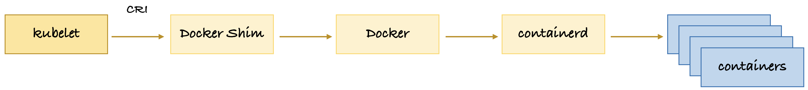
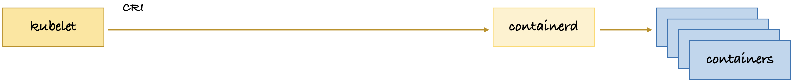
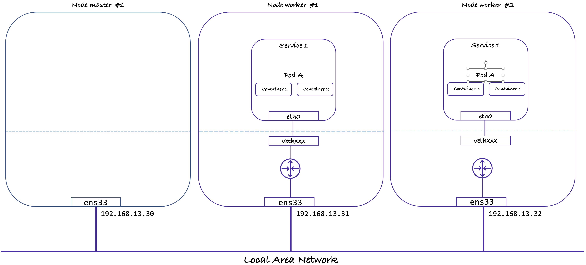

<a name="readme-top"></a>

# Live switching of Kubernetes container runtime from Docker to containerd
In this tutorial, I will show you how to change the container runtime on your existing K8s cluster with workloads running. This is based on this [video](https://www.youtube.com/watch?v=H7l48VQewmA).

The K8s cluster is using `Docker` as the container runtime.



The goal is to make `kubelet` use `containerd` as the container runtime for the K8s cluster.



## Last Version
|Name|Version|
|:---|:---|
|**VMware Fusion**|13.0.1|
|**Debian Bullseye**|11.6.0|
|**Kernel**|6.1.0-0|
|**Docker-CE**|23.0.3|
|**K8s**|1.26.3|
|**Cilium**|1.13.1|
|**cri-dockerd**|0.3.1|

# Introduction
The step-by-step guide demonstrates you how to install Kubernetes cluster on Debian 11 with Kubeadm utility for a Learning environment. All the Debian hosts are running as VMs with VMware Fusion.

This Kubernetes (K8s) cluster have one master and two worker nodes. Master node works as the control plane and the worker nodes runs the actual container(s).

In this tutorial, you will set up a Kubernetes Cluster by:

- Setting up three Debian 11 virtual machines with a Kernel 6.1.0
- Installing Docker-CE and Docker Compose plugin
- Installing CRI-Docker plugin
- Installing Kubernetes kubelet, kubeadm, and kubectl
- Installing a CNI Plugin (Cilium)
- Configuring Docker as the container runtime for Kubernetes
- Initializing one K8s master node and adding two worker nodes

At the end you will have a complete K8s cluster ready to run your microservices.

# Lab Setup
For this tutorial, I will be using three Debian 11 systems with following hostnames, IP addresses, OS, Kernel:

## Configurations
|Role|FQDN|IP|OS|Kernel|RAM|CPU|
|----|----|----|----|----|----|----|
|Master|k8smaster1.example.com|192.168.13.30|Debian 11.06|6.1.0-0|4G|4|
|Worker|k8sworker1.example.com|192.168.13.31|Debian 11.06|6.1.0-0|4G|4|
|Worker|k8sworker2.example.com|192.168.13.32|Debian 11.06|6.1.0-0|4G|4|

<p align="right">(<a href="#readme-top">back to top</a>)</p>

# Title
You can see that the K8s cluster is using Docker has the container runtime. The goal is to migrate to containerd runtime live. I will not remove Docker but just ask `kubelet` to use another container runtime.

    kubectl get nodes -o wide

    NAME         STATUS   ROLES           AGE     VERSION   INTERNAL-IP     EXTERNAL-IP   OS-IMAGE                         KERNEL-VERSION          CONTAINER-RUNTIME
    k8smaster1   Ready    control-plane   3d22h   v1.26.3   192.168.13.30   <none>        Debian GNU/Linux 11 (bullseye)   6.1.0-0.deb11.5-amd64   docker://23.0.3
    k8sworker1   Ready    <none>          3d22h   v1.26.3   192.168.13.31   <none>        Debian GNU/Linux 11 (bullseye)   6.1.0-0.deb11.5-amd64   docker://23.0.3
    k8sworker2   Ready    <none>          3d22h   v1.26.3   192.168.13.32   <none>        Debian GNU/Linux 11 (bullseye)   6.1.0-0.deb11.5-amd64   docker://23.0.3


## Create some containers
Lets create some containers with an imperative deployment. I created an image with Alpine Linux, PHP8 and Nginx. I modified the web page to give information taken for the notorious `phpinfo()` function. See my [Githud page](https://github.com/ddella/PHP8-Nginx/).

    kubectl create deployment website --replicas=4 --image=php8_nginx:3.17.3

You should have a total of four (4) containers total, normally two on each worker node.

    Every 2.0s: kubectl get nodes,pods -o wide                                                                                                                                                                         k8smaster1: Tue Apr 11 14:05:41 2023

    NAME              STATUS   ROLES           AGE     VERSION   INTERNAL-IP     EXTERNAL-IP   OS-IMAGE                         KERNEL-VERSION          CONTAINER-RUNTIME
    node/k8smaster1   Ready    control-plane   3d22h   v1.26.3   192.168.13.30   <none>        Debian GNU/Linux 11 (bullseye)   6.1.0-0.deb11.5-amd64   docker://23.0.3
    node/k8sworker1   Ready    <none>          3d22h   v1.26.3   192.168.13.31   <none>        Debian GNU/Linux 11 (bullseye)   6.1.0-0.deb11.5-amd64   docker://23.0.3
    node/k8sworker2   Ready    <none>          3d22h   v1.26.3   192.168.13.32   <none>        Debian GNU/Linux 11 (bullseye)   6.1.0-0.deb11.5-amd64   docker://23.0.3

    NAME                           READY   STATUS    RESTARTS   AGE    IP           NODE         NOMINATED NODE   READINESS GATES
    pod/website-64876789d7-27vcs   1/1     Running   0          113s   10.0.2.67    k8sworker1   <none>           <none>
    pod/website-64876789d7-jpdd5   1/1     Running   0          113s   10.0.2.56    k8sworker1   <none>           <none>
    pod/website-64876789d7-ppcr4   1/1     Running   0          113s   10.0.1.14    k8sworker2   <none>           <none>
    pod/website-64876789d7-tnbdt   1/1     Running   0          46s    10.0.1.112   k8sworker2   <none>           <none>

## Test the website
You can use cURL to get the base web page. You can test all 4 pods:

```sh
curl http://10.0.2.67
```

# Migration from Docker to containerd runtime
This is the actual migration from Docker to containerd runtime while we have active pods servicing customers 😀

## Cordon the node
The order of the migration will be
1. Worker node #2
2. Worker node #1
3. Master #1



We start by cordon a node. It will be in state `SchedulingDisabled` but still runs the existing pods. It marks the node as unschedulable:

    kubectl cordon k8sworker2

    Every 2.0s: kubectl get nodes,pods -o wide                                                                                                                                                                         k8smaster1: Tue Apr 11 18:10:58 2023

    NAME              STATUS                     ROLES           AGE    VERSION   INTERNAL-IP     EXTERNAL-IP   OS-IMAGE                         KERNEL-VERSION          CONTAINER-RUNTIME
    node/k8smaster1   Ready                      control-plane   4d2h   v1.26.3   192.168.13.30   <none>        Debian GNU/Linux 11 (bullseye)   6.1.0-0.deb11.5-amd64   docker://23.0.3
    node/k8sworker1   Ready                      <none>          4d2h   v1.26.3   192.168.13.31   <none>        Debian GNU/Linux 11 (bullseye)   6.1.0-0.deb11.5-amd64   docker://23.0.3
    node/k8sworker2   Ready,SchedulingDisabled   <none>          4d2h   v1.26.3   192.168.13.32   <none>        Debian GNU/Linux 11 (bullseye)   6.1.0-0.deb11.5-amd64   docker://23.0.3

    NAME                           READY   STATUS    RESTARTS   AGE   IP           NODE         NOMINATED NODE   READINESS GATES
    pod/website-54bd988986-2fmqg   1/1     Running   0          14m   10.0.1.158   k8sworker2   <none>           <none>
    pod/website-54bd988986-765pl   1/1     Running   0          14m   10.0.2.97    k8sworker1   <none>           <none>
    pod/website-54bd988986-g5zns   1/1     Running   0          14m   10.0.2.178   k8sworker1   <none>           <none>
    pod/website-54bd988986-w66lh   1/1     Running   0          14m   10.0.1.81    k8sworker2   <none>           <none>

Next we need to `drain` the node in preparation for maintenance. Use `kubectl drain` to safely evict all of your pods from a node before we perform the maintenance on the node. Safe evictions allow the pod's containers to gracefully terminate. This could take up to a minute:

    kubectl drain k8sworker2 --ignore-daemonsets

Results:

    node/k8sworker2 already cordoned
    Warning: ignoring DaemonSet-managed Pods: kube-system/cilium-cjp26, kube-system/kube-proxy-vsb96
    evicting pod kube-system/coredns-787d4945fb-q4mc8
    evicting pod emissary-system/emissary-apiext-54568d96f4-mwvhj
    evicting pod emissary/emissary-ingress-6b58f6cf5-zpp8n
    evicting pod emissary/emissary-ingress-agent-6846ddbcd5-2qphq
    evicting pod default/website-54bd988986-2fmqg
    evicting pod kube-system/cilium-operator-56486f49cd-7p2j5
    evicting pod default/website-54bd988986-w66lh
    pod/emissary-ingress-6b58f6cf5-zpp8n evicted
    pod/cilium-operator-56486f49cd-7p2j5 evicted
    pod/emissary-apiext-54568d96f4-mwvhj evicted
    pod/emissary-ingress-agent-6846ddbcd5-2qphq evicted
    pod/coredns-787d4945fb-q4mc8 evicted
    pod/website-54bd988986-2fmqg evicted
    pod/website-54bd988986-w66lh evicted
    node/k8sworker2 drained


Now all the pods have been evicted from `worker #2` aand were reschedule on `worker #1`:

    Every 2.0s: kubectl get nodes,pods -o wide                                                                                                                                                                         k8smaster1: Tue Apr 11 18:23:52 2023

    NAME              STATUS                     ROLES           AGE    VERSION   INTERNAL-IP     EXTERNAL-IP   OS-IMAGE                         KERNEL-VERSION          CONTAINER-RUNTIME
    node/k8smaster1   Ready                      control-plane   4d3h   v1.26.3   192.168.13.30   <none>        Debian GNU/Linux 11 (bullseye)   6.1.0-0.deb11.5-amd64   docker://23.0.3
    node/k8sworker1   Ready                      <none>          4d2h   v1.26.3   192.168.13.31   <none>        Debian GNU/Linux 11 (bullseye)   6.1.0-0.deb11.5-amd64   docker://23.0.3
    node/k8sworker2   Ready,SchedulingDisabled   <none>          4d2h   v1.26.3   192.168.13.32   <none>        Debian GNU/Linux 11 (bullseye)   6.1.0-0.deb11.5-amd64   docker://23.0.3

    NAME                           READY   STATUS    RESTARTS   AGE   IP           NODE         NOMINATED NODE   READINESS GATES
    pod/website-54bd988986-765pl   1/1     Running   0          27m   10.0.2.97    k8sworker1   <none>           <none>
    pod/website-54bd988986-77kng   1/1     Running   0          97s   10.0.2.122   k8sworker1   <none>           <none>
    pod/website-54bd988986-g5zns   1/1     Running   0          27m   10.0.2.178   k8sworker1   <none>           <none>
    pod/website-54bd988986-g7fd9   1/1     Running   0          98s   10.0.2.18    k8sworker1   <none>           <none>

## Login to worker node #2
Get the lis of all running container using Docker Shim runtime, that uses `containerd`, with the command:

    docker container ps

Results:

    CONTAINER ID   IMAGE                       COMMAND                  CREATED        STATUS        PORTS     NAMES
    91a9f5d06b92   d830d9b89eac                "cilium-agent --conf…"   12 hours ago   Up 12 hours             k8s_cilium-agent_cilium-cjp26_kube-system_64384d2c-f551-4a9f-8668-5d93a5b3d21a_3
    e007de4e0a2d   92ed2bec97a6                "/usr/local/bin/kube…"   12 hours ago   Up 12 hours             k8s_kube-proxy_kube-proxy-vsb96_kube-system_46010912-0ef5-4a2b-9f76-17d0324f3357_5
    05e236baeebb   registry.k8s.io/pause:3.6   "/pause"                 12 hours ago   Up 12 hours             k8s_POD_kube-proxy-vsb96_kube-system_46010912-0ef5-4a2b-9f76-17d0324f3357_5
    591fd10c824f   registry.k8s.io/pause:3.6   "/pause"                 12 hours ago   Up 12 hours             k8s_POD_cilium-cjp26_kube-system_64384d2c-f551-4a9f-8668-5d93a5b3d21a_3


    sudo ctr namespace list

    NAME LABELS 
    moby        

Get the lis of all running container using `containerd` runtime with the command:

    sudo ctr --namespace moby container list

Results:

    CONTAINER                                                           IMAGE    RUNTIME                  
    05e236baeebb1016e91c8ef3c34c88c6dae4b3baff655744c7bbfc0047305e71    -        io.containerd.runc.v2    
    51977a0bb0f0cb9caf1c765de440f6c4e9a38c08625ad3b6f01c02f6e821407b    -        io.containerd.runc.v2    
    591fd10c824fff209b5b3092f6b1a82fa033922a72e5c9c42bc08bd6df43d858    -        io.containerd.runc.v2    
    91a9f5d06b92a22eb15bfc9927eca0f974aae9bbb22f0035c8c52bcf97485876    -        io.containerd.runc.v2    
    e007de4e0a2d02e1477d3c20717966172b7e6cf0fb190f0d1b8ffa66d14efb4f    -        io.containerd.runc.v2    

>**Note**:They should be the same. Check the containers ID.

## Stop services
Stop the `kubelet` service with:

    sudo systemctl stop kubelet

Stop the `docker` service with:

    sudo systemctl stop docker
    
    sudo systemctl disable docker.service --now
    Synchronizing state of docker.service with SysV service script with /lib/systemd/systemd-sysv-install.
    Executing: /lib/systemd/systemd-sysv-install disable docker
    Warning: Stopping docker.service, but it can still be activated by:
    docker.socket

List the running container with the command:

    sudo ctr --namespace moby container list

Results:

    CONTAINER                                                           IMAGE    RUNTIME                  
    51977a0bb0f0cb9caf1c765de440f6c4e9a38c08625ad3b6f01c02f6e821407b    -        io.containerd.runc.v2    

## Activate containerd
Lets find where the `containerd` configuration file reside with the command (it's a `.toml` file):
    dpkg -L containerd.io | grep toml

    /etc/containerd/config.toml
    /usr/share/man/man5/containerd-config.toml.5.gz

We need to activate the `cri` plugin for `containerd`. Edit the file `/etc/containerd/config.toml`:

    sudo vi /etc/containerd/config.toml

 and comment the following line:

    # disabled_plugins = ["cri"]

Restart the service for the change to take effect:

    sudo systemctl restart containerd

## Modify kubelet configuration
This is the file to pass extra arguments to `kubelet`. 

    sudo vi /var/lib/kubelet/kubeadm-flags.env

This is my original file:

    KUBELET_KUBEADM_ARGS="--container-runtime-endpoint=unix:///var/run/cri-dockerd.sock --pod-infra-container-image=registry.k8s.io/pause:3.9"

New file:

    KUBELET_KUBEADM_ARGS="--container-runtime=remote --container-runtime-endpoint=unix:///run/containerd/containerd.sock --pod-infra-container-image=registry.k8s.io/pause:3.9"

**On the master node**

    kubectl edit no k8sworker2

change the line:
    
    kubeadm.alpha.kubernetes.io/cri-socket: unix:///var/run/cri-dockerd.sock

to:
    kubeadm.alpha.kubernetes.io/cri-socket: unix:///run/containerd/containerd.sock

**On the worker node 2**
Start the `kubelet`service with the command:

    sudo systemctl start kubelet

## Final verification
Check the status of node `k8sworker2`. It's ready and now uses `containerd` as the runtime container.

    Every 2.0s: kubectl get nodes,pods -o wide                                                                                                                                                                         k8smaster1: Tue Apr 11 19:09:37 2023

    NAME              STATUS                     ROLES           AGE    VERSION   INTERNAL-IP     EXTERNAL-IP   OS-IMAGE                         KERNEL-VERSION          CONTAINER-RUNTIME
    node/k8smaster1   Ready                      control-plane   4d3h   v1.26.3   192.168.13.30   <none>        Debian GNU/Linux 11 (bullseye)   6.1.0-0.deb11.5-amd64   docker://23.0.3
    node/k8sworker1   Ready                      <none>          4d3h   v1.26.3   192.168.13.31   <none>        Debian GNU/Linux 11 (bullseye)   6.1.0-0.deb11.5-amd64   docker://23.0.3
    node/k8sworker2   Ready,SchedulingDisabled   <none>          4d3h   v1.26.3   192.168.13.32   <none>        Debian GNU/Linux 11 (bullseye)   6.1.0-0.deb11.5-amd64   containerd://1.6.20

    NAME                           READY   STATUS    RESTARTS   AGE   IP           NODE         NOMINATED NODE   READINESS GATES
    pod/website-54bd988986-765pl   1/1     Running   0          73m   10.0.2.97    k8sworker1   <none>           <none>
    pod/website-54bd988986-77kng   1/1     Running   0          47m   10.0.2.122   k8sworker1   <none>           <none>
    pod/website-54bd988986-g5zns   1/1     Running   0          73m   10.0.2.178   k8sworker1   <none>           <none>
    pod/website-54bd988986-g7fd9   1/1     Running   0          47m   10.0.2.18    k8sworker1   <none>           <none>

## Uncordon the node
Now you need to uncordon `k8sworker2` so it can receive pods.
>Don't forget that this command **MUST** be run from the master node:


    kubectl uncordon k8sworker2

    node/k8sworker2 uncordoned

    Every 2.0s: kubectl get nodes,pods -o wide                                                                                                                                                                         k8smaster1: Tue Apr 11 19:18:59 2023

    NAME              STATUS   ROLES           AGE    VERSION   INTERNAL-IP     EXTERNAL-IP   OS-IMAGE                         KERNEL-VERSION          CONTAINER-RUNTIME
    node/k8smaster1   Ready    control-plane   4d4h   v1.26.3   192.168.13.30   <none>        Debian GNU/Linux 11 (bullseye)   6.1.0-0.deb11.5-amd64   docker://23.0.3
    node/k8sworker1   Ready    <none>          4d3h   v1.26.3   192.168.13.31   <none>        Debian GNU/Linux 11 (bullseye)   6.1.0-0.deb11.5-amd64   docker://23.0.3
    node/k8sworker2   Ready    <none>          4d3h   v1.26.3   192.168.13.32   <none>        Debian GNU/Linux 11 (bullseye)   6.1.0-0.deb11.5-amd64   containerd://1.6.20

    NAME                           READY   STATUS    RESTARTS   AGE   IP           NODE         NOMINATED NODE   READINESS GATES
    pod/website-54bd988986-765pl   1/1     Running   0          82m   10.0.2.97    k8sworker1   <none>           <none>
    pod/website-54bd988986-77kng   1/1     Running   0          56m   10.0.2.122   k8sworker1   <none>           <none>
    pod/website-54bd988986-g5zns   1/1     Running   0          82m   10.0.2.178   k8sworker1   <none>           <none>
    pod/website-54bd988986-g7fd9   1/1     Running   0          56m   10.0.2.18    k8sworker1   <none>           <none>


## Move some containers back to worker node 2
To rebalance the pods, I delete two of them and they got replaced on worker node #2:

    kubectl delete pod/website-54bd988986-ggvmh 
    pod "website-54bd988986-ggvmh" deleted
    
    kubectl delete pod/website-54bd988986-6p4vl
    pod "website-54bd988986-6p4vl" deleted

The deleted pods were created back on the worker node 2:

    Every 2.0s: kubectl get nodes,pods -o wide                                                                                                                        k8smaster1: Wed Apr 12 18:23:54 2023

    NAME              STATUS   ROLES           AGE    VERSION   INTERNAL-IP     EXTERNAL-IP   OS-IMAGE                         KERNEL-VERSION          CONTAINER-RUNTIME
    node/k8smaster1   Ready    control-plane   5d3h   v1.26.3   192.168.13.30   <none>        Debian GNU/Linux 11 (bullseye)   6.1.0-0.deb11.5-amd64   docker://23.0.3
    node/k8sworker1   Ready    <none>          5d2h   v1.26.3   192.168.13.31   <none>        Debian GNU/Linux 11 (bullseye)   6.1.0-0.deb11.5-amd64   docker://23.0.3
    node/k8sworker2   Ready    <none>          22h    v1.26.3   192.168.13.32   <none>        Debian GNU/Linux 11 (bullseye)   6.1.0-0.deb11.5-amd64   docker://23.0.3

    NAME                           READY   STATUS    RESTARTS      AGE     IP           NODE         NOMINATED NODE   READINESS GATES
    pod/website-54bd988986-8c8sw   1/1     Running   1 (21h ago)   21h     10.0.2.227   k8sworker1   <none>           <none>
    pod/website-54bd988986-cn52k   1/1     Running   1 (21h ago)   21h     10.0.2.114   k8sworker1   <none>           <none>
    pod/website-54bd988986-jhx4j   1/1     Running   0             105s    10.0.3.91    k8sworker2   <none>           <none>
    pod/website-54bd988986-k2jwd   1/1     Running   0             2m41s   10.0.3.28    k8sworker2   <none>           <none>

# Troubleshooting

    kubectl describe nodes


    sudo journalctl -u kubelet


## License
Distributed under the MIT License. See [LICENSE](LICENSE) for more information.
<p align="right">(<a href="#readme-top">back to top</a>)</p>

## Contact
Daniel Della-Noce - [Linkedin](https://www.linkedin.com/in/daniel-della-noce-2176b622/) - daniel@isociel.com  
Project Link: [https://github.com/ddella/Debian11-Docker-K8s](https://github.com/ddella/Debian11-Docker-K8s)
<p align="right">(<a href="#readme-top">back to top</a>)</p>

https://kubernetes.io/docs/tasks/administer-cluster/migrating-from-dockershim/change-runtime-containerd/

Live switching of Kubernetes container runtime | From Docker to Containerd  
https://www.youtube.com/watch?v=H7l48VQewmA

Kubeadm HA | Adding additional master nodes to the cluster  
https://www.youtube.com/watch?v=c_AWJttifTc&list=PL34sAs7_26wNBRWM6BDhnonoA5FMERax0&index=6
