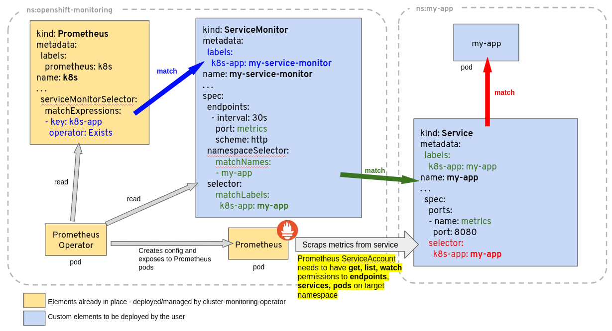

# How to create a ServiceMonitor for prometheus-operator
This tutorial is about to add a custom application to monitoring by prometheus-operator in a k8s cluster.



# Prometheus `release` label
Get the Prometheus `release` label:
```sh
kubectl get prometheuses.monitoring.coreos.com -n prometheus -o go-template='{{range .items}}{{.spec.scrapeConfigSelector.matchLabels.release}}{{"\n"}}{{end}}'
```

Output:
```yaml
prometheus
```

# List ServiceMonitor
Get the list of Prometheus ServiceMonitor:
```sh
kubectl get servicemonitors.monitoring.coreos.com -n prometheus
```

# 

```yaml
apiVersion: monitoring.coreos.com/v1
kind: ServiceMonitor
metadata:
  name: example-app
  labels:
    team: frontend
spec:
  selector:
    matchLabels:
      app: example-app
  endpoints:
  - port: web
```

# References
[Prometheus Community Kubernetes Helm Charts](https://github.com/prometheus-community/helm-charts)  
[How to create a ServiceMonitor for prometheus-operator?](https://stackoverflow.com/questions/52991038/how-to-create-a-servicemonitor-for-prometheus-operator)
