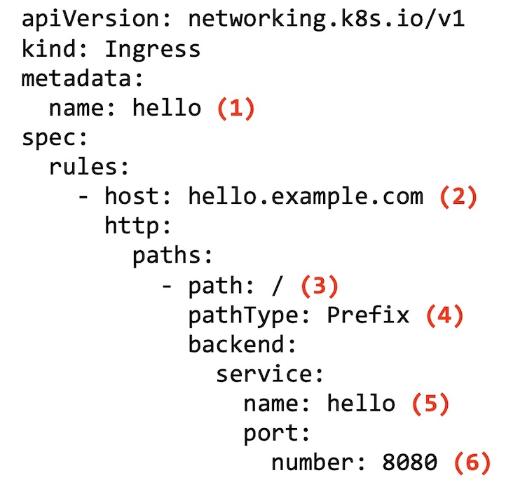

# Grafana - Ingress
The goal of this tutorial is to access Grafana via `HTTPS`, since by default Grafana exposes only `HTTP`.

Ingress exposes `HTTP` and `HTTPS` routes from outside the cluster to services within the cluster. Traffic routing is controlled by rules defined on the Ingress resource.

Here is a simple example where an Ingress sends all its traffic to one Service:


# Grafana Service
This is the Grafana Service that was created by Helm chart. You can get the configuration with the command:
```sh
kubectl get service -n prometheus prometheus-grafana -o yaml
```

I removed unnecessary information:
```yaml
apiVersion: v1
kind: Service
metadata:
  annotations:
    meta.helm.sh/release-name: prometheus
    meta.helm.sh/release-namespace: default
  creationTimestamp: "2023-08-30T23:53:44Z"
  labels:
    app.kubernetes.io/instance: prometheus
    app.kubernetes.io/managed-by: Helm
    app.kubernetes.io/name: grafana
    app.kubernetes.io/version: 10.1.0
    helm.sh/chart: grafana-6.59.0
  name: prometheus-grafana
  namespace: prometheus
  resourceVersion: "219783"
  uid: 6e3dab53-2eab-481b-9826-043d44888aeb
spec:
  type: ClusterIP
  externalIPs:
  - 198.19.0.91
  internalTrafficPolicy: Cluster
  ports:
  - name: http-web
    port: 80
    protocol: TCP
    targetPort: 3000
  selector:
    app.kubernetes.io/instance: prometheus
    app.kubernetes.io/name: grafana
  sessionAffinity: None
```

# Ingress Resource Configuration



```yaml
apiVersion: networking.k8s.io/v1
kind: Ingress
metadata:
  name: grafana (1)
  namespace: prometheus (2)
spec:
  rules:
    - host: grafana.isociel.com (3)
      http:
        paths:
          - path: / (4)
            pathType: Prefix (5)
            backend:
              service:
                name: prometheus-grafana (6)
                port:
                  number: 80 (7)
```

1.	The name of the ingress resource.
2.	The namespace of the ingress resource.
3.	The host’s name used by external users to access your application.
4.	This value is used in combination with pathType to determine if the URL request matches any of the accepted paths. A path value of / with the pathType value of Prefix is the equivalent of a wildcard that matches any path.
5.	This value is used in combination with path to determine if the URL matches any of the accepted paths. A pathType of Prefix offers a bit more flexibility allowing for matches where the path and the requested URL can contain either a trailing / or not. A pathType of Exact requires the requested URL to exactly match the path value.
6.	The name of the service to which requests are redirected.
7.	The port number on which the service listens.

# Test
We can pretend we already configured a DNS entry by using `cURL`:
```sh
curl --resolve "grafana.isociel.com:80:198.19.0.91" -i http://grafana.isociel.com
```

