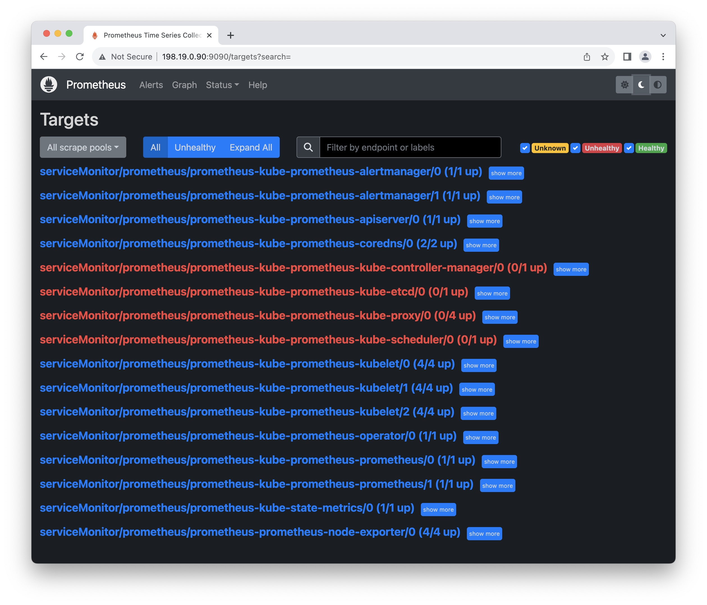

# K8s Cluster Monitoring with Prometheus
We are going to show how to install Prometheus and Grafana using Helm charts. We are also going to learn how we can connect Prometheus and Grafana together and set up a basic dashboard on Grafana to monitor resources on the Kubernetes cluster.

Prometheus takes care of data fetching as a data source and feeds that data into Grafana which is used to visualize data with attractive dashboards.

# kube-prometheus-stack
Installs the kube-prometheus stack, a collection of Kubernetes manifests, Grafana dashboards, and Prometheus rules combined with documentation and scripts to provide easy to operate end-to-end Kubernetes cluster monitoring with Prometheus using the Prometheus Operator.

See the kube-prometheus README for details about components, dashboards, and alerts.

Note: This chart was formerly named prometheus-operator chart, now renamed to more clearly reflect that it installs the kube-prometheus project stack, within which Prometheus Operator is only one component.

# Get Helm Repository Info
Get Repository Info:
```sh
helm repo add prometheus-community https://prometheus-community.github.io/helm-charts
helm repo update
```

# Install Prometheus
I'll use `helm` to install Prometheus. If you don't have Helm installed, follow this quick tutorial [here](../helm.md)

### Check the version available on Helm (Optional):
```sh
helm show chart prometheus-community/prometheus | grep ^appVersion
```

### Customize Chart Values
Get the values of the chart: 
```sh
helm show values prometheus-community/kube-prometheus-stack > values.yaml
```

I prefer running Prometheus in it's own namespace:
```sh
sed -i 's/namespaceOverride: ""/namespaceOverride: "prometheus"/g' values.yaml
```

```
## Override the deployment namespace
##
namespaceOverride: "prometheus"
...
## Using default values from https://github.com/grafana/helm-charts/blob/main/charts/grafana/values.yaml
##
grafana:
  enabled: true
  namespaceOverride: "prometheus"
...
## Configuration for kube-state-metrics subchart
##
kube-state-metrics:
  namespaceOverride: "prometheus"
...
## Configuration for prometheus-node-exporter subchart
##
prometheus-node-exporter:
  namespaceOverride: "prometheus"
```

### Install Prometheus with a customized configuration:
The following commands can be run on your "jump station".
```sh
kubectl create namespace prometheus
helm install prometheus prometheus-community/kube-prometheus-stack -f values.yaml
```

Output:
```
NAME: prometheus
LAST DEPLOYED: Mon Aug 14 08:54:30 2023
NAMESPACE: default
STATUS: deployed
REVISION: 1
NOTES:
kube-prometheus-stack has been installed. Check its status by running:
  kubectl --namespace prometheus get pods -l "release=prometheus"

Visit https://github.com/prometheus-operator/kube-prometheus for instructions on how to create & configure Alertmanager and Prometheus instances using the Operator.
```

# Verify Installation
You can monitor the installation with the following command:
```sh
watch kubectl get all -n prometheus
```

Hit <kbd>Ctrl</kbd> + <kbd>Alt</kbd> + <kbd>C</kbd> to quit.

Output:
```
NAME                                                         READY   STATUS    RESTARTS   AGE
pod/alertmanager-prometheus-kube-prometheus-alertmanager-0   2/2     Running   0          37s
pod/prometheus-grafana-5b4b87769c-zkfz7                      3/3     Running   0          49s
pod/prometheus-kube-prometheus-operator-6c676cfb6b-ffcsq     1/1     Running   0          49s
pod/prometheus-kube-state-metrics-7f4f499cb5-24dhz           1/1     Running   0          49s
pod/prometheus-prometheus-kube-prometheus-prometheus-0       2/2     Running   0          36s
pod/prometheus-prometheus-node-exporter-7cdq9                1/1     Running   0          49s
pod/prometheus-prometheus-node-exporter-dc7wr                1/1     Running   0          49s
pod/prometheus-prometheus-node-exporter-h76xl                1/1     Running   0          49s
pod/prometheus-prometheus-node-exporter-qkjps                1/1     Running   0          49s

NAME                                              TYPE        CLUSTER-IP       EXTERNAL-IP   PORT(S)                      AGE
service/alertmanager-operated                     ClusterIP   None             <none>        9093/TCP,9094/TCP,9094/UDP   37s
service/prometheus-grafana                        ClusterIP   198.18.176.7     <none>        80/TCP                       49s
service/prometheus-kube-prometheus-alertmanager   ClusterIP   198.18.209.242   <none>        9093/TCP,8080/TCP            49s
service/prometheus-kube-prometheus-operator       ClusterIP   198.18.171.201   <none>        443/TCP                      49s
service/prometheus-kube-prometheus-prometheus     ClusterIP   198.18.188.7     <none>        9090/TCP,8080/TCP            49s
service/prometheus-kube-state-metrics             ClusterIP   198.18.181.191   <none>        8080/TCP                     49s
service/prometheus-operated                       ClusterIP   None             <none>        9090/TCP                     37s
service/prometheus-prometheus-node-exporter       ClusterIP   198.18.7.36      <none>        9100/TCP                     49s

NAME                                                 DESIRED   CURRENT   READY   UP-TO-DATE   AVAILABLE   NODE SELECTOR            AGE
daemonset.apps/prometheus-prometheus-node-exporter   4         4         4       4            4           kubernetes.io/os=linux   49s

NAME                                                  READY   UP-TO-DATE   AVAILABLE   AGE
deployment.apps/prometheus-grafana                    1/1     1            1           49s
deployment.apps/prometheus-kube-prometheus-operator   1/1     1            1           49s
deployment.apps/prometheus-kube-state-metrics         1/1     1            1           49s

NAME                                                             DESIRED   CURRENT   READY   AGE
replicaset.apps/prometheus-grafana-5b4b87769c                    1         1         1       49s
replicaset.apps/prometheus-kube-prometheus-operator-6c676cfb6b   1         1         1       49s
replicaset.apps/prometheus-kube-state-metrics-7f4f499cb5         1         1         1       49s

NAME                                                                    READY   AGE
statefulset.apps/alertmanager-prometheus-kube-prometheus-alertmanager   1/1     37s
statefulset.apps/prometheus-prometheus-kube-prometheus-prometheus       1/1     37s
```

# Connect to Prometheus
```sh
kubectl get svc -n prometheus
```

Output:
```
NAME                                      TYPE        CLUSTER-IP       EXTERNAL-IP   PORT(S)                      AGE
alertmanager-operated                     ClusterIP   None             <none>        9093/TCP,9094/TCP,9094/UDP   28h
prometheus-grafana                        ClusterIP   198.18.176.7     <none>        80/TCP                       28h
prometheus-kube-prometheus-alertmanager   ClusterIP   198.18.209.242   <none>        9093/TCP,8080/TCP            28h
prometheus-kube-prometheus-operator       ClusterIP   198.18.171.201   <none>        443/TCP                      28h
prometheus-kube-prometheus-prometheus     ClusterIP   198.18.188.7     <none>        9090/TCP,8080/TCP            28h
prometheus-kube-state-metrics             ClusterIP   198.18.181.191   <none>        8080/TCP                     28h
prometheus-operated                       ClusterIP   None             <none>        9090/TCP                     28h
prometheus-prometheus-node-exporter       ClusterIP   198.18.7.36      <none>        9100/TCP                     28h
```
The Prometheus server is `prometheus-kube-prometheus-prometheus     ClusterIP   198.18.188.7     <none>        9090/TCP,8080/TCP            28h`

> [!IMPORTANT]  
> You will most probably run the following command from a "jump station", at least that's my case.
> You can test with the web server with `curl` **from your "jump station"**.

Configure port-forwarding (**from your "jump station"**):
```sh
kubectl port-forward -n prometheus prometheus-prometheus-kube-prometheus-prometheus-0 9090
```

Test with `curl` (**from your "jump station"**)
```sh
curl http://127.0.0.1:9090
```

Your output should be similar as this:
```
<a href="/graph">Found</a>.
```

## Edit Prometheus Service
I have dynamic routing in my cluster with ToR router. I configured an external IP for the service. I can now reach the web page from any workstation:
```sh
kubectl edit service -n prometheus prometheus-kube-prometheus-prometheus
```

Add the following under `ports`, save and quit:
```yaml
  externalIPs:
    - 198.19.0.90
```

Open your favorite browser and use the url: `http://198.19.0.90:9090/`

## Edit Grafana Service
Add external IP for Grafana:
```sh
kubectl edit service -n prometheus prometheus-grafana
```

Add the following under `ports`, save and quit:
```yaml
  externalIPs:
    - 198.19.0.91
```

Open your favorite browser and use the url: `http://198.19.0.91/login`

# Fixing Errors
I had some *unhealthy service monitor*. Let's try to fix them.



## kube-controller-scheduler
You need to be on a master node. Edit the configuration file of the controller manager:
```sh
sudo vi /etc/kubernetes/manifests/kube-scheduler.yaml
```

You either need to have `--bind-address=0.0.0.0` or if you are using control-plane IP, you need to change `livenessProbe` and `startupProbe` host, too.
```yaml
...
spec:
  containers:
  - command:
...
    - --bind-address=192.168.13.61
...
      httpGet:
        host: 192.168.13.61
        path: /healthz
...
      httpGet:
        host: 192.168.13.61
        path: /healthz
```

No need to restart anything. K8s will pickup the change anld restart the Pod `kube-controller-manager-XXXXXXX` for you.

[kube-prometheus-stack issue scraping metrics](https://stackoverflow.com/questions/65901186/kube-prometheus-stack-issue-scraping-metrics/66276144#66276144)  

## kube-controller-manager
You need to be on a master node. Edit the configuration file of the controller manager:
```sh
sudo vi /etc/kubernetes/manifests/kube-controller-manager.yaml
```

You either need to have `--bind-address=0.0.0.0` or if you are using control-plane IP, you need to change `livenessProbe` and `startupProbe` host, too.
```yaml
...
spec:
  containers:
  - command:
...
    - --bind-address=192.168.13.61
...
      httpGet:
        host: 192.168.13.61
        path: /healthz
...
      httpGet:
        host: 192.168.13.61
        path: /healthz
```

No need to restart anything. K8s will pickup the change anld restart the Pod `kube-controller-manager-XXXXXXX` for you

[kube-prometheus-stack issue scraping metrics](https://stackoverflow.com/questions/65901186/kube-prometheus-stack-issue-scraping-metrics/66276144#66276144)  

## kube-proxy
This is the fix if you get Kubernetes proxy down alert for all the nodes in Prometheus.

Set the kube-proxy argument for metric-bind-address:
```sh
kubectl edit cm/kube-proxy -n kube-system
```

```yaml
...
kind: KubeProxyConfiguration
metricsBindAddress: 0.0.0.0:10249
...
```

Restart all `kube-proxy` Pods:
```sh
kubectl delete pod -l k8s-app=kube-proxy -n kube-system
```

[All Kubernetes proxy targets down - Prometheus Operator](https://stackoverflow.com/questions/60734799/all-kubernetes-proxy-targets-down-prometheus-operator)  

## prometheus-kube-prometheus-kube-etcd

> [!IMPORTANT]  
>If you bootstrapped your cluster using `kubeadm`, it has configured `etcd` with `--listen-metrics-urls` on `http`, which does not require any certificates.

Add the IP address of control-plane. You need to **be on a control plane** to edit the file:
```sh
sudo vi /etc/kubernetes/manifests/etcd.yaml
```

In my case I just added this `,http://192.168.13.61:2381`
```yaml
    - --listen-metrics-urls=http://127.0.0.1:2381,http://192.168.13.61:2381
```

Uncomment the following lines and make sure to use `http`:
```yaml
  serviceMonitor:
    scheme: http
    serverName: localhost
```

Reapply the new configuration:
```sh
helm upgrade prometheus prometheus-community/kube-prometheus-stack -f values.yaml
```

[](https://github.com/prometheus-community/helm-charts/issues/204#issuecomment-765155883)  

# Prometheus Configuration

---
# Uninstall Helm Chart (just in case 😀)
If you ever want to uninstall Prometheus completely, use the commands below:
```sh
helm uninstall prometheus
kubectl delete ns prometheus
```
CRDs created by this chart are not removed by default and should be manually cleaned up:
```sh
kubectl delete crd alertmanagerconfigs.monitoring.coreos.com
kubectl delete crd alertmanagers.monitoring.coreos.com
kubectl delete crd podmonitors.monitoring.coreos.com
kubectl delete crd probes.monitoring.coreos.com
kubectl delete crd prometheusagents.monitoring.coreos.com
kubectl delete crd prometheuses.monitoring.coreos.com
kubectl delete crd prometheusrules.monitoring.coreos.com
kubectl delete crd scrapeconfigs.monitoring.coreos.com
kubectl delete crd servicemonitors.monitoring.coreos.com
kubectl delete crd thanosrulers.monitoring.coreos.com
```

You shouldn't see anything in the namespace `prometheus`
```sh
kubectl get all -n prometheus
```

Delete the namespace:
```sh
kubectl delete ns prometheus
```

## If you want to remove the images
Go on each node (master and worker) and delete the images related to Prometheus and Grafana.

1. List the image(s)

List the local images:
```sh
crictl images ls
sudo nerdctl -n k8s.io image ls
```

The ouput should look like this:
```
IMAGE                                                    TAG                 IMAGE ID            SIZE
...
quay.io/prometheus-operator/prometheus-config-reloader   v0.65.1             27473df42d72c       5.2MB
quay.io/prometheus/alertmanager                          v0.25.0             c8568f914cd25       30.8MB
quay.io/prometheus/node-exporter                         v1.5.0              0da6a335fe135       11.5MB
quay.io/prometheus/prometheus                            v2.44.0             75972a31ad256       93MB
...
```

2. Delete the image(s) with the command:
```sh
crictl rmi <IMAGE ID>
sudo nerdctl -n k8s.io image rm <IMAGE ID>
```

# References
[Kubernetes Monitoring Made Easy with Prometheus | KodeKloud](https://www.youtube.com/watch?v=6xmWr7p5TE0)  
[helm-charts](https://github.com/prometheus-community/helm-charts)  
[kube-prometheus-stack](https://github.com/prometheus-community/helm-charts/blob/main/charts/kube-prometheus-stack/README.md)  
[kube-prometheus](https://github.com/prometheus-operator/kube-prometheus)  

# Advanced Configuration
**INCOMPLETE**

## Prometheus Configuration

Get all StatefulSet:
```sh
kubectl get statefulset -n prometheus
```

```sh
kubectl describe statefulset -n prometheus prometheus-prometheus-kube-prometheus-prometheus > prometheus.yaml
```

The secret is:
```yaml
   config:
    Type:        Secret (a volume populated by a Secret)
    SecretName:  prometheus-prometheus-kube-prometheus-prometheus
```

The rules are:
```yaml
   prometheus-prometheus-kube-prometheus-prometheus-rulefiles-0:
    Type:      ConfigMap (a volume populated by a ConfigMap)
    Name:      prometheus-prometheus-kube-prometheus-prometheus-rulefiles-0
```

Grab the `SecretName` above:
```sh
kubectl describe secrets -n prometheus prometheus-prometheus-kube-prometheus-prometheus
```

Grab the `Name` of the `ConfigMap` above:
```sh
kubectl describe configmap -n prometheus prometheus-prometheus-kube-prometheus-prometheus-rulefiles-0 > rulefile.yaml
```

> [!NOTE]  
> This stores the rulefiles.

## Operator Config

Get all the Deployments:
```sh
kubectl get deploy -n prometheus
```

```sh
kubectl describe deploy -n prometheus prometheus-kube-prometheus-operator > operator.yaml
```
