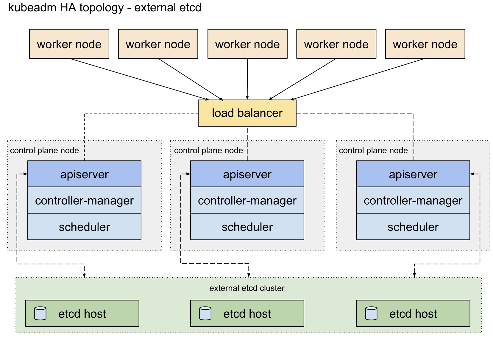
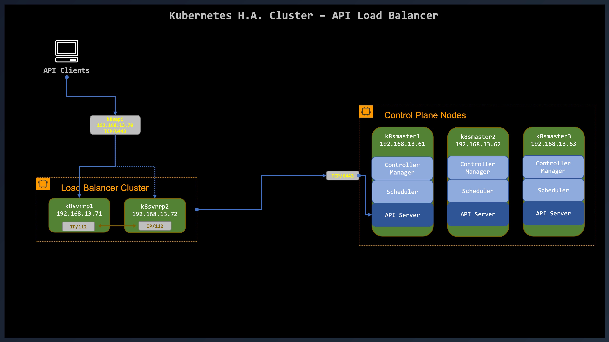

# Kubernetes High Availability(HA)
This tutorial is about Creating a Highly Available Kubernetes Clusters with `kubeadm`.

> [!WARNING]  
> If you are new to Kubernetes, this tutorial is **NOT** for you. I assume you have a good knowledge of Ubuntu, networking, reverse proxy with Nginx, PKI, VRRP and knowledge of Kubernetes.

This tutorial does not address running your cluster on a cloud provider. It will work with bare metal or virtual servers.

# Options for Highly Available Topology
There's two different approaches to setting up a highly available Kubernetes cluster using `kubeadm`:

1. With **stacked control plane nodes**. The `etcd` members and control plane nodes are co-located. This approach requires less infrastructure.
2. With an **external `etcd` cluster**. The control plane nodes and `etcd` members are separated. This approach requires more infrastructure.

In this tutorial we're going to use option with an **external `etcd` cluster**. See the [topology diagram](https://kubernetes.io/docs/setup/production-environment/tools/kubeadm/ha-topology/) taken from Kubernetes.



# What is failure tolerance?
A Kubernetes and an `etcd` cluster operates so long as a member quorum can be established. In the case of `etcd`, if quorum is lost through transient network failures (e.g., partitions), `etcd` automatically and safely resumes once the network recovers and restores quorum.

It is recommended to have an odd number of members in a cluster for the control plane and for `etcd`. An odd-size cluster tolerates the same number of failures as an even-size cluster but with fewer nodes.

|Cluster Size|Majority|Failure Tolerance|
|----|----|----|
|1|1|0|
|2|2|0|
|---> **3**|**2**|**1** <---|
|4|3|1|
|5|3|2|
|6|4|2|
|7|4|3|
|8|5|3|
|9|5|4|

# Before you begin
You will need eleven (11) Linux servers Ubuntu 22.04.3 LTS with minimal installation. See [this tutorial](./01_Ubuntu-22-04.md) on how-to make a VM with Ubuntu 22.04.

### Kubernetes master and worker nodes:
- Three machines that meet kubeadm's minimum requirements for Kubernetes control-plane nodes:
  - including a container runtime, already set up and working.
Three machines that meet kubeadm's minimum requirements for the worker nodes:
  - including a container runtime, already set up and working.
- Full network connectivity between all machines in the cluster
- Superuser privileges on all machines using sudo. You can use a different tool but this guide uses sudo.
- SSH access from one bastion host to all nodes in the system.
- `kubeadm` and `kubelet` already installed on all **master** and **worker** machines.

### etcd datastore nodes:
- Three additional machines, that will become `etcd` cluster members.
- Some infrastructure to copy files between hosts. For example `ssh` and `scp` can satisfy this requirement.
  <!-- - These machines again need to have kubeadm and kubelet installed.
  - These machines also require a container runtime, that is already set up and working. -->

### Load Balancer API:
- Two additional machines that acts as `kube-apiserver` load balancer with a DNS name that resolves to the VRRP floating IP address.
  - Keepalived for VRRP
  - These machines should run a load balancer. I have choosen Nginx Open Source.
  - The load balancer must be able to communicate with all control plane nodes on the apiserver port `6443`.
  - Make sure the address VIP of the load balancer always matches the address of kubeadm's `ControlPlaneEndpoint`. This is **VERY** important and can only be set when you bootstrap your K8s Cluster.

|Role|FQDN|IP|OS|Kernel|RAM|vCPU|
|----|----|----|----|----|----|----|
|K8s Master|k8smaster1.isociel.com|192.168.13.61|Ubuntu 22.04.3|6.4.14|2G|2|
|K8s Master|k8smaster2.isociel.com|192.168.13.62|Ubuntu 22.04.3|6.4.14|2G|2|
|K8s Master|k8smaster3.isociel.com|192.168.13.63|Ubuntu 22.04.3|6.4.14|2G|2|
|K8s Worker|k8sworker1.isociel.com|192.168.13.65|Ubuntu 22.04.3|6.4.14|2G|2|
|K8s Worker|k8sworker2.isociel.com|192.168.13.66|Ubuntu 22.04.3|6.4.14|2G|2|
|K8s Worker|k8sworker3.isociel.com|192.168.13.67|Ubuntu 22.04.3|6.4.14|2G|2|
|etcd datastore|k8setcd1.isociel.com|192.168.13.35|Ubuntu 22.04.3|6.4.14|2G|2|
|etcd datastore|k8setcd2.isociel.com|192.168.13.36|Ubuntu 22.04.3|6.4.14|2G|2|
|etcd datastore|k8setcd3.isociel.com|192.168.13.37|Ubuntu 22.04.3|6.4.14|2G|2|
|K8s API VIP|k8sapi.isociel.com|192.168.13.70|This is a VIP for API|N/A|N/A|N/A|
|Load Balancer|k8svrrp1.isociel.com|192.168.13.71|Ubuntu 22.04.3|6.4.14|2G|2|
|Load Balancer|k8svrrp2.isociel.com|192.168.13.72|Ubuntu 22.04.3|6.4.14|2G|2|

Each master node, in a multi-master environment, runs its own copy of
- Kube API server
- controller manager, which handles replication
- scheduler, which schedules pods to nodes.

The `etcd` database is run on separate servers.

# Bootstrapping an `etcd` cluster

## Overview
This guide will cover the static mechanisms for bootstrapping an `etcd` cluster. Starting an `etcd` cluster statically requires that each member knows another in the cluster. TLS channels will be used for encrypted internal cluster communication between peers as well as encrypted client traffic.

We will use our own private CA. Each cluster member will have a single unique cert/key pair (`k8setcd{1-3}.crt`, `k8setcd{1-3}.key`) signed our private CA certificate (`etcd-ca.crt`) for both peer connections and client connections.

> [!IMPORTANT]  
> Keep the the CA certificate and private key (`etcd-ca.crt` and `etcd-ca.key`) as you will need them to bootstrap the Kubernetes control plane.

|Role|FQDN|IP|OS|Kernel|RAM|vCPU|
|----|----|----|----|----|----|----|
|etcd datastore|k8setcd1.isociel.com|192.168.13.35|Ubuntu 22.04.3|6.4.14|2G|2|
|etcd datastore|k8setcd2.isociel.com|192.168.13.36|Ubuntu 22.04.3|6.4.14|2G|2|
|etcd datastore|k8setcd3.isociel.com|192.168.13.37|Ubuntu 22.04.3|6.4.14|2G|2|

[Follow this page to build the etcd cluster](203-etcd/01-HA-etcd.md)  

> [!NOTE]  
> I tried to do most of my work from a bastion host. If you do that, you should have all the `etcd` certificate handy when you bootstrap you cluster.

## What's next
Once you have the `etcd` cluster with 3 working members, you can continue setting up a highly available control plane using the external `etcd` method with `kubeadm`.

## References - `etcd`
[etcd Docs](https://etcd.io/docs/v3.5/)  
[etcd Clustering](https://etcd.io/docs/v3.5/op-guide/clustering/)  

# Load Balancer
In highly available Kubernetes Cluster, a load balancer must sit in front of the `kube-apiservers` to correctly route requests to healthy API servers. The load balancer routes traffic to the `kube-apiservers`. If one Kubernetes Control Plane goes goes down, the load balancer routes traffic around this failure.

For this guide we'll use:
- Nginx as a load balancer - reverse proxy in layer 4 only.
- `keepalived` to implement VRRP between the two Nginx servers.



## Nginx - Reverse Proxy
Before you begin, you need:

- Two (2) machines running Ubuntu 22.04 Linux OS.
- 2 GiB or more of RAM per machine.
- 2 vCPUs on each server.
- Full network connectivity among both machines in the cluster.
- One floating IP addresse for the VIP between the cluster of load balancer.

|Role|FQDN|IP|OS|Kernel|RAM|vCPU|
|----|----|----|----|----|----|----|
|K8s API VIP|k8sapi.isociel.com|192.168.13.70|This is a VIP for API|N/A|N/A|N/A|
|Load Balancer|k8svrrp1.isociel.com|192.168.13.71|Ubuntu 22.04.3|6.4.14|2G|2|
|Load Balancer|k8svrrp2.isociel.com|192.168.13.72|Ubuntu 22.04.3|6.4.14|2G|2|

[Follow this page to build an Nginx server that will act as a load balancer](./03-k8s-API-LB4.md)

## Keepalived
`Keepalived` is a powerful package that leverages the Linux kernel feature of floating IP addresses through Virtual Router Redundancy Protocol (VRRP). Two instances of Nginx are launched, a primary instance and a standby instance. If the primary instance fails, `keepalived` moves the floating IP address to the standby, and no service disruption will occur.

`Keepalived` will monitor each instances of Nginx.

Follow [this guide](./KeepaliveD/README.md) to setup `keepalived` and Nginx.

## References - `Nginx - Keepalived`
[Keepalived Home Page](https://www.keepalived.org/)  

---
# Bootstrap a master node
The preferred way to configure `kubeadm` is to pass an YAML configuration file with the `--config` option. Some of the configuration options defined in the `kubeadm` config file are also available as command line flags, but only the most common/simple use case are supported with this approach.

You can use this procedure even if you plan to bootstrap only one Control Plane.

See [kubeadm Configuration (v1beta3)](https://kubernetes.io/docs/reference/config-api/kubeadm-config.v1beta3/) for the options of the kubeadm configuration file format.

## Multiple Control Plane
> [!IMPORTANT]  
> In case of multiple control plane, you will need a VIP that will be the `controlPlaneEndpoint`. In this example, the `controlPlaneEndpoint` is `k8sapi.isociel.com` which is the load balancer cluster.

|Role|FQDN|IP|OS|Kernel|RAM|vCPU|
|----|----|----|----|----|----|----|
|K8s API VIP|k8sapi.isociel.com|192.168.13.70|This is a VIP for API|N/A|N/A|N/A|
|K8s Master|k8smaster1.isociel.com|192.168.13.61|Ubuntu 22.04.3|6.4.14|2G|2|
|K8s Master|k8smaster2.isociel.com|192.168.13.62|Ubuntu 22.04.3|6.4.14|2G|2|
|K8s Master|k8smaster3.isociel.com|192.168.13.63|Ubuntu 22.04.3|6.4.14|2G|2|
|etcd datastore|k8setcd1.isociel.com|192.168.13.35|Ubuntu 22.04.3|6.4.14|2G|2|
|etcd datastore|k8setcd2.isociel.com|192.168.13.36|Ubuntu 22.04.3|6.4.14|2G|2|
|etcd datastore|k8setcd3.isociel.com|192.168.13.37|Ubuntu 22.04.3|6.4.14|2G|2|

## `etcd` TLS Certificates
When we created the `etcd` cluster we created a CA for `etcd` and some client certificates. In my case the files are on my bastion host. I also created a certificate/key for Kubernetes Control Plane.

The TLS files needed to access our `etcd` cluster. Those files must be copied on `k8smaster1` (the 1st Control Plane):
```
/etc/kubernetes/pki
└── etcd
    ├── etcd-ca.crt
    ├── etcd-ca.key
    ├── apiserver-etcd-client.crt
    ├── apiserver-etcd-client.key
```

- Create the `/etc/kubernetes/pki/etcd` directory on the first master node.
- Copy the `etcd` CA certificate and private key in the directory `/etc/kubernetes/pki/etcd` on the master node.

When the cluster is `bootstrapped`, `kubeadm` will not override the certificate and private key
```sh
# Command executes from bastion host used to copy the ETCD TLS certificates on first Master Node
ssh k8smaster1 'sudo mkdir -p /etc/kubernetes/pki/etcd'
scp etcd-ca.{crt,key} daniel@k8smaster1:/$HOME/.
scp k8smaster1.{crt,key} daniel@k8smaster1:/$HOME/.
ssh daniel@k8smaster1 'sudo mv etcd-ca.crt /etc/kubernetes/pki/etcd/. && sudo chown root:root /etc/kubernetes/pki/etcd-ca.crt'
ssh daniel@k8smaster1 'sudo mv k8smaster1.crt /etc/kubernetes/pki/etcd/apiserver-etcd-client.crt && sudo chown root:root /etc/kubernetes/pki/etcd/apiserver-etcd-client.crt'
 ssh daniel@k8smaster1 'sudo mv etcd-ca.key /etc/kubernetes/pki/etcd/. && sudo chown root:root /etc/kubernetes/pki/etcd-ca.key'
ssh daniel@k8smaster1 'sudo mv k8smaster1.key /etc/kubernetes/pki/etcd/apiserver-etcd-client.key && sudo chown root:root /etc/kubernetes/pki/etcd/apiserver-etcd-client.key'
```

[Kubernetes PKI certificates and requirements](https://kubernetes.io/docs/setup/best-practices/certificates/)  

## Bootstrap `k8smaster1`
Let's bootstrap the first control plane 🥳

## Create configuration file
I decided to create a `yaml` file for `kubeadm` to bootstrap the K8s cluster. Since I'm planning to use either `Calico` or `Cilium` as my CNI, the cluster will be `kube-proxy` free 😉 This is the option `skipPhases: addon/kube-proxy`. If you need `kube-proxy`, just comment that line.

For the IP addresses assigned to **Pods** and **Services**, I will be using the following:
- Pods: `100.64.0.0/10`
  - Shared address space for communications between a service provider and its subscribers when using a carrier-grade NAT.
- Services: `198.18.0.0/16`
  - Used for benchmark testing of inter-network communications between two separate subnets.

>Note: Feel free to adjust the IP addresses above

> [!IMPORTANT]  
> You need to be on `k8smaster1`.

Create a configuration file `kubeadm-k8smaster1-config.yaml` with the following content. Do not hesitate to modify it for your own environment:

```sh
cat <<EOF | tee kubeadm-k8smaster1-config.yaml
apiVersion: kubeadm.k8s.io/v1beta3
kind: InitConfiguration
nodeRegistration:
  criSocket: unix:///var/run/containerd/containerd.sock
localAPIEndpoint:
  advertiseAddress: 192.168.13.61
  bindPort: 6443
# Uncomment if you DON'T want to install "kube-proxy"
# skipPhases:
#   - addon/kube-proxy
---
# Comment if you DON'T want to use "IPVS" and prefer to use the default "IPTABLES"
apiVersion: kubeproxy.config.k8s.io/v1alpha1
kind: KubeProxyConfiguration
mode: ipvs
---
apiVersion: kubeadm.k8s.io/v1beta3
kind: ClusterConfiguration
clusterName: k8s-cluster1
controlPlaneEndpoint: k8sapi.isociel.com:6443
# The 'etcd' section is only if you have an external etcd cluster
etcd:
  external:
    endpoints:
      - https://192.168.13.35:2379 # change ETCD-IP appropriately
      - https://192.168.13.36:2379 # change ETCD-IP appropriately
      - https://192.168.13.37:2379 # change ETCD-IP appropriately
    caFile: /etc/kubernetes/pki/etcd/etcd-ca.crt
    certFile: /etc/kubernetes/pki/etcd/apiserver-etcd-client.crt
    keyFile: /etc/kubernetes/pki/etcd/apiserver-etcd-client.key

networking:
  dnsDomain: cluster.local
  podSubnet: 100.64.0.0/10
  serviceSubnet: 198.18.0.0/16
apiServer:
  certSANs:
  - k8smaster1
  - k8smaster2
  - k8smaster3
  - k8sapi.isociel.com
  - k8smaster1.isociel.com
  - k8smaster2.isociel.com
  - k8smaster3.isociel.com
  - kubernetes
  - kubernetes.default
  - kubernetes.default.svc
  - kubernetes.default.svc.cluster.local
  - 192.168.13.70
  - 192.168.13.61
  - 192.168.13.62
  - 192.168.13.63
  timeoutForControlPlane: 4m0s
certificatesDir: /etc/kubernetes/pki
controllerManager:
  extraArgs:
    "node-cidr-mask-size": "24"
EOF
```

### IP addresses

- Pods IP address: is the pool of IP's assign to Pods (managed by Kubernetes)
- Cluster IP: is the pool of IP's assign to service (managed by Kubernetes)
- External IP: is the pool of IP's assign to external load balancer (NOT managed by Kubernetes)

|Pods CIRD|Cluster IPs|External IPs*|
|----|----|----|
|100.64.0.0/10|198.18.0.0/16|198.19.0.0/16*|

> [!IMPORTANT]  
> *External IP addresses are NOT managed by Kubernetes. If you have your own On Prem Cluster, it's managed by you 🙂

## Bootstrap the cluster
Run the following command to bootstrap `k8smaster1` and create the cluster:
```sh
sudo kubeadm init --config kubeadm-k8smaster1-config.yaml --upload-certs
```

Output:
```
[init] Using Kubernetes version: v1.28.2
[preflight] Running pre-flight checks
[preflight] Pulling images required for setting up a Kubernetes cluster
[preflight] This might take a minute or two, depending on the speed of your internet connection
[preflight] You can also perform this action in beforehand using 'kubeadm config images pull'
W0913 14:13:21.632283    3021 checks.go:835] detected that the sandbox image "registry.k8s.io/pause:3.8" of the container runtime is inconsistent with that used by kubeadm. It is recommended that using "registry.k8s.io/pause:3.9" as the CRI sandbox image.
[certs] Using certificateDir folder "/etc/kubernetes/pki"
[certs] Generating "ca" certificate and key
[certs] Generating "apiserver" certificate and key
[certs] apiserver serving cert is signed for DNS names [k8sapi.isociel.com k8smaster1 k8smaster1.isociel.com k8smaster2 k8smaster2.isociel.com k8smaster3 k8smaster3.isociel.com kubernetes kubernetes.default kubernetes.default.svc kubernetes.default.svc.cluster.local] and IPs [198.18.0.1 192.168.13.61 192.168.13.70 192.168.13.62 192.168.13.63]
[certs] Generating "apiserver-kubelet-client" certificate and key
[certs] Generating "front-proxy-ca" certificate and key
[certs] Generating "front-proxy-client" certificate and key
[certs] External etcd mode: Skipping etcd/ca certificate authority generation
[certs] External etcd mode: Skipping etcd/server certificate generation
[certs] External etcd mode: Skipping etcd/peer certificate generation
[certs] External etcd mode: Skipping etcd/healthcheck-client certificate generation
[certs] External etcd mode: Skipping apiserver-etcd-client certificate generation
[certs] Generating "sa" key and public key
[kubeconfig] Using kubeconfig folder "/etc/kubernetes"
[kubeconfig] Writing "admin.conf" kubeconfig file
[kubeconfig] Writing "kubelet.conf" kubeconfig file
[kubeconfig] Writing "controller-manager.conf" kubeconfig file
[kubeconfig] Writing "scheduler.conf" kubeconfig file
[control-plane] Using manifest folder "/etc/kubernetes/manifests"
[control-plane] Creating static Pod manifest for "kube-apiserver"
[control-plane] Creating static Pod manifest for "kube-controller-manager"
[control-plane] Creating static Pod manifest for "kube-scheduler"
[kubelet-start] Writing kubelet environment file with flags to file "/var/lib/kubelet/kubeadm-flags.env"
[kubelet-start] Writing kubelet configuration to file "/var/lib/kubelet/config.yaml"
[kubelet-start] Starting the kubelet
[wait-control-plane] Waiting for the kubelet to boot up the control plane as static Pods from directory "/etc/kubernetes/manifests". This can take up to 4m0s
[apiclient] All control plane components are healthy after 10.986025 seconds
[upload-config] Storing the configuration used in ConfigMap "kubeadm-config" in the "kube-system" Namespace
[kubelet] Creating a ConfigMap "kubelet-config" in namespace kube-system with the configuration for the kubelets in the cluster
[upload-certs] Storing the certificates in Secret "kubeadm-certs" in the "kube-system" Namespace
[upload-certs] Using certificate key:
f9ea00c50ef12a386949dfb84b3abb2aa1053cc84f3792cd4b8aa6cc42c1fd57
[mark-control-plane] Marking the node k8smaster1.isociel.com as control-plane by adding the labels: [node-role.kubernetes.io/control-plane node.kubernetes.io/exclude-from-external-load-balancers]
[mark-control-plane] Marking the node k8smaster1.isociel.com as control-plane by adding the taints [node-role.kubernetes.io/control-plane:NoSchedule]
[bootstrap-token] Using token: 38tjlt.ibkwbtflmj6w8qmg
[bootstrap-token] Configuring bootstrap tokens, cluster-info ConfigMap, RBAC Roles
[bootstrap-token] Configured RBAC rules to allow Node Bootstrap tokens to get nodes
[bootstrap-token] Configured RBAC rules to allow Node Bootstrap tokens to post CSRs in order for nodes to get long term certificate credentials
[bootstrap-token] Configured RBAC rules to allow the csrapprover controller automatically approve CSRs from a Node Bootstrap Token
[bootstrap-token] Configured RBAC rules to allow certificate rotation for all node client certificates in the cluster
[bootstrap-token] Creating the "cluster-info" ConfigMap in the "kube-public" namespace
[kubelet-finalize] Updating "/etc/kubernetes/kubelet.conf" to point to a rotatable kubelet client certificate and key
[addons] Applied essential addon: CoreDNS
[addons] Applied essential addon: kube-proxy

Your Kubernetes control-plane has initialized successfully!

To start using your cluster, you need to run the following as a regular user:

  mkdir -p $HOME/.kube
  sudo cp -i /etc/kubernetes/admin.conf $HOME/.kube/config
  sudo chown $(id -u):$(id -g) $HOME/.kube/config

Alternatively, if you are the root user, you can run:

  export KUBECONFIG=/etc/kubernetes/admin.conf

You should now deploy a pod network to the cluster.
Run "kubectl apply -f [podnetwork].yaml" with one of the options listed at:
  https://kubernetes.io/docs/concepts/cluster-administration/addons/

You can now join any number of the control-plane node running the following command on each as root:

  kubeadm join k8sapi.isociel.com:6443 --token 38tjlt.ibkwbtflmj6w8qmg \
	--discovery-token-ca-cert-hash sha256:8817bb69522a72618241f20adfede139743f48403367cec3f4144b43f918b97d \
	--control-plane --certificate-key f9ea00c50ef12a386949dfb84b3abb2aa1053cc84f3792cd4b8aa6cc42c1fd57

Please note that the certificate-key gives access to cluster sensitive data, keep it secret!
As a safeguard, uploaded-certs will be deleted in two hours; If necessary, you can use
"kubeadm init phase upload-certs --upload-certs" to reload certs afterward.

Then you can join any number of worker nodes by running the following on each as root:

kubeadm join k8sapi.isociel.com:6443 --token 38tjlt.ibkwbtflmj6w8qmg \
	--discovery-token-ca-cert-hash sha256:8817bb69522a72618241f20adfede139743f48403367cec3f4144b43f918b97d 
```

## Start using the cluster
It's not mandatory to administor the cluster from a master node. I would say it's better to use a bastion 😇. To copy the file `admin.conf` from a master node to your bastion host, execute the commands below (on the bastion host):
```sh
mkdir $HOME/.kube
ssh k8smaster1 'sudo cat /etc/kubernetes/admin.conf' > $HOME/.kube/config
```

## Verification
Check that you have a cluster with one master node only with the command (Don't worry about the `NotReady`):
```sh
kubectl get nodes -o=wide
```

Output:
```
NAME                     STATUS     ROLES           AGE    VERSION   INTERNAL-IP     EXTERNAL-IP   OS-IMAGE             KERNEL-VERSION          CONTAINER-RUNTIME
k8smaster1.isociel.com   NotReady   control-plane   5m5s   v1.28.1   192.168.13.61   <none>        Ubuntu 22.04.3 LTS   6.4.14-060414-generic   containerd://1.7.5
```

# Bootstrap another Control Plance
If you plan to bootstrap another Control Plane, follow the steps below for each one. If you don't plan to have a K8s Cluster in H.A., skip to the next section.

### **You need to be connected to `k8smaster2`.**
Now lets bootstarp `k8smaster2` within 2 hours of bootstraping `k8smaster1` since the *certificate-key* is ony valid for 2 hours. We use the command from the output of the `kubeadm init` we did in the preceeding step.

```sh
sudo kubeadm join k8sapi.isociel.com:6443 --token 38tjlt.ibkwbtflmj6w8qmg \
--discovery-token-ca-cert-hash sha256:8817bb69522a72618241f20adfede139743f48403367cec3f4144b43f918b97d \
--control-plane --certificate-key f9ea00c50ef12a386949dfb84b3abb2aa1053cc84f3792cd4b8aa6cc42c1fd57
```
---------------------------
# Bootstrap Worker Node(s)
For every worker node you want to join, follow the steps below within 24 hours, since token will expire. Don't worry, you can generate anoter token.

### **You need to be connected to the worker node.**
You can join any number of `worker` nodes by running the following command, **on each**, as root:
```sh
sudo kubeadm join k8sapi.isociel.com:6443 --token 38tjlt.ibkwbtflmj6w8qmg \
--discovery-token-ca-cert-hash sha256:8817bb69522a72618241f20adfede139743f48403367cec3f4144b43f918b97d
```

## Add node role
I like to have a `ROLES` with `worker`, so I add a node role for each worker node with the command:
```sh
kubectl label node k8sworker1.isociel.com node-role.kubernetes.io/worker=myworker
kubectl label node k8sworker2.isociel.com node-role.kubernetes.io/worker=myworker
kubectl label node k8sworker3.isociel.com node-role.kubernetes.io/worker=myworker
```

## Verification
Check that you have all your nodes in your cluster with the command:
```sh
kubectl get nodes -o=wide
```

>**Note**: The status of `NotReady` is normal since we don't have a CNI.

# Bootstrap Worker Node
### **You need to be connected to the worker node.**
Now let's bootstrap `k8smaster3` more than 2 hours after bootstraping `k8smaster1`. The `certificate-key` shouldn't be valid. The command from the output of the `kubeadm init` we did for `k8smaster1` is not valid anymore.

```sh
kubectl get pods -A
```

Output with three Control Plane:
```
NAMESPACE     NAME                                             READY   STATUS    RESTARTS   AGE
kube-system   coredns-5dd5756b68-lp5xr                         0/1     Pending   0          17m
kube-system   coredns-5dd5756b68-tqstw                         0/1     Pending   0          17m
kube-system   kube-apiserver-k8smaster1.isociel.com            1/1     Running   0          17m
kube-system   kube-apiserver-k8smaster2.isociel.com            1/1     Running   0          9m25s
kube-system   kube-apiserver-k8smaster3.isociel.com            1/1     Running   0          8m26s
kube-system   kube-controller-manager-k8smaster1.isociel.com   1/1     Running   0          17m
kube-system   kube-controller-manager-k8smaster2.isociel.com   1/1     Running   0          9m24s
kube-system   kube-controller-manager-k8smaster3.isociel.com   1/1     Running   0          8m26s
kube-system   kube-proxy-42gql                                 1/1     Running   0          9m27s
kube-system   kube-proxy-8hm9s                                 1/1     Running   0          8m29s
kube-system   kube-proxy-pmsck                                 1/1     Running   0          17m
kube-system   kube-scheduler-k8smaster1.isociel.com            1/1     Running   0          17m
kube-system   kube-scheduler-k8smaster2.isociel.com            1/1     Running   0          9m24s
kube-system   kube-scheduler-k8smaster3.isociel.com            1/1     Running   0          8m26s
```

# IPVS
Verify that your K8s Cluster runs in `ipvs` mode. You should have one line of output per node, either master or worker, in your cluster:
```sh
KUB_PROXY=$(kubectl get pods -n kube-system -l k8s-app=kube-proxy --no-headers -o custom-columns=":metadata.name")
KUB_PROXY_ARR=($(echo $KUB_PROXY | tr " " "\n"))
for i in "${KUB_PROXY_ARR[@]}"; do kubectl logs "${i}" -n kube-system | grep "Using ipvs Proxier"; done
unset KUB_PROXY_ARR
unset KUB_PROXY
```

Output for a four-node K8s Cluster using `ipvs`:
```
I0904 00:36:28.919993       1 server_others.go:218] "Using ipvs Proxier"
I0904 00:36:28.937684       1 server_others.go:218] "Using ipvs Proxier"
I0904 00:36:28.781134       1 server_others.go:218] "Using ipvs Proxier"
I0904 00:36:29.225663       1 server_others.go:218] "Using ipvs Proxier"
```

# Install CNI
The next step is to install a CNI for networking inside your Kubernetes Cluster. You just need one, don't install both 😉

## Install Calico
Follow theses steps to install Calico [here](./201-Calico/00-Install-Calico-Kube-Proxy.md)

## Install Cilium
Follow theses steps to install Calico [here](./202-Cilium/01-0-Install-Cilium.md)

# After installing CNI
After installing any CNI, your cluster should look like this:
```
NAME                     STATUS   ROLES           AGE   VERSION   INTERNAL-IP     EXTERNAL-IP   OS-IMAGE             KERNEL-VERSION          CONTAINER-RUNTIME
k8smaster1.isociel.com   Ready    control-plane   84m   v1.28.1   192.168.13.61   <none>        Ubuntu 22.04.3 LTS   6.4.14-060414-generic   containerd://1.7.5
k8smaster2.isociel.com   Ready    control-plane   76m   v1.28.1   192.168.13.62   <none>        Ubuntu 22.04.3 LTS   6.4.14-060414-generic   containerd://1.7.5
k8smaster3.isociel.com   Ready    control-plane   75m   v1.28.1   192.168.13.63   <none>        Ubuntu 22.04.3 LTS   6.4.14-060414-generic   containerd://1.7.5
k8sworker1.isociel.com   Ready    worker          63m   v1.28.1   192.168.13.65   <none>        Ubuntu 22.04.3 LTS   6.4.14-060414-generic   containerd://1.7.5
k8sworker2.isociel.com   Ready    worker          41m   v1.28.1   192.168.13.66   <none>        Ubuntu 22.04.3 LTS   6.4.14-060414-generic   containerd://1.7.5
```

# `etcd` Pods
Verify that there's no more `kube-etcd-xxxx` Pods since the `etcd` cluster is external from the Kubernetes Cluster:
```
kubectl get pods -n kube-system
NAME                                             READY   STATUS    RESTARTS   AGE
coredns-5dd5756b68-lp5xr                         1/1     Running   0          99m
coredns-5dd5756b68-tqstw                         1/1     Running   0          99m
kube-apiserver-k8smaster1.isociel.com            1/1     Running   0          99m
kube-apiserver-k8smaster2.isociel.com            1/1     Running   0          91m
kube-apiserver-k8smaster3.isociel.com            1/1     Running   0          90m
kube-controller-manager-k8smaster1.isociel.com   1/1     Running   0          99m
kube-controller-manager-k8smaster2.isociel.com   1/1     Running   0          91m
kube-controller-manager-k8smaster3.isociel.com   1/1     Running   0          90m
kube-proxy-42gql                                 1/1     Running   0          91m
kube-proxy-82scj                                 1/1     Running   0          56m
kube-proxy-8hm9s                                 1/1     Running   0          90m
kube-proxy-dznx6                                 1/1     Running   0          78m
kube-proxy-pmsck                                 1/1     Running   0          99m
kube-scheduler-k8smaster1.isociel.com            1/1     Running   0          99m
kube-scheduler-k8smaster2.isociel.com            1/1     Running   0          91m
kube-scheduler-k8smaster3.isociel.com            1/1     Running   0          90m
```

# References
[Demystifying High Availability in Kubernetes Using Kubeadm](https://medium.com/velotio-perspectives/demystifying-high-availability-in-kubernetes-using-kubeadm-3d83ed8c458b)  
